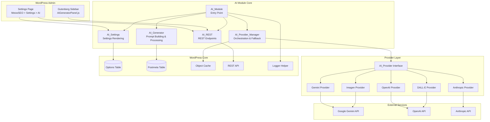
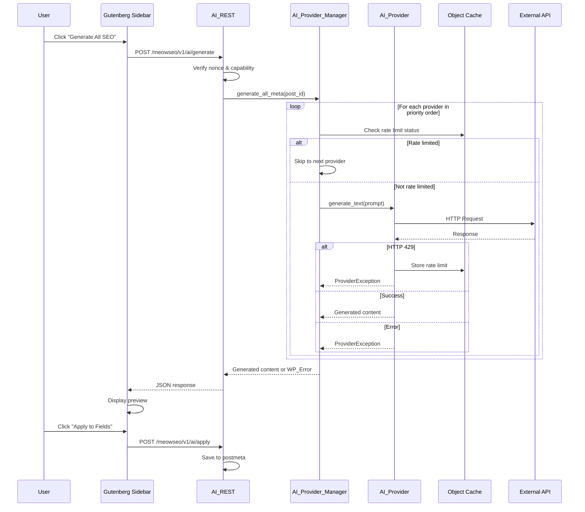
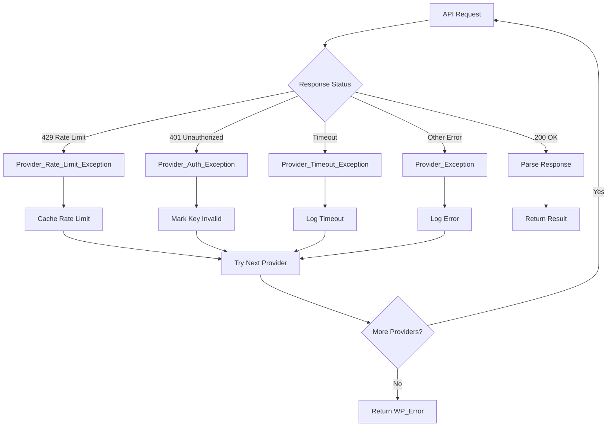
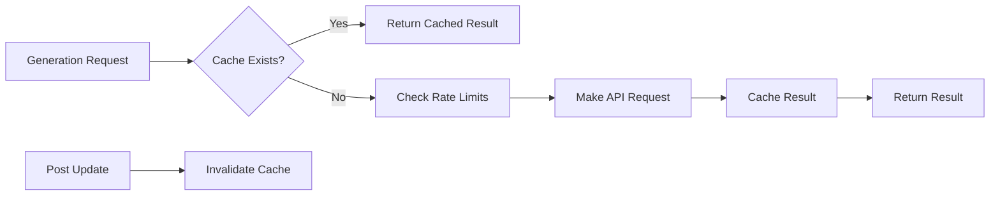

# Design Document: AI Generation Module

## Overview

The AI Generation Module provides AI-powered SEO metadata and featured image generation for the MeowSEO WordPress plugin. It integrates multiple AI providers (Gemini, OpenAI, Anthropic, Imagen, DALL-E) with automatic fallback, ensuring content generation continues even when individual providers fail.

### Key Design Goals

1. **Multi-Provider Resilience**: Automatic fallback across providers ensures high availability
2. **Security First**: Encrypted API keys, nonce verification, capability checks
3. **User Experience**: Seamless Gutenberg integration with preview and partial generation
4. **Extensibility**: Provider interface allows easy addition of new AI services
5. **Performance**: Caching, rate limit handling, and async processing

### Design Decisions

| Decision | Rationale |
|----------|-----------|
| Provider Interface Pattern | Enables easy addition of new providers without modifying core logic |
| Object Cache for Rate Limits | Fast, transient storage prevents repeated rate-limited requests |
| AES-256-CBC Encryption | Matches existing GSC module pattern, uses WordPress AUTH_KEY |
| REST API for Generation | Decouples frontend from backend, enables future API access |
| JSON Response Format | Structured, parseable output with validation |

---

## Architecture

### System Architecture Diagram



### Component Interaction Flow



---

## Components and Interfaces

### File Structure

```
includes/modules/ai/
├── class-ai-module.php              # Module entry point
├── class-ai-provider-manager.php    # Provider orchestration
├── class-ai-generator.php           # Prompt building & processing
├── class-ai-settings.php            # Settings page rendering
├── class-ai-rest.php                # REST endpoint handling
├── contracts/
│   └── interface-ai-provider.php    # Provider interface
├── providers/
│   ├── class-provider-gemini.php    # Gemini implementation
│   ├── class-provider-openai.php    # OpenAI implementation
│   ├── class-provider-anthropic.php # Anthropic implementation
│   ├── class-provider-imagen.php    # Imagen implementation
│   └── class-provider-dalle.php     # DALL-E implementation
└── exceptions/
    ├── class-provider-exception.php        # Base exception
    ├── class-provider-rate-limit.php       # Rate limit exception
    └── class-provider-auth-exception.php   # Auth exception

src/components/
└── AiGeneratorPanel.js              # Gutenberg sidebar panel
```

### Module Interface Implementation

```php
<?php
namespace MeowSEO\Modules\AI;

use MeowSEO\Contracts\Module;
use MeowSEO\Options;

class AI_Module implements Module {
    private Options $options;
    private AI_Provider_Manager $provider_manager;
    private AI_Generator $generator;
    private AI_Settings $settings;
    private AI_REST $rest;

    public function __construct( Options $options ) {
        $this->options = $options;
        $this->provider_manager = new AI_Provider_Manager( $options );
        $this->generator = new AI_Generator( $this->provider_manager, $options );
        $this->settings = new AI_Settings( $options, $this->provider_manager );
        $this->rest = new AI_REST( $this->generator, $this->provider_manager );
    }

    public function boot(): void {
        add_action( 'rest_api_init', [ $this, 'register_rest_routes' ] );
        add_action( 'admin_enqueue_scripts', [ $this, 'enqueue_admin_scripts' ] );
        add_action( 'enqueue_block_editor_assets', [ $this, 'enqueue_gutenberg_assets' ] );
        add_action( 'save_post', [ $this, 'handle_auto_generation' ], 10, 3 );
        add_filter( 'meowseo_settings_tabs', [ $this->settings, 'add_ai_tab' ] );
    }

    public function get_id(): string {
        return 'ai';
    }
}
```

### Provider Interface

```php
<?php
namespace MeowSEO\Modules\AI\Contracts;

interface AI_Provider {
    /**
     * Get unique provider identifier.
     */
    public function get_slug(): string;

    /**
     * Get display name for UI.
     */
    public function get_label(): string;

    /**
     * Check if provider supports text generation.
     */
    public function supports_text(): bool;

    /**
     * Check if provider supports image generation.
     */
    public function supports_image(): bool;

    /**
     * Generate text content.
     *
     * @param string $prompt Generation prompt.
     * @param array  $options Provider-specific options.
     * @return array{content: string, usage: array} Generated content.
     * @throws Provider_Exception On failure.
     */
    public function generate_text( string $prompt, array $options = [] ): array;

    /**
     * Generate image.
     *
     * @param string $prompt Image generation prompt.
     * @param array  $options Provider-specific options.
     * @return array{url: string, revised_prompt: string|null} Generated image data.
     * @throws Provider_Exception On failure.
     */
    public function generate_image( string $prompt, array $options = [] ): array;

    /**
     * Validate API key by making test request.
     */
    public function validate_api_key( string $key ): bool;

    /**
     * Get last error message.
     */
    public function get_last_error(): ?string;
}
```

### Provider Manager Class

```php
<?php
namespace MeowSEO\Modules\AI;

use MeowSEO\Modules\AI\Contracts\AI_Provider;
use MeowSEO\Modules\AI\Exceptions\Provider_Exception;
use MeowSEO\Modules\AI\Exceptions\Provider_Rate_Limit_Exception;
use MeowSEO\Options;
use MeowSEO\Helpers\Logger;
use WP_Error;

class AI_Provider_Manager {
    private Options $options;
    private array $providers = [];
    private array $errors = [];

    public function __construct( Options $options ) {
        $this->options = $options;
        $this->load_providers();
    }

    /**
     * Load all available providers.
     */
    private function load_providers(): void {
        $provider_classes = [
            'gemini'    => Providers\Provider_Gemini::class,
            'openai'    => Providers\Provider_OpenAI::class,
            'anthropic' => Providers\Provider_Anthropic::class,
            'imagen'    => Providers\Provider_Imagen::class,
            'dalle'     => Providers\Provider_DALL_E::class,
        ];

        foreach ( $provider_classes as $slug => $class ) {
            $api_key = $this->get_decrypted_api_key( $slug );
            if ( $api_key ) {
                $this->providers[$slug] = new $class( $api_key );
            }
        }
    }

    /**
     * Generate text with fallback.
     *
     * @param string $prompt Generation prompt.
     * @param array  $options Generation options.
     * @return array|WP_Error Generated content or error.
     */
    public function generate_text( string $prompt, array $options = [] ) {
        $ordered_providers = $this->get_ordered_providers( 'text' );
        $this->errors = [];

        foreach ( $ordered_providers as $provider ) {
            if ( ! $provider->supports_text() ) {
                continue;
            }

            if ( $this->is_rate_limited( $provider->get_slug() ) ) {
                $this->log_skip( $provider->get_slug(), 'rate_limited' );
                continue;
            }

            try {
                $result = $provider->generate_text( $prompt, $options );
                $this->log_success( $provider->get_slug(), 'text' );
                return [
                    'content' => $result['content'],
                    'provider' => $provider->get_slug(),
                    'usage' => $result['usage'] ?? [],
                ];
            } catch ( Provider_Rate_Limit_Exception $e ) {
                $this->handle_rate_limit( $provider->get_slug(), $e );
                $this->errors[$provider->get_slug()] = $e->getMessage();
            } catch ( Provider_Exception $e ) {
                $this->errors[$provider->get_slug()] = $e->getMessage();
                $this->log_failure( $provider->get_slug(), $e->getMessage() );
            }
        }

        return new WP_Error(
            'all_providers_failed',
            __( 'All AI providers failed. Please check your API keys.', 'meowseo' ),
            [ 'errors' => $this->errors ]
        );
    }

    /**
     * Generate image with fallback.
     */
    public function generate_image( string $prompt, array $options = [] ) {
        $ordered_providers = $this->get_ordered_providers( 'image' );
        $this->errors = [];

        foreach ( $ordered_providers as $provider ) {
            if ( ! $provider->supports_image() ) {
                continue;
            }

            if ( $this->is_rate_limited( $provider->get_slug() ) ) {
                $this->log_skip( $provider->get_slug(), 'rate_limited' );
                continue;
            }

            try {
                $result = $provider->generate_image( $prompt, $options );
                $this->log_success( $provider->get_slug(), 'image' );
                return [
                    'url' => $result['url'],
                    'provider' => $provider->get_slug(),
                ];
            } catch ( Provider_Rate_Limit_Exception $e ) {
                $this->handle_rate_limit( $provider->get_slug(), $e );
                $this->errors[$provider->get_slug()] = $e->getMessage();
            } catch ( Provider_Exception $e ) {
                $this->errors[$provider->get_slug()] = $e->getMessage();
                $this->log_failure( $provider->get_slug(), $e->getMessage() );
            }
        }

        return new WP_Error(
            'all_image_providers_failed',
            __( 'All image providers failed.', 'meowseo' ),
            [ 'errors' => $this->errors ]
        );
    }

    /**
     * Get providers ordered by priority.
     */
    private function get_ordered_providers( string $type = 'text' ): array {
        $order = $this->options->get( 'ai_provider_order', [] );
        $active = $this->options->get( 'ai_active_providers', [] );
        
        $ordered = [];
        
        // Add providers in configured order
        foreach ( $order as $slug ) {
            if ( isset( $this->providers[$slug] ) && in_array( $slug, $active, true ) ) {
                $ordered[] = $this->providers[$slug];
            }
        }
        
        // Add remaining active providers not in order
        foreach ( $this->providers as $slug => $provider ) {
            if ( in_array( $slug, $active, true ) && ! in_array( $provider, $ordered, true ) ) {
                $ordered[] = $provider;
            }
        }
        
        return $ordered;
    }

    /**
     * Check if provider is rate limited.
     */
    private function is_rate_limited( string $provider_slug ): bool {
        $cache_key = "meowseo_ai_ratelimit_{$provider_slug}";
        return (bool) wp_cache_get( $cache_key, 'meowseo' );
    }

    /**
     * Handle rate limit by caching status.
     */
    private function handle_rate_limit( string $provider_slug, Provider_Rate_Limit_Exception $e ): void {
        $cache_key = "meowseo_ai_ratelimit_{$provider_slug}";
        $ttl = $e->get_retry_after() ?: 60;
        wp_cache_set( $cache_key, time() + $ttl, 'meowseo', $ttl );
        
        Logger::warning(
            "AI provider rate limited: {$provider_slug}",
            [ 'module' => 'ai', 'provider' => $provider_slug, 'retry_after' => $ttl ]
        );
    }

    /**
     * Get decrypted API key for provider.
     */
    private function get_decrypted_api_key( string $provider_slug ): ?string {
        $encrypted = get_option( "meowseo_ai_{$provider_slug}_api_key", '' );
        if ( empty( $encrypted ) ) {
            return null;
        }
        return $this->decrypt_key( $encrypted );
    }

    /**
     * Decrypt API key using AES-256-CBC.
     */
    private function decrypt_key( string $encrypted ): string {
        if ( ! defined( 'AUTH_KEY' ) || empty( AUTH_KEY ) ) {
            return '';
        }

        $key = substr( hash( 'sha256', AUTH_KEY, true ), 0, 32 );
        $iv = substr( hash( 'sha256', AUTH_KEY, true ), 0, 16 );
        $decoded = base64_decode( $encrypted, true );
        
        if ( false === $decoded ) {
            return '';
        }

        $decrypted = openssl_decrypt( $decoded, 'AES-256-CBC', $key, 0, $iv );
        return $decrypted ?: '';
    }

    /**
     * Get all provider statuses.
     */
    public function get_provider_statuses(): array {
        $statuses = [];
        $order = $this->options->get( 'ai_provider_order', [] );
        $active = $this->options->get( 'ai_active_providers', [] );

        foreach ( $this->providers as $slug => $provider ) {
            $rate_limit_end = wp_cache_get( "meowseo_ai_ratelimit_{$slug}", 'meowseo' );
            
            $statuses[$slug] = [
                'label' => $provider->get_label(),
                'active' => in_array( $slug, $active, true ),
                'has_api_key' => true,
                'supports_text' => $provider->supports_text(),
                'supports_image' => $provider->supports_image(),
                'rate_limited' => (bool) $rate_limit_end,
                'rate_limit_remaining' => $rate_limit_end ? max( 0, $rate_limit_end - time() ) : 0,
                'priority' => array_search( $slug, $order, true ) ?: 999,
            ];
        }

        // Add providers without API keys
        $all_slugs = [ 'gemini', 'openai', 'anthropic', 'imagen', 'dalle' ];
        foreach ( $all_slugs as $slug ) {
            if ( ! isset( $statuses[$slug] ) ) {
                $statuses[$slug] = [
                    'label' => $this->get_provider_label( $slug ),
                    'active' => false,
                    'has_api_key' => false,
                    'supports_text' => in_array( $slug, [ 'gemini', 'openai', 'anthropic' ] ),
                    'supports_image' => in_array( $slug, [ 'imagen', 'dalle', 'openai' ] ),
                    'rate_limited' => false,
                    'rate_limit_remaining' => 0,
                    'priority' => 999,
                ];
            }
        }

        return $statuses;
    }
}
```

### Generator Class

```php
<?php
namespace MeowSEO\Modules\AI;

use MeowSEO\Options;
use MeowSEO\Helpers\Logger;

class AI_Generator {
    private AI_Provider_Manager $provider_manager;
    private Options $options;

    public function __construct( AI_Provider_Manager $provider_manager, Options $options ) {
        $this->provider_manager = $provider_manager;
        $this->options = $options;
    }

    /**
     * Generate all SEO metadata for a post.
     *
     * @param int  $post_id Post ID.
     * @param bool $generate_image Whether to generate featured image.
     * @return array|WP_Error Generated content or error.
     */
    public function generate_all_meta( int $post_id, bool $generate_image = false ) {
        $post = get_post( $post_id );
        if ( ! $post ) {
            return new WP_Error( 'invalid_post', __( 'Post not found.', 'meowseo' ) );
        }

        // Check minimum content length
        $word_count = str_word_count( wp_strip_all_tags( $post->post_content ) );
        if ( $word_count < 300 ) {
            return new WP_Error(
                'content_too_short',
                __( 'Content must be at least 300 words for generation.', 'meowseo' )
            );
        }

        // Build prompt
        $prompt = $this->build_text_prompt( $post );

        // Generate text content
        $text_result = $this->provider_manager->generate_text( $prompt );
        if ( is_wp_error( $text_result ) ) {
            return $text_result;
        }

        // Parse JSON response
        $parsed = $this->parse_json_response( $text_result['content'] );
        if ( is_wp_error( $parsed ) ) {
            return $parsed;
        }

        $result = [
            'text' => $parsed,
            'provider' => $text_result['provider'],
            'image' => null,
        ];

        // Generate image if requested
        if ( $generate_image ) {
            $image_prompt = $this->build_image_prompt( $post, $parsed['seo_title'] ?? '' );
            $image_result = $this->provider_manager->generate_image( $image_prompt );
            
            if ( ! is_wp_error( $image_result ) ) {
                $attachment_id = $this->save_image_to_media_library(
                    $image_result['url'],
                    $post_id,
                    $post->post_title
                );
                
                if ( $attachment_id ) {
                    $result['image'] = [
                        'attachment_id' => $attachment_id,
                        'url' => wp_get_attachment_url( $attachment_id ),
                        'provider' => $image_result['provider'],
                    ];
                }
            }
        }

        // Cache the result
        $this->cache_result( $post_id, $result );

        return $result;
    }

    /**
     * Build text generation prompt.
     */
    private function build_text_prompt( \WP_Post $post ): string {
        $title = $post->post_title;
        $content = wp_strip_all_tags( $post->post_content );
        $content = wp_trim_words( $content, 2000 ); // First 2000 words
        $excerpt = $post->post_excerpt ?: wp_trim_words( $content, 50 );
        
        $categories = wp_get_post_categories( $post->ID, [ 'fields' => 'names' ] );
        $tags = wp_get_post_tags( $post->ID, [ 'fields' => 'names' ] );
        
        $language = $this->options->get( 'ai_output_language', 'auto' );
        $custom_instructions = $this->options->get( 'ai_custom_instructions', '' );

        $prompt = "You are an SEO expert. Generate SEO metadata for the following article.\n\n";
        $prompt .= "Article Title: {$title}\n";
        $prompt .= "Article Content: {$content}\n";
        $prompt .= "Categories: " . implode( ', ', $categories ) . "\n";
        $prompt .= "Tags: " . implode( ', ', $tags ) . "\n";
        
        if ( $language !== 'auto' ) {
            $prompt .= "Language: {$language}\n";
        }
        
        if ( $custom_instructions ) {
            $prompt .= "\nCustom Instructions: {$custom_instructions}\n";
        }

        $prompt .= "\nReturn ONLY a JSON object with these fields (no markdown, no explanation):\n";
        $prompt .= "{\n";
        $prompt .= '  "seo_title": "max 60 chars",' . "\n";
        $prompt .= '  "seo_description": "140-160 chars",' . "\n";
        $prompt .= '  "focus_keyword": "single keyword",' . "\n";
        $prompt .= '  "og_title": "engaging title",' . "\n";
        $prompt .= '  "og_description": "100-200 chars",' . "\n";
        $prompt .= '  "twitter_title": "Twitter title",' . "\n";
        $prompt .= '  "twitter_description": "conversational",' . "\n";
        $prompt .= '  "direct_answer": "300-450 chars for AI Overviews",' . "\n";
        $prompt .= '  "schema_type": "Article|FAQPage|HowTo|LocalBusiness|Product",' . "\n";
        $prompt .= '  "schema_justification": "one sentence",' . "\n";
        $prompt .= '  "slug_suggestion": "url-friendly-slug",' . "\n";
        $prompt .= '  "secondary_keywords": ["keyword1", "keyword2", "keyword3"]' . "\n";
        $prompt .= "}\n";

        return $prompt;
    }

    /**
     * Build image generation prompt.
     */
    private function build_image_prompt( \WP_Post $post, string $seo_title ): string {
        $style = $this->options->get( 'ai_image_style', 'professional' );
        $color_palette = $this->options->get( 'ai_image_color_palette', '' );

        $prompt = "Generate a featured image for an article about: {$seo_title}\n\n";
        $prompt .= "Style: {$style}\n";
        
        if ( $color_palette ) {
            $prompt .= "Color palette: {$color_palette}\n";
        }
        
        $prompt .= "\nRequirements:\n";
        $prompt .= "- Clean, professional, suitable for web publishing\n";
        $prompt .= "- No text overlay\n";
        $prompt .= "- Wide format 16:9\n";
        $prompt .= "- High resolution\n";
        $prompt .= "- PNG format\n";

        return $prompt;
    }

    /**
     * Parse JSON response from AI.
     */
    private function parse_json_response( string $content ): array {
        // Remove potential markdown code blocks
        $content = preg_replace( '/^```json\s*/m', '', $content );
        $content = preg_replace( '/^```\s*/m', '', $content );
        $content = trim( $content );

        $parsed = json_decode( $content, true );
        
        if ( json_last_error() !== JSON_ERROR_NONE ) {
            Logger::error(
                'Failed to parse AI JSON response',
                [ 'module' => 'ai', 'error' => json_last_error_msg() ]
            );
            return new WP_Error(
                'json_parse_error',
                __( 'Failed to parse AI response.', 'meowseo' )
            );
        }

        // Validate required fields
        $required = [ 'seo_title', 'seo_description', 'focus_keyword' ];
        foreach ( $required as $field ) {
            if ( empty( $parsed[$field] ) ) {
                return new WP_Error(
                    'missing_field',
                    sprintf( __( 'Missing required field: %s', 'meowseo' ), $field )
                );
            }
        }

        // Sanitize all values
        return array_map( 'sanitize_text_field', $parsed );
    }

    /**
     * Save generated image to media library.
     */
    private function save_image_to_media_library( string $image_url, int $post_id, string $title ): ?int {
        require_once ABSPATH . 'wp-admin/includes/file.php';
        require_once ABSPATH . 'wp-admin/includes/media.php';
        require_once ABSPATH . 'wp-admin/includes/image.php';

        // Download image
        $response = wp_remote_get( $image_url, [ 'timeout' => 60 ] );
        if ( is_wp_error( $response ) ) {
            return null;
        }

        $image_data = wp_remote_retrieve_body( $response );
        
        // Save to temp file
        $temp_file = wp_tempnam( 'ai-generated-image.png' );
        file_put_contents( $temp_file, $image_data );

        // Upload to media library
        $file_array = [
            'name' => sanitize_file_name( $title . '-featured.png' ),
            'tmp_name' => $temp_file,
        ];

        $attachment_id = media_handle_sideload( $file_array, $post_id, $title );

        if ( is_wp_error( $attachment_id ) ) {
            @unlink( $temp_file );
            return null;
        }

        // Set as featured image
        set_post_thumbnail( $post_id, $attachment_id );

        // Set alt text
        update_post_meta( $attachment_id, '_wp_attachment_image_alt', $title );

        return $attachment_id;
    }

    /**
     * Apply generated content to postmeta.
     */
    public function apply_to_postmeta( int $post_id, array $content ): bool {
        $field_mapping = [
            'seo_title' => '_meowseo_title',
            'seo_description' => '_meowseo_description',
            'focus_keyword' => '_meowseo_focus_keyword',
            'og_title' => '_meowseo_og_title',
            'og_description' => '_meowseo_og_description',
            'twitter_title' => '_meowseo_twitter_title',
            'twitter_description' => '_meowseo_twitter_description',
            'schema_type' => '_meowseo_schema_type',
        ];

        $overwrite = $this->options->get( 'ai_overwrite_behavior', 'ask' );

        foreach ( $field_mapping as $source => $target ) {
            if ( empty( $content[$source] ) ) {
                continue;
            }

            $existing = get_post_meta( $post_id, $target, true );
            
            if ( $overwrite === 'always' || empty( $existing ) ) {
                update_post_meta( $post_id, $target, $content[$source] );
            }
        }

        // Handle image fields
        if ( ! empty( $content['image']['url'] ) ) {
            update_post_meta( $post_id, '_meowseo_og_image', $content['image']['url'] );
            update_post_meta( $post_id, '_meowseo_twitter_image', $content['image']['url'] );
        }

        return true;
    }

    /**
     * Cache generation result.
     */
    private function cache_result( int $post_id, array $result ): void {
        $cache_key = "meowseo_ai_gen_{$post_id}_all";
        wp_cache_set( $cache_key, $result, 'meowseo', DAY_IN_SECONDS );
    }
}
```

---

## Data Models

### Options Schema

| Option Name | Type | Description |
|------------|------|-------------|
| `meowseo_ai_gemini_api_key` | string (encrypted) | Gemini API key |
| `meowseo_ai_openai_api_key` | string (encrypted) | OpenAI API key |
| `meowseo_ai_anthropic_api_key` | string (encrypted) | Anthropic API key |
| `meowseo_ai_imagen_api_key` | string (encrypted) | Imagen API key (uses Gemini key) |
| `meowseo_ai_dalle_api_key` | string (encrypted) | DALL-E API key (uses OpenAI key) |
| `meowseo_ai_provider_order` | array | Ordered provider slugs |
| `meowseo_ai_active_providers` | array | Active provider slugs |
| `meowseo_ai_auto_generate` | bool | Auto-generate on first save |
| `meowseo_ai_auto_generate_image` | bool | Auto-generate featured image |
| `meowseo_ai_overwrite_behavior` | string | always/never/ask |
| `meowseo_ai_output_language` | string | auto/id/en |
| `meowseo_ai_custom_instructions` | string | Custom prompt instructions |
| `meowseo_ai_image_enabled` | bool | Enable image generation |
| `meowseo_ai_image_style` | string | professional/modern/minimal/illustrative/photography |
| `meowseo_ai_image_color_palette` | string | Color palette hint |

### Postmeta Field Mapping

| Generated Field | Postmeta Key | Description |
|----------------|--------------|-------------|
| `seo_title` | `_meowseo_title` | SEO title (max 60 chars) |
| `seo_description` | `_meowseo_description` | Meta description (140-160 chars) |
| `focus_keyword` | `_meowseo_focus_keyword` | Primary focus keyword |
| `og_title` | `_meowseo_og_title` | Open Graph title |
| `og_description` | `_meowseo_og_description` | Open Graph description |
| `og_image` | `_meowseo_og_image` | Open Graph image URL |
| `twitter_title` | `_meowseo_twitter_title` | Twitter Card title |
| `twitter_description` | `_meowseo_twitter_description` | Twitter Card description |
| `twitter_image` | `_meowseo_twitter_image` | Twitter Card image URL |
| `schema_type` | `_meowseo_schema_type` | Recommended schema type |

### Cache Keys

| Pattern | TTL | Description |
|---------|-----|-------------|
| `meowseo_ai_gen_{post_id}_{type}` | 24 hours | Generation results |
| `meowseo_ai_status_{provider}` | 5 minutes | Provider status |
| `meowseo_ai_ratelimit_{provider}` | 60 seconds | Rate limit status |

---

## REST API Endpoints

### Endpoint Specifications

#### POST /meowseo/v1/ai/generate

Generate SEO metadata for a post.

**Request:**
```json
{
  "post_id": 123,
  "type": "all",
  "generate_image": true,
  "bypass_cache": false
}
```

**Parameters:**
| Name | Type | Required | Description |
|------|------|----------|-------------|
| post_id | integer | Yes | Post ID |
| type | string | No | text/image/all (default: all) |
| generate_image | boolean | No | Generate featured image (default: false) |
| bypass_cache | boolean | No | Skip cache (default: false) |

**Response (200):**
```json
{
  "success": true,
  "data": {
    "text": {
      "seo_title": "Example SEO Title",
      "seo_description": "Example meta description for the article.",
      "focus_keyword": "example keyword",
      "og_title": "Engaging Open Graph Title",
      "og_description": "Open Graph description text.",
      "twitter_title": "Twitter Title",
      "twitter_description": "Twitter description text.",
      "direct_answer": "Concise answer for AI Overviews.",
      "schema_type": "Article",
      "schema_justification": "Standard blog post format.",
      "slug_suggestion": "example-seo-title",
      "secondary_keywords": ["keyword1", "keyword2", "keyword3"]
    },
    "image": {
      "attachment_id": 456,
      "url": "https://example.com/wp-content/uploads/2024/01/image.png",
      "provider": "dalle"
    },
    "provider": "gemini"
  }
}
```

**Error Response (400/403/500):**
```json
{
  "success": false,
  "error": {
    "code": "all_providers_failed",
    "message": "All AI providers failed. Please check your API keys.",
    "data": {
      "errors": {
        "gemini": "Rate limit exceeded",
        "openai": "Invalid API key"
      }
    }
  }
}
```

#### POST /meowseo/v1/ai/generate-image

Generate only a featured image.

**Request:**
```json
{
  "post_id": 123,
  "custom_prompt": "Optional custom prompt"
}
```

**Response (200):**
```json
{
  "success": true,
  "data": {
    "attachment_id": 456,
    "url": "https://example.com/wp-content/uploads/2024/01/image.png",
    "provider": "dalle"
  }
}
```

#### GET /meowseo/v1/ai/provider-status

Get all provider statuses.

**Response (200):**
```json
{
  "success": true,
  "data": {
    "gemini": {
      "label": "Google Gemini",
      "active": true,
      "has_api_key": true,
      "supports_text": true,
      "supports_image": false,
      "rate_limited": false,
      "rate_limit_remaining": 0,
      "priority": 1
    },
    "openai": {
      "label": "OpenAI",
      "active": true,
      "has_api_key": true,
      "supports_text": true,
      "supports_image": true,
      "rate_limited": true,
      "rate_limit_remaining": 45,
      "priority": 2
    }
  }
}
```

#### POST /meowseo/v1/ai/apply

Apply generated content to postmeta.

**Request:**
```json
{
  "post_id": 123,
  "content": {
    "seo_title": "Example Title",
    "seo_description": "Example description"
  },
  "fields": ["seo_title", "seo_description"]
}
```

#### POST /meowseo/v1/ai/test-provider

Test provider connection.

**Request:**
```json
{
  "provider": "gemini",
  "api_key": "test-key"
}
```

**Response (200):**
```json
{
  "success": true,
  "data": {
    "valid": true,
    "message": "Connection successful"
  }
}
```

---

## Error Handling

### Exception Hierarchy

```php
<?php
namespace MeowSEO\Modules\AI\Exceptions;

class Provider_Exception extends \Exception {
    protected string $provider_slug;

    public function __construct( string $message, string $provider_slug, int $code = 0 ) {
        parent::__construct( $message, $code );
        $this->provider_slug = $provider_slug;
    }

    public function get_provider_slug(): string {
        return $this->provider_slug;
    }
}

class Provider_Rate_Limit_Exception extends Provider_Exception {
    private int $retry_after;

    public function __construct( string $provider_slug, int $retry_after = 60 ) {
        parent::__construct(
            'Rate limit exceeded',
            $provider_slug,
            429
        );
        $this->retry_after = $retry_after;
    }

    public function get_retry_after(): int {
        return $this->retry_after;
    }
}

class Provider_Auth_Exception extends Provider_Exception {
    public function __construct( string $provider_slug ) {
        parent::__construct(
            'Invalid API key',
           {}
            $provider_slug,
            401
        );
    }
}
```

### Error Handling Strategy



### Error Messages

| Error Code | User Message | Action |
|------------|--------------|--------|
| `all_providers_failed` | "All AI providers failed. Please check your API keys." | Link to settings |
| `content_too_short` | "Content must be at least 300 words for generation." | None |
| `invalid_post` | "Post not found." | None |
| `json_parse_error` | "Failed to parse AI response. Please try again." | Retry button |
| `rate_limited` | "Provider rate limited. Trying next provider..." | Auto-retry |
| `invalid_api_key` | "Invalid API key for {provider}. Please check your settings." | Link to settings |
| `permission_denied` | "You do not have permission to generate content." | None |

---

## Testing Strategy

### Unit Tests

Unit tests verify individual component behavior with mocked dependencies.

**Test Categories:**

1. **Provider Interface Tests**
   - Each provider correctly implements interface methods
   - API key validation returns expected results
   - Error handling produces correct exceptions

2. **Provider Manager Tests**
   - Provider ordering follows configured priority
   - Fallback logic skips rate-limited providers
   - All failures produce WP_Error with details

3. **Generator Tests**
   - Prompt building includes all required context
   - JSON parsing handles valid and invalid responses
   - Postmeta mapping applies correct fields

4. **REST API Tests**
   - Endpoint registration
   - Permission callbacks
   - Parameter validation
   - Response formatting

### Integration Tests

Integration tests verify component interactions with WordPress core.

**Test Scenarios:**

1. **End-to-End Generation**
   - Full generation flow from REST request to postmeta
   - Image download and media library integration
   - Cache storage and retrieval

2. **Provider Fallback**
   - Simulate provider failures
   - Verify fallback to next provider
   - Verify error aggregation

3. **Settings Integration**
   - API key encryption/decryption
   - Provider order persistence
   - Auto-generation on post save

### Property-Based Tests

Property-based tests verify universal properties across generated inputs.

**Properties to Test:**

1. **JSON Round-Trip**: For any valid generation response, parsing and re-encoding produces equivalent structure
2. **Prompt Consistency**: For any post, generated prompts always include required fields
3. **Encryption Reversibility**: For any API key, encryption followed by decryption returns original value
4. **Cache Key Consistency**: For any post_id and type, cache key is deterministic

### Test Configuration

```php
// phpunit.xml
<testsuites>
    <testsuite name="AI Module">
        <directory>tests/modules/ai</directory>
    </testsuite>
</testsuites>
```

**Minimum Coverage Targets:**
- Provider classes: 80%
- Provider Manager: 90%
- Generator: 85%
- REST endpoints: 90%

---

## Security Considerations

### API Key Security

1. **Encryption at Rest**
   - All API keys encrypted using AES-256-CBC
   - Uses WordPress AUTH_KEY for encryption key
   - Keys never stored in plaintext

2. **Decryption Scope**
   - Keys decrypted only when making API requests
   - Decrypted keys never logged or displayed
   - Memory cleared after use

3. **Key Validation**
   - Test connection validates key before saving
   - Invalid keys marked with error status

### REST API Security

1. **Authentication**
   - All POST endpoints require valid WordPress nonce
   - Nonce verified via X-WP-Nonce header
   - GET endpoints require authenticated user

2. **Authorization**
   - `edit_posts` capability required for generation
   - `manage_options` capability required for settings
   - Capability checked before any operation

3. **Input Validation**
   - All parameters sanitized with appropriate functions
   - post_id validated as integer
   - Provider slugs validated against whitelist
   - Custom instructions limited to 500 characters

### Rate Limiting

1. **Client-Side**
   - UI prevents rapid repeated requests
   - Loading state disables buttons
   - Debounce on auto-save triggers

2. **Server-Side**
   - Rate limit status cached per provider
   - 60-second minimum between retries
   - Retry-After header parsed when available

### Data Protection

1. **No Sensitive Logging**
   - API keys never logged
   - Post content truncated in logs
   - Error messages sanitized

2. **Cache Isolation**
   - Cache keys include unique prefix
   - Cache group isolated to plugin
   - Sensitive data not cached

---

## Performance Considerations

### Caching Strategy



### Optimization Techniques

1. **Request Optimization**
   - First 2000 words of content only
   - Parallel provider status checks
   - Connection pooling for HTTP requests

2. **Cache Optimization**
   - 24-hour TTL for generation results
   - 5-minute TTL for provider status
   - 60-second TTL for rate limits

3. **UI Optimization**
   - Lazy load provider status
   - Debounced settings saves
   - Optimistic UI updates

### Performance Targets

| Operation | Target | Maximum |
|-----------|--------|---------|
| Text generation | 15s | 30s |
| Image generation | 30s | 60s |
| Provider status check | 100ms | 500ms |
| Settings save | 50ms | 200ms |
| Cache hit response | 10ms | 50ms |

---

## Gutenberg Integration

### Component Architecture

```jsx
// src/components/AiGeneratorPanel.js

import { useState, useCallback } from '@wordpress/element';
import { Button, Spinner, Notice, PanelBody, TextareaControl } from '@wordpress/components';
import { useSelect, useDispatch } from '@wordpress/data';
import apiFetch from '@wordpress/api-fetch';

export function AiGeneratorPanel() {
    const [ isGenerating, setIsGenerating ] = useState( false );
    const [ generatedContent, setGeneratedContent ] = useState( null );
    const [ error, setError ] = useState( null );
    const [ provider, setProvider ] = useState( null );

    const postId = useSelect( ( select ) => 
        select( 'core/editor' ).getCurrentPostId()
    );

    const handleGenerate = useCallback( async ( type = 'all', generateImage = false ) => {
        setIsGenerating( true );
        setError( null );

        try {
            const response = await apiFetch( {
                path: '/meowseo/v1/ai/generate',
                method: 'POST',
                data: {
                    post_id: postId,
                    type,
                    generate_image: generateImage,
                },
            } );

            if ( response.success ) {
                setGeneratedContent( response.data );
                setProvider( response.data.provider );
            } else {
                setError( response.error.message );
            }
        } catch ( err ) {
            setError( err.message || 'Generation failed' );
        } finally {
            setIsGenerating( false );
        }
    }, [ postId ] );

    const handleApply = useCallback( async () => {
        if ( ! generatedContent ) return;

        try {
            await apiFetch( {
                path: '/meowseo/v1/ai/apply',
                method: 'POST',
                data: {
                    post_id: postId,
                    content: generatedContent.text,
                    image: generatedContent.image,
                },
            } );

            // Update editor state
            // ...
        } catch ( err ) {
            setError( 'Failed to apply content' );
        }
    }, [ postId, generatedContent ] );

    return (
        <PanelBody title="AI SEO Generator" initialOpen={ true }>
            { error && (
                <Notice status="error" isDismissible={ true } onRemove={ () => setError( null ) }>
                    { error }
                    { ' ' }
                    <a href="admin.php?page=meowseo-settings&tab=ai">Settings</a>
                </Notice>
            ) }

            { provider && ! error && (
                <Notice status="warning" isDismissible={ true }>
                    Generated via { provider.toUpperCase() } (primary provider unavailable)
                </Notice>
            ) }

            <div className="meowseo-ai-buttons">
                <Button
                    variant="primary"
                    onClick={ () => handleGenerate( 'all', true ) }
                    disabled={ isGenerating }
                    className="meowseo-ai-button"
                >
                    { isGenerating ? <Spinner /> : 'Generate All SEO' }
                </Button>

                <div className="meowseo-ai-partial-buttons">
                    <Button
                        variant="secondary"
                        onClick={ () => handleGenerate( 'text', false ) }
                        disabled={ isGenerating }
                    >
                        Text Only
                    </Button>
                    <Button
                        variant="secondary"
                        onClick={ () => handleGenerate( 'image', false ) }
                        disabled={ isGenerating }
                    >
                        Image Only
                    </Button>
                </div>
            </div>

            { generatedContent && (
                <PreviewPanel
                    content={ generatedContent }
                    onApply={ handleApply }
                />
            ) }
        </PanelBody>
    );
}
```

### Preview Panel Component

```jsx
function PreviewPanel( { content, onApply } ) {
    const [ editedContent, setEditedContent ] = useState( content.text );

    const fields = [
        { key: 'seo_title', label: 'SEO Title', maxChars: 60 },
        { key: 'seo_description', label: 'Meta Description', maxChars: 160 },
        { key: 'focus_keyword', label: 'Focus Keyword' },
        { key: 'og_title', label: 'OG Title' },
        { key: 'og_description', label: 'OG Description', maxChars: 200 },
        { key: 'twitter_title', label: 'Twitter Title' },
        { key: 'twitter_description', label: 'Twitter Description' },
        { key: 'schema_type', label: 'Schema Type' },
    ];

    return (
        <div className="meowseo-ai-preview">
            <h4>Generated Content Preview</h4>

            { fields.map( ( field ) => (
                <div key={ field.key } className="meowseo-ai-field">
                    <label>{ field.label }</label>
                    { field.maxChars ? (
                        <TextareaControl
                            value={ editedContent[ field.key ] || '' }
                            onChange={ ( value ) => 
                                setEditedContent( { ...editedContent, [ field.key ]: value } )
                            }
                            help={ `${ ( editedContent[ field.key ] || '' ).length }/${ field.maxChars } chars` }
                        />
                    ) : (
                        <input
                            type="text"
                            value={ editedContent[ field.key ] || '' }
                            onChange={ ( e ) => 
                                setEditedContent( { ...editedContent, [ field.key ]: e.target.value } )
                            }
                        />
                    ) }
                </div>
            ) ) }

            { content.image && (
                <div className="meowseo-ai-image-preview">
                    <label>Generated Image</label>
                    
                </div>
            ) }

            <Button variant="primary" onClick={ onApply }>
                Apply to Fields
            </Button>
        </div>
    );
}
```

---

## Settings Page Design

### Settings Tab Structure

```php
public function render_ai_tab(): void {
    $this->render_provider_configuration_section();
    $this->render_provider_status_section();
    $this->render_generation_settings_section();
    $this->render_image_settings_section();
}
```

### Provider Configuration Section

```php
private function render_provider_configuration_section(): void {
    $providers = $this->provider_manager->get_provider_statuses();
    $order = $this->options->get( 'ai_provider_order', [] );
    ?>
    <h3><?php esc_html_e( 'AI Providers', 'meowseo' ); ?></h3>
    <p class="description">
        <?php esc_html_e( 'Configure API keys and set provider priority. Drag to reorder.', 'meowseo' ); ?>
    </p>

    <table class="form-table" role="presentation">
        <tbody id="meowseo-ai-providers" class="meowseo-sortable">
            <?php foreach ( $providers as $slug => $provider ) : ?>
                <tr data-provider="<?php echo esc_attr( $slug ); ?>">
                    <th scope="row">
                        <span class="meowseo-drag-handle dashicons dashicons-menu"></span>
                        <label for="ai_provider_<?php echo esc_attr( $slug ); ?>">
                            <?php echo esc_html( $provider['label'] ); ?>
                        </label>
                    </th>
                    <td>
                        <fieldset>
                            <input
                                type="password"
                                name="ai_<?php echo esc_attr( $slug ); ?>_api_key"
                                id="ai_provider_<?php echo esc_attr( $slug ); ?>"
                                placeholder="<?php esc_attr_e( 'Enter API key', 'meowseo' ); ?>"
                                class="regular-text"
                            />
                            <label>
                                <input
                                    type="checkbox"
                                    name="ai_active_providers[]"
                                    value="<?php echo esc_attr( $slug ); ?>"
                                    <?php checked( $provider['active'] ); ?>
                                />
                                <?php esc_html_e( 'Active', 'meowseo' ); ?>
                            </label>
                            <button
                                type="button"
                                class="button meowseo-test-provider"
                                data-provider="<?php echo esc_attr( $slug ); ?>"
                            >
                                <?php esc_html_e( 'Test Connection', 'meowseo' ); ?>
                            </button>
                            <span class="meowseo-provider-status" data-provider="<?php echo esc_attr( $slug ); ?>"></span>
                        </fieldset>
                        <p class="description">
                            <?php if ( $provider['supports_text'] ) : ?>
                                <span class="dashicons dashicons-media-text"></span> Text
                            <?php endif; ?>
                            <?php if ( $provider['supports_image'] ) : ?>
                                <span class="dashicons dashicons-format-image"></span> Image
                            <?php endif; ?>
                        </p>
                    </td>
                </tr>
            <?php endforeach; ?>
        </tbody>
    </table>

    <input type="hidden" name="ai_provider_order" id="ai_provider_order" value="<?php echo esc_attr( implode( ',', $order ) ); ?>" />
    <?php
}
```

### Generation Settings Section

```php
private function render_generation_settings_section(): void {
    $auto_generate = $this->options->get( 'ai_auto_generate', false );
    $auto_generate_image = $this->options->get( 'ai_auto_generate_image', false );
    $overwrite = $this->options->get( 'ai_overwrite_behavior', 'ask' );
    $language = $this->options->get( 'ai_output_language', 'auto' );
    $custom_instructions = $this->options->get( 'ai_custom_instructions', '' );
    ?>
    <h3><?php esc_html_e( 'Generation Settings', 'meowseo' ); ?></h3>

    <table class="form-table" role="presentation">
        <tr>
            <th scope="row"><?php esc_html_e( 'Auto-Generation', 'meowseo' ); ?></th>
            <td>
                <fieldset>
                    <label>
                        <input type="checkbox" name="ai_auto_generate" value="1" <?php checked( $auto_generate ); ?> />
                        <?php esc_html_e( 'Auto-generate on first draft save', 'meowseo' ); ?>
                    </label>
                    <br />
                    <label>
                        <input type="checkbox" name="ai_auto_generate_image" value="1" <?php checked( $auto_generate_image ); ?> />
                        <?php esc_html_e( 'Auto-generate featured image if missing', 'meowseo' ); ?>
                    </label>
                </fieldset>
            </td>
        </tr>
        <tr>
            <th scope="row"><?php esc_html_e( 'Overwrite Behavior', 'meowseo' ); ?></th>
            <td>
                <select name="ai_overwrite_behavior">
                    <option value="ask" <?php selected( $overwrite, 'ask' ); ?>>
                        <?php esc_html_e( 'Ask before overwriting', 'meowseo' ); ?>
                    </option>
                    <option value="always" <?php selected( $overwrite, 'always' ); ?>>
                        <?php esc_html_e( 'Always overwrite', 'meowseo' ); ?>
                    </option>
                    <option value="never" <?php selected( $overwrite, 'never' ); ?>>
                        <?php esc_html_e( 'Never overwrite', 'meowseo' ); ?>
                    </option>
                </select>
            </td>
        </tr>
        <tr>
            <th scope="row"><?php esc_html_e( 'Output Language', 'meowseo' ); ?></th>
            <td>
                <select name="ai_output_language">
                    <option value="auto" <?php selected( $language, 'auto' ); ?>>
                        <?php esc_html_e( 'Auto-detect', 'meowseo' ); ?>
                    </option>
                    <option value="id" <?php selected( $language, 'id' ); ?>>
                        <?php esc_html_e( 'Indonesian', 'meowseo' ); ?>
                    </option>
                    <option value="en" <?php selected( $language, 'en' ); ?>>
                        <?php esc_html_e( 'English', 'meowseo' ); ?>
                    </option>
                </select>
            </td>
        </tr>
        <tr>
            <th scope="row">
                <label for="ai_custom_instructions"><?php esc_html_e( 'Custom Instructions', 'meowseo' ); ?></label>
            </th>
            <td>
                <textarea
                    name="ai_custom_instructions"
                    id="ai_custom_instructions"
                    rows="4"
                    class="large-text"
                    maxlength="500"
                ><?php echo esc_textarea( $custom_instructions ); ?></textarea>
                <p class="description">
                    <?php esc_html_e( 'Additional instructions for AI generation (max 500 chars).', 'meowseo' ); ?>
                    <span class="meowseo-char-count"><?php echo strlen( $custom_instructions ); ?>/500</span>
                </p>
            </td>
        </tr>
    </table>
    <?php
}
```

---

## Provider Implementations

### Gemini Provider

```php
<?php
namespace MeowSEO\Modules\AI\Providers;

use MeowSEO\Modules\AI\Contracts\AI_Provider;
use MeowSEO\Modules\AI\Exceptions\{Provider_Exception, Provider_Rate_Limit_Exception, Provider_Auth_Exception};

class Provider_Gemini implements AI_Provider {
    private const API_URL = 'https://generativelanguage.googleapis.com/v1beta/models/gemini-2.0-flash:generateContent';
    private string $api_key;
    private ?string $last_error = null;

    public function __construct( string $api_key ) {
        $this->api_key = $api_key;
    }

    public function get_slug(): string {
        return 'gemini';
    }

    public function get_label(): string {
        return 'Google Gemini';
    }

    public function supports_text(): bool {
        return true;
    }

    public function supports_image(): bool {
        return false;
    }

    public function generate_text( string $prompt, array $options = [] ): array {
        $response = wp_remote_post( self::API_URL, [
            'headers' => [
                'Content-Type' => 'application/json',
                'x-goog-api-key' => $this->api_key,
            ],
            'body' => json_encode( [
                'contents' => [
                    [ 'parts' => [ [ 'text' => $prompt ] ] ]
                ],
                'generationConfig' => [
                    'temperature' => $options['temperature'] ?? 0.7,
                    'maxOutputTokens' => $options['max_tokens'] ?? 2048,
                ],
            ] ),
            'timeout' => 60,
        ] );

        return $this->parse_response( $response );
    }

    public function generate_image( string $prompt, array $options = [] ): array {
        throw new Provider_Exception( 'Gemini does not support image generation', 'gemini' );
    }

    public function validate_api_key( string $key ): bool {
        $response = wp_remote_post( self::API_URL, [
            'headers' => [
                'Content-Type' => 'application/json',
                'x-goog-api-key' => $key,
            ],
            'body' => json_encode( [
                'contents' => [ [ 'parts' => [ [ 'text' => 'test' ] ] ] ]
            ] ),
            'timeout' => 10,
        ] );

        $code = wp_remote_retrieve_response_code( $response );
        return $code !== 401 && $code !== 403;
    }

    public function get_last_error(): ?string {
        return $this->last_error;
    }

    private function parse_response( $response ): array {
        if ( is_wp_error( $response ) ) {
            $this->last_error = $response->get_error_message();
            throw new Provider_Exception( $this->last_error, 'gemini' );
        }

        $code = wp_remote_retrieve_response_code( $response );
        $body = json_decode( wp_remote_retrieve_body( $response ), true );

        if ( $code === 429 ) {
            $retry_after = $this->parse_retry_after( $response );
            throw new Provider_Rate_Limit_Exception( 'gemini', $retry_after );
        }

        if ( $code === 401 || $code === 403 ) {
            throw new Provider_Auth_Exception( 'gemini' );
        }

        if ( $code !== 200 || empty( $body['candidates'][0]['content']['parts'][0]['text'] ) ) {
            $this->last_error = $body['error']['message'] ?? "HTTP {$code}";
            throw new Provider_Exception( $this->last_error, 'gemini' );
        }

        return [
            'content' => $body['candidates'][0]['content']['parts'][0]['text'],
            'usage' => [
                'input_tokens' => $body['usageMetadata']['promptTokenCount'] ?? 0,
                'output_tokens' => $body['usageMetadata']['candidatesTokenCount'] ?? 0,
            ],
        ];
    }

    private function parse_retry_after( $response ): int {
        $retry_after = wp_remote_retrieve_header( $response, 'retry-after' );
        return $retry_after ? (int) $retry_after : 60;
    }
}
```

### OpenAI Provider

```php
<?php
namespace MeowSEO\Modules\AI\Providers;

use MeowSEO\Modules\AI\Contracts\AI_Provider;
use MeowSEO\Modules\AI\Exceptions\{Provider_Exception, Provider_Rate_Limit_Exception, Provider_Auth_Exception};

class Provider_OpenAI implements AI_Provider {
    private const TEXT_API_URL = 'https://api.openai.com/v1/chat/completions';
    private const IMAGE_API_URL = 'https://api.openai.com/v1/images/generations';
    
    private string $api_key;
    private ?string $last_error = null;

    public function __construct( string $api_key ) {
        $this->api_key = $api_key;
    }

    public function get_slug(): string {
        return 'openai';
    }

    public function get_label(): string {
        return 'OpenAI';
    }

    public function supports_text(): bool {
        return true;
    }

    public function supports_image(): bool {
        return true;
    }

    public function generate_text( string $prompt, array $options = [] ): array {
        $response = wp_remote_post( self::TEXT_API_URL, [
            'headers' => [
                'Content-Type' => 'application/json',
                'Authorization' => 'Bearer ' . $this->api_key,
            ],
            'body' => json_encode( [
                'model' => $options['model'] ?? 'gpt-4o-mini',
                'messages' => [
                    [ 'role' => 'user', 'content' => $prompt ]
                ],
                'temperature' => $options['temperature'] ?? 0.7,
                'max_tokens' => $options['max_tokens'] ?? 2048,
            ] ),
            'timeout' => 60,
        ] );

        return $this->parse_text_response( $response );
    }

    public function generate_image( string $prompt, array $options = [] ): array {
        $response = wp_remote_post( self::IMAGE_API_URL, [
            'headers' => [
                'Content-Type' => 'application/json',
                'Authorization' => 'Bearer ' . $this->api_key,
            ],
            'body' => json_encode( [
                'model' => 'dall-e-3',
                'prompt' => $prompt,
                'n' => 1,
                'size' => '1792x1024',
                'quality' => 'standard',
                'response_format' => 'url',
            ] ),
            'timeout' => 60,
        ] );

        return $this->parse_image_response( $response );
    }

    public function validate_api_key( string $key ): bool {
        $response = wp_remote_get( 'https://api.openai.com/v1/models', [
            'headers' => [
                'Authorization' => 'Bearer ' . $key,
            ],
            'timeout' => 10,
        ] );

        $code = wp_remote_retrieve_response_code( $response );
        return $code === 200;
    }

    public function get_last_error(): ?string {
        return $this->last_error;
    }

    private function parse_text_response( $response ): array {
        if ( is_wp_error( $response ) ) {
            $this->last_error = $response->get_error_message();
            throw new Provider_Exception( $this->last_error, 'openai' );
        }

        $code = wp_remote_retrieve_response_code( $response );
        $body = json_decode( wp_remote_retrieve_body( $response ), true );

        $this->handle_error_codes( $code, $body, 'openai' );

        if ( $code !== 200 || empty( $body['choices'][0]['message']['content'] ) ) {
            $this->last_error = $body['error']['message'] ?? "HTTP {$code}";
            throw new Provider_Exception( $this->last_error, 'openai' );
        }

        return [
            'content' => $body['choices'][0]['message']['content'],
            'usage' => [
                'input_tokens' => $body['usage']['prompt_tokens'] ?? 0,
                'output_tokens' => $body['usage']['completion_tokens'] ?? 0,
            ],
        ];
    }

    private function parse_image_response( $response ): array {
        if ( is_wp_error( $response ) ) {
            $this->last_error = $response->get_error_message();
            throw new Provider_Exception( $this->last_error, 'openai' );
        }

        $code = wp_remote_retrieve_response_code( $response );
        $body = json_decode( wp_remote_retrieve_body( $response ), true );

        $this->handle_error_codes( $code, $body, 'openai' );

        if ( $code !== 200 || empty( $body['data'][0]['url'] ) ) {
            $this->last_error = $body['error']['message'] ?? "HTTP {$code}";
            throw new Provider_Exception( $this->last_error, 'openai' );
        }

        return [
            'url' => $body['data'][0]['url'],
            'revised_prompt' => $body['data'][0]['revised_prompt'] ?? null,
        ];
    }

    private function handle_error_codes( int $code, array $body, string $provider ): void {
        if ( $code === 429 ) {
            $retry_after = $body['error']['retry_after'] ?? 60;
            throw new Provider_Rate_Limit_Exception( $provider, $retry_after );
        }

        if ( $code === 401 ) {
            throw new Provider_Auth_Exception( $provider );
        }
    }
}
```

---

## Implementation Checklist

### Phase 1: Core Infrastructure
- [ ] Create module directory structure
- [ ] Implement AI_Module entry point
- [ ] Create provider interface
- [ ] Implement base exception classes
- [ ] Set up autoloader registration

### Phase 2: Provider Layer
- [ ] Implement Provider_Gemini
- [ ] Implement Provider_OpenAI
- [ ] Implement Provider_Anthropic
- [ ] Implement Provider_Imagen
- [ ] Implement Provider_DALL_E
- [ ] Create provider tests

### Phase 3: Orchestration
- [ ] Implement AI_Provider_Manager
- [ ] Implement fallback logic
- [ ] Implement rate limit caching
- [ ] Implement API key encryption
- [ ] Create manager tests

### Phase 4: Generation
- [ ] Implement AI_Generator
- [ ] Implement prompt building
- [ ] Implement JSON parsing
- [ ] Implement image saving
- [ ] Create generator tests

### Phase 5: REST API
- [ ] Implement AI_REST
- [ ] Register endpoints
- [ ] Implement permission callbacks
- [ ] Implement response formatting
- [ ] Create REST tests

### Phase 6: Settings
- [ ] Implement AI_Settings
- [ ] Create settings tab
- [ ] Implement provider configuration UI
- [ ] Implement drag-and-drop ordering
- [ ] Create settings tests

### Phase 7: Gutenberg Integration
- [ ] Create AiGeneratorPanel component
- [ ] Implement generation buttons
- [ ] Implement preview panel
- [ ] Implement apply functionality
- [ ] Create component tests

### Phase 8: Integration
- [ ] Implement auto-generation hook
- [ ] Test end-to-end flow
- [ ] Performance optimization
- [ ] Security audit
- [ ] Documentation
---

## Correctness Properties

*A property is a characteristic or behavior that should hold true across all valid executions of a system—essentially, a formal statement about what the system should do. Properties serve as the bridge between human-readable specifications and machine-verifiable correctness guarantees.*

### Property Reflection

After analyzing all acceptance criteria, the following properties were identified as suitable for property-based testing:

**Redundancy Analysis:**
- Properties 1.4, 1.5, 1.6 (error handling fallback) can be combined into a single comprehensive fallback property
- Properties 4.1-4.10 (field constraints) can be combined into a single content validation property
- Properties 24 (encryption) and 2.3 (encryption) are the same - consolidated

**Final Property Set:**

### Property 1: Provider Fallback Order

*For any* ordered list of providers and *any* sequence of provider failures, the system SHALL attempt providers in the configured priority order, skipping failed providers until one succeeds or all have been tried.

**Validates: Requirements 1.3, 1.4, 1.5, 1.6, 1.7**

### Property 2: Encryption Round-Trip

*For any* valid string, encryption followed by decryption using AES-256-CBC with AUTH_KEY SHALL return the original string unchanged.

**Validates: Requirements 2.3, 24.1, 24.2, 24.3, 24.4, 24.5**

### Property 3: Generated Content Constraints

*For any* successfully generated SEO metadata, all fields SHALL meet their specified constraints:
- seo_title: maximum 60 characters
- seo_description: 140-160 characters
- focus_keyword: non-empty string
- og_description: 100-200 characters
- direct_answer: 300-450 characters
- schema_type: one of Article, FAQPage, HowTo, LocalBusiness, Product

**Validates: Requirements 4.1, 4.2, 4.3, 4.5, 4.8, 5.1**

### Property 4: Schema Type Validity

*For any* generated content, the schema_type SHALL be one of the valid types (Article, FAQPage, HowTo, LocalBusiness, Product) and the schema_justification SHALL be a non-empty string.

**Validates: Requirements 5.1, 5.2**

### Property 5: Rate Limit Caching

*For any* provider that returns HTTP 429, the rate limit status SHALL be cached in Object Cache with the correct TTL, and subsequent requests within that TTL SHALL skip the provider without making an API call.

**Validates: Requirements 23.1, 23.2, 23.3, 23.4**

### Property 6: Input Sanitization Safety

*For any* input string passed to sanitization functions, the output SHALL be safe for storage and display (no XSS, no SQL injection, valid UTF-8).

**Validates: Requirements 26.1, 26.2, 26.3, 26.4, 26.5**

### Property 7: Postmeta Field Mapping

*For any* valid generated content object, applying it to postmeta SHALL correctly map each field to its corresponding postmeta key with the exact value.

**Validates: Requirements 27.1, 27.2, 27.3, 27.4, 27.5, 27.6, 27.7, 27.8, 27.9, 27.10**

### Property 8: Prompt Completeness

*For any* valid post object, the generated prompt SHALL contain:
- The post title
- Post content (first 2000 words)
- Categories and tags
- Language preference (if set)
- Custom instructions (if set)
- Output format specification

**Validates: Requirements 32.1, 32.2, 32.3, 32.4, 32.5, 32.6, 32.7**

### Property 9: JSON Parsing Robustness

*For any* valid JSON object with required SEO fields, parsing SHALL succeed and return all fields. For any invalid JSON, parsing SHALL return a WP_Error without crashing.

**Validates: Requirements 33.1, 33.2, 33.3, 33.4, 33.5**

### Property 10: Cache Key Consistency

*For any* post_id and generation type, the cache key SHALL be deterministic and consistent across multiple calls with the same parameters.

**Validates: Requirements 31.2, 31.3**

---

## Testing Strategy

### Dual Testing Approach

This module uses both unit tests and property-based tests for comprehensive coverage:

**Unit Tests:**
- Verify specific examples and edge cases
- Test integration points between components
- Test error conditions and UI behavior
- Mock external dependencies (HTTP requests, WordPress APIs)

**Property Tests:**
- Verify universal properties across all inputs
- Use randomization to discover edge cases
- Focus on pure functions and data transformations
- Minimum 100 iterations per property

### Test Organization

```
tests/
├── modules/
│   └── ai/
│       ├── Unit/
│       │   ├── ProviderManagerTest.php
│       │   ├── GeneratorTest.php
│       │   ├── RestTest.php
│       │   └── SettingsTest.php
│       ├── Integration/
│       │   ├── ProviderIntegrationTest.php
│       │   ├── GutenbergIntegrationTest.php
│       │   └── AutoGenerationTest.php
│       └── Property/
│           ├── FallbackPropertyTest.php
│           ├── EncryptionPropertyTest.php
│           ├── ContentConstraintsPropertyTest.php
│           └── SanitizationPropertyTest.php
```

### Property Test Configuration

Using [PHPUnit's property-based testing extension](https://github.com/ericmorand/property-based-testing) or [Eris](https://github.com/giorgiosironi/eris):

```php
// Example property test
class EncryptionPropertyTest extends TestCase {
    use Eris\TestTrait;

    /**
     * @test
     * Property 2: Encryption Round-Trip
     */
    public function encryptionRoundTrip() {
        $this->forAll(
            Generator\string()
        )->then(function($string) {
            $auth = new GSC_Auth($this->options);
            $encrypted = $auth->encrypt_token($string);
            $decrypted = $auth->decrypt_token($encrypted);
            
            $this->assertEquals($string, $decrypted,
                "Encryption round-trip should preserve original value"
            );
        });
    }
}
```

### Test Coverage Requirements

| Component | Unit Tests | Property Tests | Integration Tests |
|-----------|------------|----------------|-------------------|
| Provider Interface | 80% | N/A | 70% |
| Provider Manager | 85% | 90% | 80% |
| Generator | 85% | 85% | 75% |
| REST Endpoints | 90% | N/A | 85% |
| Settings | 80% | 70% | 70% |
| Encryption | 90% | 95% | N/A |

### Test Tags

Each property test must be tagged with:
```php
/**
 * @test
 * @feature ai-generation-module
 * @property 2 Encryption Round-Trip
 */
```

### Integration Test Strategy

Integration tests verify component interactions with WordPress core and external services:

1. **Provider Integration Tests**
   - Mock HTTP responses using WP_HTTP tests
   - Test rate limit detection
   - Test timeout handling
   - Test authentication errors

2. **WordPress Integration Tests**
   - Test postmeta storage
   - Test options storage
   - Test cache integration
   - Test hook registration

3. **Gutenberg Integration Tests**
   - Test REST endpoint responses
   - Test nonce verification
   - Test capability checks

### Smoke Tests

Smoke tests verify basic functionality:

1. Module loads without errors
2. All providers are registered
3. REST endpoints are accessible
4. Settings page renders
5. Gutenberg panel loads

### Performance Tests

Performance tests verify timing requirements:

1. Text generation completes within 30 seconds
2. Image generation completes within 60 seconds
3. Provider status check completes within 500ms
4. Cache hit returns within 50ms
