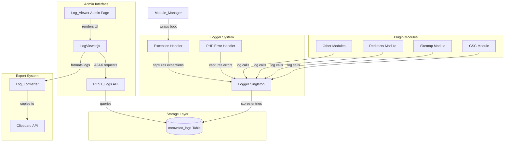

# Design Document: Debug Log and Error Viewer

## Overview

The Debug Log and Error Viewer module provides centralized logging, error capture, and AI-friendly log export capabilities for the MeowSEO WordPress plugin. This module enables developers to diagnose issues across all plugin modules through a unified logging system with database storage, automatic error capture, and formatted export for AI-powered debugging tools.

### Key Features

- **Centralized Logging**: Singleton Logger class with static methods accessible from any module
- **Automatic Error Capture**: PHP error handler and exception catching integrated into Module_Manager
- **Database Storage**: Custom meowseo_logs table with indexed columns for efficient querying
- **Log Deduplication**: Hash-based matching with time window to prevent log spam
- **Admin UI**: WordPress admin page with AJAX-powered filtering, pagination, and bulk operations
- **AI-Friendly Export**: Markdown-formatted log output with system context for AI debugging assistants
- **Security**: Capability checks, nonce verification, and sensitive data sanitization

### Design Principles

1. **WordPress Standards**: Follow WordPress coding standards and conventions
2. **Modular Architecture**: Integrate seamlessly with existing plugin structure
3. **Performance**: Efficient database queries with proper indexing
4. **Security**: Protect sensitive debug information with capability checks
5. **Developer Experience**: Easy-to-use logging API with minimal boilerplate

## Architecture

### High-Level Component Diagram



### Component Responsibilities

#### Logger (includes/helpers/class-logger.php)
- Singleton pattern implementation
- Static methods for each log level (debug, info, warning, error, critical)
- Database storage with prepared statements
- Log deduplication logic
- Automatic log cleanup (1000 entry limit)
- Sensitive data sanitization
- PHP error handler registration
- Fatal error capture via shutdown function

#### Log_Formatter (includes/helpers/class-log-formatter.php)
- Parse JSON context data from database
- Format log entries as markdown
- Include system context (plugin version, WordPress version, PHP version)
- Include active module list
- Format stack traces with file paths and line numbers
- Round-trip parsing validation

#### Log_Viewer (includes/admin/class-log-viewer.php)
- Register WordPress admin submenu
- Render admin page with React root element
- Verify manage_options capability
- Conditional visibility based on WP_DEBUG or explicit debug mode

#### REST_Logs (includes/rest/class-rest-logs.php)
- Register REST API endpoints under meowseo/v1 namespace
- GET /logs endpoint with filtering and pagination
- DELETE /logs endpoint for bulk deletion
- GET /logs/{id}/formatted endpoint for single entry export
- Capability checks (manage_options)
- Nonce verification for mutations

#### LogViewer.js (src/admin/LogViewer.js)
- React component for log table UI
- Filter controls (level, module, date range)
- Pagination controls
- Expandable rows for context and stack traces
- Bulk selection checkboxes
- AJAX requests to REST API
- Clipboard API integration
- Session storage for filter persistence

#### Module_Manager Integration
- Wrap module boot() calls in try-catch blocks
- Log exceptions via Logger
- Continue booting other modules after exception

## Components and Interfaces

### Logger Class

**File**: `includes/helpers/class-logger.php`

**Singleton Pattern**:
```php
class Logger {
    private static ?Logger $instance = null;
    
    public static function get_instance(): Logger {
        if (null === self::$instance) {
            self::$instance = new self();
        }
        return self::$instance;
    }
    
    private function __construct() {
        $this->register_error_handlers();
    }
}
```

**Public API**:
```php
// Static methods for easy access
public static function debug(string $message, array $context = []): void
public static function info(string $message, array $context = []): void
public static function warning(string $message, array $context = []): void
public static function error(string $message, array $context = []): void
public static function critical(string $message, array $context = []): void
```

**Internal Methods**:
```php
private function log(string $level, string $message, array $context = []): void
private function store_log_entry(array $data): void
private function deduplicate_log(array $data): bool
private function cleanup_old_logs(): void
private function sanitize_context(array $context): array
private function register_error_handlers(): void
private function error_handler(int $errno, string $errstr, string $errfile, int $errline): bool
private function shutdown_handler(): void
private function get_calling_module(): string
```

**Error Handler Integration**:
```php
// Register custom error handler
set_error_handler([$this, 'error_handler'], E_ALL);

// Register shutdown function for fatal errors
register_shutdown_function([$this, 'shutdown_handler']);
```

**Error Level Mapping**:
- E_ERROR, E_PARSE, E_CORE_ERROR, E_COMPILE_ERROR → CRITICAL
- E_WARNING, E_CORE_WARNING, E_COMPILE_WARNING → WARNING
- E_NOTICE, E_USER_NOTICE → INFO
- E_DEPRECATED, E_USER_DEPRECATED → DEBUG

### Log_Formatter Class

**File**: `includes/helpers/class-log-formatter.php`

**Public API**:
```php
public static function format_for_ai(array $log_entries): string
public static function format_single_entry(array $entry): string
public static function parse_context(string $json_context): array
private static function get_system_context(): array
private static function get_active_modules(): array
private static function format_stack_trace(string $stack_trace): string
```

**Output Format**:
```markdown
# MeowSEO Debug Log Export

## System Information
- Plugin Version: 1.0.0
- WordPress Version: 6.4.2
- PHP Version: 8.1.0
- Active Modules: meta, schema, sitemap, redirects

## Log Entries

### Entry 1: ERROR - GSC Module
**Timestamp**: 2024-01-15 10:30:45
**Module**: gsc
**Message**: OAuth authentication failed

**Context**:
```json
{
  "job_type": "fetch_url",
  "error_code": "invalid_grant"
}
```

**Stack Trace**:
```
#0 /path/to/includes/modules/gsc/class-gsc.php(123): GSC->execute_api_call()
#1 /path/to/includes/modules/gsc/class-gsc.php(89): GSC->process_queue_entry()
```
```

### REST_Logs Class

**File**: `includes/rest/class-rest-logs.php`

**Endpoints**:

1. **GET /meowseo/v1/logs**
   - Query Parameters: level, module, start_date, end_date, page, per_page
   - Response: `{ logs: [], total: 0, pages: 0 }`
   - Permission: manage_options

2. **DELETE /meowseo/v1/logs**
   - Body: `{ ids: [1, 2, 3] }`
   - Response: `{ success: true, deleted: 3 }`
   - Permission: manage_options
   - Nonce: Required

3. **GET /meowseo/v1/logs/{id}/formatted**
   - Response: `{ formatted: "markdown string" }`
   - Permission: manage_options

**Class Structure**:
```php
class REST_Logs {
    private Options $options;
    
    public function __construct(Options $options) {
        $this->options = $options;
    }
    
    public function register_routes(): void
    public function get_logs(\WP_REST_Request $request): \WP_REST_Response
    public function delete_logs(\WP_REST_Request $request): \WP_REST_Response
    public function get_formatted_log(\WP_REST_Request $request): \WP_REST_Response
    private function verify_nonce(\WP_REST_Request $request): bool
    private function manage_options_permission(): bool
}
```

### Log_Viewer Class

**File**: `includes/admin/class-log-viewer.php`

**Class Structure**:
```php
class Log_Viewer {
    private Options $options;
    
    public function __construct(Options $options) {
        $this->options = $options;
    }
    
    public function boot(): void
    public function register_admin_menu(): void
    public function render_log_viewer_page(): void
    public function enqueue_admin_assets(string $hook_suffix): void
    private function should_show_menu(): bool
}
```

**Menu Registration**:
```php
add_submenu_page(
    'meowseo-settings',
    __('Debug Logs', 'meowseo'),
    __('Debug Logs', 'meowseo'),
    'manage_options',
    'meowseo-logs',
    [$this, 'render_log_viewer_page']
);
```

**Conditional Visibility**:
- Show menu if WP_DEBUG is true
- Show menu if meowseo_debug_mode option is true
- Hide menu otherwise

### LogViewer.js Component

**File**: `src/admin/LogViewer.js`

**Component Structure**:
```javascript
import { useState, useEffect } from '@wordpress/element';
import { Button, CheckboxControl, SelectControl, DatePicker } from '@wordpress/components';
import apiFetch from '@wordpress/api-fetch';

export default function LogViewer() {
    const [logs, setLogs] = useState([]);
    const [filters, setFilters] = useState({
        level: [],
        module: '',
        startDate: null,
        endDate: null
    });
    const [pagination, setPagination] = useState({ page: 1, perPage: 50, total: 0 });
    const [selectedIds, setSelectedIds] = useState([]);
    const [expandedRows, setExpandedRows] = useState([]);
    
    // Fetch logs from REST API
    // Apply filters
    // Handle bulk operations
    // Copy to clipboard
}
```

**Key Features**:
- Filter controls with multi-select for log levels
- Date range picker for time filtering
- Expandable rows showing context and stack traces
- Bulk selection with "Select All" checkbox
- Bulk delete with confirmation
- "Copy for AI Editor" button using Clipboard API
- Session storage for filter persistence

## Data Models

### meowseo_logs Table Schema

```sql
CREATE TABLE {prefix}meowseo_logs (
    id BIGINT UNSIGNED NOT NULL AUTO_INCREMENT,
    level VARCHAR(20) NOT NULL,
    module VARCHAR(50) NOT NULL,
    message TEXT NOT NULL,
    message_hash CHAR(64) NOT NULL,
    context JSON NULL,
    stack_trace TEXT NULL,
    hit_count BIGINT UNSIGNED NOT NULL DEFAULT 1,
    created_at DATETIME NOT NULL DEFAULT CURRENT_TIMESTAMP,
    PRIMARY KEY (id),
    KEY idx_level (level),
    KEY idx_module (module),
    KEY idx_created_at (created_at),
    UNIQUE KEY idx_dedup (level, module, message_hash, created_at)
) {charset_collate};
```

**Column Descriptions**:
- `id`: Auto-incrementing primary key
- `level`: Log level (DEBUG, INFO, WARNING, ERROR, CRITICAL)
- `module`: Module name (gsc, sitemap, redirects, etc.)
- `message`: Log message text
- `message_hash`: SHA-256 hash of message for deduplication
- `context`: JSON-encoded context data
- `stack_trace`: Full stack trace for errors/exceptions
- `hit_count`: Number of duplicate occurrences
- `created_at`: Timestamp of first occurrence (updated for duplicates)

**Indexes**:
- `idx_level`: Fast filtering by log level
- `idx_module`: Fast filtering by module
- `idx_created_at`: Fast sorting and time-range filtering
- `idx_dedup`: Unique constraint for deduplication within 5-minute window

### Log Entry Data Structure

**PHP Array**:
```php
[
    'id' => 123,
    'level' => 'ERROR',
    'module' => 'gsc',
    'message' => 'OAuth authentication failed',
    'message_hash' => 'abc123...',
    'context' => '{"job_type":"fetch_url","error_code":"invalid_grant"}',
    'stack_trace' => '#0 /path/to/file.php(123): function()...',
    'hit_count' => 5,
    'created_at' => '2024-01-15 10:30:45'
]
```

**REST API Response**:
```json
{
    "logs": [
        {
            "id": 123,
            "level": "ERROR",
            "module": "gsc",
            "message": "OAuth authentication failed",
            "context": {
                "job_type": "fetch_url",
                "error_code": "invalid_grant"
            },
            "stack_trace": "#0 /path/to/file.php(123): function()...",
            "hit_count": 5,
            "created_at": "2024-01-15 10:30:45"
        }
    ],
    "total": 150,
    "pages": 3,
    "page": 1,
    "per_page": 50
}
```

## Correctness Properties

*A property is a characteristic or behavior that should hold true across all valid executions of a system—essentially, a formal statement about what the system should do. Properties serve as the bridge between human-readable specifications and machine-verifiable correctness guarantees.*

Before writing correctness properties, I need to analyze the acceptance criteria to determine which are testable as properties.


### Property Reflection

After analyzing all acceptance criteria, I've identified the following properties that need consolidation:

**Redundancies Identified:**
1. Properties 1.3 and 2.1 both test that logs are stored in database - can be combined
2. Properties 4.3 and 4.5 both test stack trace storage - 4.5 is redundant
3. Properties 5.1, 5.4, and 5.5 all test the 1000 entry limit - can be combined into one comprehensive property
4. Properties 6.1 and 6.4 both test deduplication counter increment - 6.4 is redundant
5. Properties 10.5 and 18.4 both test stack trace formatting - 18.4 is redundant
6. Properties 15.1 and 15.3 both test capability checks - 15.3 is redundant
7. Properties 16.1 and 16.3 both test nonce verification - 16.3 is redundant
8. Properties 17.1 and 17.2 both test sensitive data redaction - 17.2 is redundant

**Final Property Set:**
After eliminating redundancies, the following unique properties remain:

1. Log storage property (combines 1.3, 2.1)
2. Automatic field capture property (1.5)
3. Context serialization round-trip property (2.3)
4. PHP error capture property (3.2)
5. Error field capture property (3.3)
6. PHP error level mapping property (3.5)
7. Exception logging property (4.2)
8. Exception field capture property (4.3)
9. Module boot continuation property (4.4)
10. Log entry limit invariant (combines 5.1, 5.4, 5.5)
11. Cleanup trigger property (5.2)
12. Deduplication property (6.1)
13. Deduplication matching property (6.2)
14. Pagination property (7.4)
15. Filter matching property (8.2)
16. Session storage round-trip property (8.5)
17. System info inclusion property (10.1)
18. Module list inclusion property (10.2)
19. Entry field inclusion property (10.3)
20. Stack trace inclusion property (10.4)
21. Stack frame formatting property (10.5)
22. GSC context fields property (11.4)
23. Token sanitization property (11.5)
24. Sitemap context fields property (12.3)
25. Redirects context fields property (13.3)
26. REST response structure property (14.5)
27. Capability check property (15.1)
28. Nonce verification property (16.1)
29. Sensitive key redaction property (17.1)
30. Nested sanitization property (17.3)
31. Non-sensitive preservation property (17.4)
32. Context parsing property (18.1)
33. Format-parse round-trip property (18.5)

### Property 1: Log Storage

*For any* log method call (debug, info, warning, error, critical) with a message string, the Logger SHALL create an entry in the meowseo_logs table with the provided message.

**Validates: Requirements 1.3, 2.1**

### Property 2: Automatic Field Capture

*For any* log entry created, the Logger SHALL automatically populate the timestamp, module name, and log level fields without requiring explicit parameters.

**Validates: Requirements 1.5**

### Property 3: Context Serialization Round-Trip

*For any* valid PHP array provided as context, serializing to JSON then deserializing SHALL produce an equivalent array structure.

**Validates: Requirements 2.3**

### Property 4: PHP Error Capture

*For any* PHP error (E_ERROR, E_WARNING, E_NOTICE, etc.) that occurs within the MeowSEO namespace, the Logger SHALL create a log entry capturing the error.

**Validates: Requirements 3.2**

### Property 5: Error Field Capture

*For any* PHP error captured by the Logger, the log entry SHALL include error level, message, file path, and line number.

**Validates: Requirements 3.3**

### Property 6: PHP Error Level Mapping

*For any* PHP error level (E_ERROR, E_WARNING, E_NOTICE, etc.), the Logger SHALL map it to the appropriate log level (CRITICAL, WARNING, INFO, DEBUG) according to the defined mapping.

**Validates: Requirements 3.5**

### Property 7: Exception Logging

*For any* exception thrown during module boot(), the Module_Manager SHALL log the exception via Logger.

**Validates: Requirements 4.2**

### Property 8: Exception Field Capture

*For any* exception logged, the log entry SHALL include exception message, class name, file path, line number, and full stack trace.

**Validates: Requirements 4.3**

### Property 9: Module Boot Continuation

*For any* module that throws an exception during boot(), the Module_Manager SHALL continue attempting to boot subsequent modules in the list.

**Validates: Requirements 4.4**

### Property 10: Log Entry Limit Invariant

*For any* sequence of log operations, the meowseo_logs table SHALL never contain more than 1000 entries, with the oldest entries deleted when the limit is exceeded.

**Validates: Requirements 5.1, 5.4, 5.5**

### Property 11: Cleanup Trigger

*For any* new log entry insertion, the Logger SHALL check the entry count and trigger cleanup if it exceeds 1000.

**Validates: Requirements 5.2**

### Property 12: Deduplication

*For any* log entry that matches an existing entry (same level, module, message hash) within a 5-minute time window, the Logger SHALL increment the hit_count instead of creating a new entry.

**Validates: Requirements 6.1**

### Property 13: Deduplication Matching

*For any* two log entries, they SHALL be considered duplicates if and only if they have the same level, module, and message hash.

**Validates: Requirements 6.2**

### Property 14: Pagination

*For any* log collection with N entries and page size P, the number of pages SHALL be ceil(N/P) and each page SHALL contain at most P entries.

**Validates: Requirements 7.4**

### Property 15: Filter Matching

*For any* filter criteria (level, module, date range) applied to the log collection, all returned entries SHALL match the specified criteria.

**Validates: Requirements 8.2**

### Property 16: Session Storage Round-Trip

*For any* filter state saved to session storage, reloading the page SHALL restore the same filter state.

**Validates: Requirements 8.5**

### Property 17: System Info Inclusion

*For any* formatted log export, the output SHALL include plugin version, WordPress version, and PHP version.

**Validates: Requirements 10.1**

### Property 18: Module List Inclusion

*For any* formatted log export, the output SHALL include the list of currently active modules.

**Validates: Requirements 10.2**

### Property 19: Entry Field Inclusion

*For any* log entry in formatted output, the entry SHALL include error message, level, module, and timestamp.

**Validates: Requirements 10.3**

### Property 20: Stack Trace Inclusion

*For any* log entry with a non-null stack_trace field, the formatted output SHALL include the full stack trace.

**Validates: Requirements 10.4**

### Property 21: Stack Frame Formatting

*For any* stack trace with N frames, the formatted output SHALL include file path and line number for each of the N frames.

**Validates: Requirements 10.5**

### Property 22: GSC Context Fields

*For any* log entry created by the GSC module, the context SHALL include job_type and payload summary fields.

**Validates: Requirements 11.4**

### Property 23: Token Sanitization

*For any* log entry with an access token in the context, the token value SHALL be replaced with '[REDACTED]' before storage.

**Validates: Requirements 11.5**

### Property 24: Sitemap Context Fields

*For any* log entry created by the Sitemap module, the context SHALL include post_type and entry_count fields.

**Validates: Requirements 12.3**

### Property 25: Redirects Context Fields

*For any* log entry created by the Redirects module, the context SHALL include source_url and target_url fields.

**Validates: Requirements 13.3**

### Property 26: REST Response Structure

*For any* GET request to /meowseo/v1/logs, the response SHALL be a JSON object containing logs array, total count, page count, current page, and per_page values.

**Validates: Requirements 14.5**

### Property 27: Capability Check

*For any* REST API endpoint call without manage_options capability, the response SHALL be 403 Forbidden.

**Validates: Requirements 15.1, 15.3**

### Property 28: Nonce Verification

*For any* DELETE request to /meowseo/v1/logs without a valid nonce, the response SHALL be 403 Forbidden.

**Validates: Requirements 16.1, 16.3**

### Property 29: Sensitive Key Redaction

*For any* context data containing keys matching sensitive patterns (token, key, password, secret), the Logger SHALL replace the values with '[REDACTED]'.

**Validates: Requirements 17.1, 17.2**

### Property 30: Nested Sanitization

*For any* nested context structure containing sensitive keys at any depth level, the Logger SHALL sanitize all sensitive values regardless of nesting level.

**Validates: Requirements 17.3**

### Property 31: Non-Sensitive Preservation

*For any* context data containing non-sensitive keys, the Logger SHALL preserve the original values unchanged after sanitization.

**Validates: Requirements 17.4**

### Property 32: Context Parsing

*For any* log entry retrieved from the database with valid JSON context, the Log_Formatter SHALL parse it into a structured PHP array.

**Validates: Requirements 18.1**

### Property 33: Format-Parse Round-Trip

*For any* valid log entry, formatting to markdown then parsing back to structured data SHALL produce equivalent data structures.

**Validates: Requirements 18.5**

## Error Handling

### Logger Error Handling

**Database Connection Failures**:
- If database connection fails during log storage, Logger SHALL fail silently to prevent breaking application flow
- Logger SHALL attempt to write to PHP error_log as fallback
- Logger SHALL not throw exceptions from log methods

**Invalid Context Data**:
- If context contains non-serializable data (resources, closures), Logger SHALL convert to string representation
- If JSON encoding fails, Logger SHALL store error message in context field
- Logger SHALL never fail to log due to context serialization issues

**Circular Reference Detection**:
- Logger SHALL detect circular references in context arrays
- Logger SHALL replace circular references with "[CIRCULAR]" marker
- Logger SHALL use json_encode with JSON_PARTIAL_OUTPUT_ON_ERROR flag

### Module_Manager Error Handling

**Module Boot Exceptions**:
- Module_Manager SHALL catch all exceptions during module boot()
- Module_Manager SHALL log exception details via Logger
- Module_Manager SHALL continue booting remaining modules
- Module_Manager SHALL not re-throw exceptions

**Logger Unavailability**:
- If Logger is not available during exception handling, Module_Manager SHALL use error_log() as fallback
- Module_Manager SHALL not fail if logging fails

### REST API Error Handling

**Invalid Request Parameters**:
- REST_Logs SHALL validate all query parameters
- REST_Logs SHALL return 400 Bad Request for invalid parameters
- REST_Logs SHALL include error message in response body

**Database Query Failures**:
- REST_Logs SHALL catch database exceptions
- REST_Logs SHALL return 500 Internal Server Error
- REST_Logs SHALL log error details via Logger

**Permission Denied**:
- REST_Logs SHALL return 403 Forbidden for capability check failures
- REST_Logs SHALL return 403 Forbidden for nonce verification failures
- REST_Logs SHALL include descriptive error message

### Log_Formatter Error Handling

**Invalid JSON Context**:
- Log_Formatter SHALL catch JSON parsing exceptions
- Log_Formatter SHALL return empty array for invalid JSON
- Log_Formatter SHALL log parsing error via Logger

**Missing Required Fields**:
- Log_Formatter SHALL handle missing fields gracefully
- Log_Formatter SHALL use placeholder values for missing data
- Log_Formatter SHALL not throw exceptions

**Stack Trace Parsing Failures**:
- Log_Formatter SHALL handle malformed stack traces
- Log_Formatter SHALL include raw stack trace if parsing fails
- Log_Formatter SHALL continue formatting other entries

## Testing Strategy

### Dual Testing Approach

This feature requires both unit tests and property-based tests for comprehensive coverage:

**Unit Tests** focus on:
- Specific examples of log operations
- WordPress integration points (admin menu, REST API registration)
- UI component rendering
- Error handling edge cases
- Module integration examples

**Property-Based Tests** focus on:
- Universal properties that hold for all inputs
- Comprehensive input coverage through randomization
- Round-trip properties (serialization, formatting)
- Invariants (entry limit, deduplication)
- Security properties (sanitization, capability checks)

### Property-Based Testing Configuration

**Testing Library**: Use [WP_Mock](https://github.com/10up/wp_mock) with [Faker](https://github.com/FakerPHP/Faker) for property-based testing in PHP.

**Test Configuration**:
- Minimum 100 iterations per property test
- Each property test must reference its design document property
- Tag format: `@property Feature: debug-log-viewer, Property {number}: {property_text}`

**Example Property Test**:
```php
/**
 * @property Feature: debug-log-viewer, Property 3: Context Serialization Round-Trip
 * @test
 */
public function test_context_serialization_round_trip() {
    $faker = \Faker\Factory::create();
    
    for ($i = 0; $i < 100; $i++) {
        // Generate random context array
        $context = [
            'key1' => $faker->word,
            'key2' => $faker->numberBetween(1, 1000),
            'key3' => $faker->boolean,
            'nested' => [
                'key4' => $faker->sentence,
                'key5' => $faker->randomFloat(2, 0, 100)
            ]
        ];
        
        // Serialize then deserialize
        $json = json_encode($context);
        $decoded = json_decode($json, true);
        
        // Assert equivalence
        $this->assertEquals($context, $decoded);
    }
}
```

### Unit Testing Strategy

**Logger Class Tests**:
- Test singleton pattern implementation
- Test each log level method (debug, info, warning, error, critical)
- Test database storage with mocked $wpdb
- Test deduplication logic with time windows
- Test cleanup logic with various entry counts
- Test sensitive data sanitization with known patterns
- Test error handler registration
- Test PHP error capture with triggered errors

**Log_Formatter Class Tests**:
- Test markdown formatting with sample entries
- Test system context inclusion
- Test stack trace formatting
- Test JSON parsing with valid/invalid input
- Test round-trip with known data structures

**Log_Viewer Class Tests**:
- Test admin menu registration
- Test conditional visibility based on WP_DEBUG
- Test capability checks
- Test asset enqueuing

**REST_Logs Class Tests**:
- Test endpoint registration
- Test GET /logs with various query parameters
- Test DELETE /logs with valid/invalid IDs
- Test GET /logs/{id}/formatted
- Test capability checks with different user roles
- Test nonce verification with valid/invalid nonces

**Module Integration Tests**:
- Test GSC module logging with mocked API calls
- Test Sitemap module logging with mocked generation
- Test Redirects module logging with mocked operations
- Test Module_Manager exception handling with failing modules

### Integration Testing Strategy

**Database Integration**:
- Test table creation via Installer
- Test index creation and uniqueness constraints
- Test prepared statement usage
- Test SQL injection resistance

**WordPress Integration**:
- Test admin menu visibility in WordPress admin
- Test REST API endpoint availability
- Test nonce generation and verification
- Test capability checks with real WordPress users

**End-to-End Tests**:
- Test complete log flow: module logs → database → REST API → UI display
- Test bulk operations: select → delete → verify removal
- Test export flow: select → format → copy to clipboard
- Test filter flow: apply filters → fetch results → display

### Performance Testing

**Database Performance**:
- Test query performance with 1000 entries
- Test cleanup performance with bulk deletes
- Test index effectiveness with EXPLAIN queries

**Deduplication Performance**:
- Test deduplication with high-frequency duplicate logs
- Test unique index performance

**REST API Performance**:
- Test pagination with large result sets
- Test filtering with complex criteria

## Implementation Notes

### Database Schema Integration

Add the meowseo_logs table to `includes/class-installer.php`:

```php
private static function get_schema(): string {
    // ... existing tables ...
    
    $schema .= "
CREATE TABLE {$prefix}meowseo_logs (
    id BIGINT UNSIGNED NOT NULL AUTO_INCREMENT,
    level VARCHAR(20) NOT NULL,
    module VARCHAR(50) NOT NULL,
    message TEXT NOT NULL,
    message_hash CHAR(64) NOT NULL,
    context JSON NULL,
    stack_trace TEXT NULL,
    hit_count BIGINT UNSIGNED NOT NULL DEFAULT 1,
    created_at DATETIME NOT NULL DEFAULT CURRENT_TIMESTAMP,
    PRIMARY KEY (id),
    KEY idx_level (level),
    KEY idx_module (module),
    KEY idx_created_at (created_at),
    UNIQUE KEY idx_dedup (level, module, message_hash, created_at)
) $charset_collate;
";
    
    return $schema;
}
```

### Module_Manager Integration

Update `includes/class-module-manager.php` to wrap module boot calls:

```php
public function boot(): void {
    $enabled_modules = $this->options->get_enabled_modules();

    foreach ( $enabled_modules as $module_id ) {
        $this->load_module( $module_id );
    }

    // Boot all loaded modules with exception handling.
    foreach ( $this->modules as $module_id => $module ) {
        try {
            $module->boot();
        } catch ( \Exception $e ) {
            // Log exception via Logger (Requirement 4.2, 4.3).
            if ( class_exists( 'MeowSEO\Helpers\Logger' ) ) {
                \MeowSEO\Helpers\Logger::error(
                    sprintf( 'Failed to boot module: %s', $module_id ),
                    [
                        'exception_class' => get_class( $e ),
                        'exception_message' => $e->getMessage(),
                        'file' => $e->getFile(),
                        'line' => $e->getLine(),
                        'stack_trace' => $e->getTraceAsString(),
                    ]
                );
            } elseif ( defined( 'WP_DEBUG' ) && WP_DEBUG ) {
                error_log( 'MeowSEO: Failed to boot module: ' . $e->getMessage() );
            }
        }
    }
}
```

### Admin Class Integration

Update `includes/class-admin.php` to register Log_Viewer:

```php
public function boot(): void {
    add_action( 'admin_menu', array( $this, 'register_admin_menu' ) );
    add_action( 'admin_enqueue_scripts', array( $this, 'enqueue_admin_assets' ) );
    
    // Initialize Log_Viewer if available.
    if ( class_exists( 'MeowSEO\Admin\Log_Viewer' ) ) {
        $log_viewer = new \MeowSEO\Admin\Log_Viewer( $this->options );
        $log_viewer->boot();
    }
}
```

### REST API Integration

Update `includes/class-rest-api.php` to register REST_Logs routes:

```php
public function register_routes(): void {
    // Register meta CRUD endpoints.
    $this->register_meta_routes();

    // Register settings endpoints.
    $this->register_settings_routes();
    
    // Register log endpoints if REST_Logs is available.
    if ( class_exists( 'MeowSEO\REST\REST_Logs' ) ) {
        $rest_logs = new \MeowSEO\REST\REST_Logs( $this->options );
        $rest_logs->register_routes();
    }
}
```

### Module Logging Examples

**GSC Module**:
```php
// OAuth failure (Requirement 11.1)
\MeowSEO\Helpers\Logger::error(
    'OAuth authentication failed',
    [
        'job_type' => $job_type,
        'error_code' => 'invalid_grant',
        'access_token' => $credentials['access_token'], // Will be sanitized
    ]
);

// Rate limit (Requirement 11.2)
\MeowSEO\Helpers\Logger::warning(
    'Rate limit exceeded',
    [
        'job_type' => $job_type,
        'retry_after' => $retry_after,
    ]
);

// Batch complete (Requirement 11.3)
\MeowSEO\Helpers\Logger::info(
    'Batch processing completed',
    [
        'job_type' => $job_type,
        'processed_count' => count($entries),
    ]
);
```

**Sitemap Module**:
```php
// Generation failure (Requirement 12.1)
\MeowSEO\Helpers\Logger::error(
    'Sitemap generation failed',
    [
        'post_type' => $post_type,
        'error' => $error_message,
    ]
);

// Cache regeneration (Requirement 12.2)
\MeowSEO\Helpers\Logger::info(
    'Sitemap cache regenerated',
    [
        'post_type' => $post_type,
        'entry_count' => count($entries),
    ]
);

// File write failure (Requirement 12.4)
\MeowSEO\Helpers\Logger::error(
    'Failed to write sitemap file',
    [
        'file_path' => $file_path,
        'error' => $error_message,
    ]
);
```

**Redirects Module**:
```php
// Loop detection (Requirement 13.1)
\MeowSEO\Helpers\Logger::warning(
    'Redirect loop detected',
    [
        'source_url' => $source_url,
        'target_url' => $target_url,
    ]
);

// CSV import failure (Requirement 13.2)
\MeowSEO\Helpers\Logger::error(
    'CSV import failed',
    [
        'file_name' => $file_name,
        'error' => $error_message,
    ]
);

// CSV import success (Requirement 13.4)
\MeowSEO\Helpers\Logger::info(
    'CSV import completed',
    [
        'file_name' => $file_name,
        'row_count' => $row_count,
    ]
);
```

### Security Considerations

**Sensitive Data Patterns**:
The Logger SHALL scan for these patterns (case-insensitive):
- `token`
- `key`
- `password`
- `secret`
- `api_key`
- `access_token`
- `refresh_token`
- `client_secret`

**Sanitization Implementation**:
```php
private function sanitize_context(array $context): array {
    $sensitive_patterns = [
        'token',
        'key',
        'password',
        'secret',
        'api_key',
        'access_token',
        'refresh_token',
        'client_secret',
    ];
    
    return $this->sanitize_recursive($context, $sensitive_patterns);
}

private function sanitize_recursive(array $data, array $patterns): array {
    foreach ($data as $key => $value) {
        // Check if key matches sensitive pattern
        foreach ($patterns as $pattern) {
            if (stripos($key, $pattern) !== false) {
                $data[$key] = '[REDACTED]';
                continue 2;
            }
        }
        
        // Recursively sanitize nested arrays
        if (is_array($value)) {
            $data[$key] = $this->sanitize_recursive($value, $patterns);
        }
    }
    
    return $data;
}
```

**Capability Checks**:
All log operations require `manage_options` capability:
- Admin page access
- REST API endpoints
- Log export functionality

**Nonce Verification**:
All mutation operations (DELETE) require valid nonce:
- Generated with `wp_create_nonce('wp_rest')`
- Verified with `wp_verify_nonce()`
- Passed in `X-WP-Nonce` header

## File Structure

```
includes/
├── helpers/
│   ├── class-logger.php          # Singleton logger with error handlers
│   └── class-log-formatter.php   # Formatting for AI export
├── admin/
│   └── class-log-viewer.php      # WordPress admin page
├── rest/
│   └── class-rest-logs.php       # REST API endpoints
└── class-installer.php           # Updated with logs table schema

src/
└── admin/
    └── LogViewer.js              # React UI component
```

## Dependencies

**PHP Dependencies**:
- WordPress 5.0+ (for REST API)
- PHP 7.4+ (for typed properties)
- MySQL 5.7+ or MariaDB 10.2+ (for JSON column type)

**JavaScript Dependencies**:
- @wordpress/element (React)
- @wordpress/components (UI components)
- @wordpress/api-fetch (REST API client)
- @wordpress/i18n (internationalization)

**WordPress APIs**:
- set_error_handler() for PHP error capture
- register_shutdown_function() for fatal error capture
- register_rest_route() for REST API
- add_submenu_page() for admin menu
- wp_create_nonce() / wp_verify_nonce() for CSRF protection
- current_user_can() for capability checks

## Conclusion

The Debug Log and Error Viewer module provides a comprehensive logging solution for the MeowSEO plugin with centralized logging, automatic error capture, database storage, admin UI, and AI-friendly export capabilities. The design follows WordPress standards, integrates seamlessly with existing plugin architecture, and includes robust security measures to protect sensitive debug information.

The module enables developers to diagnose issues across all plugin modules through a unified interface, with property-based testing ensuring correctness across all input variations and edge cases.
