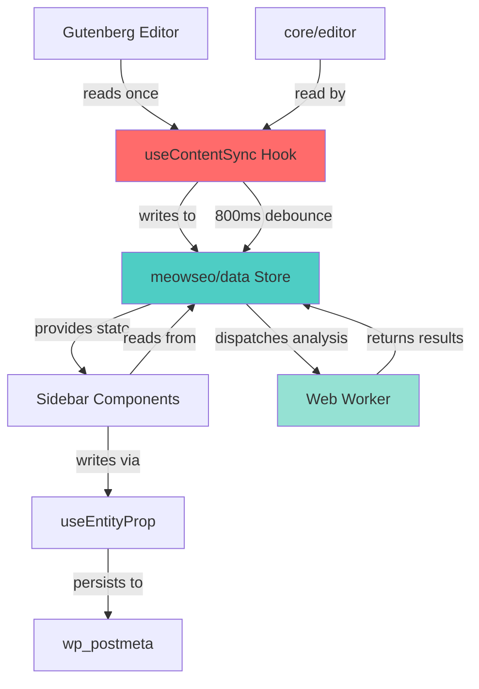
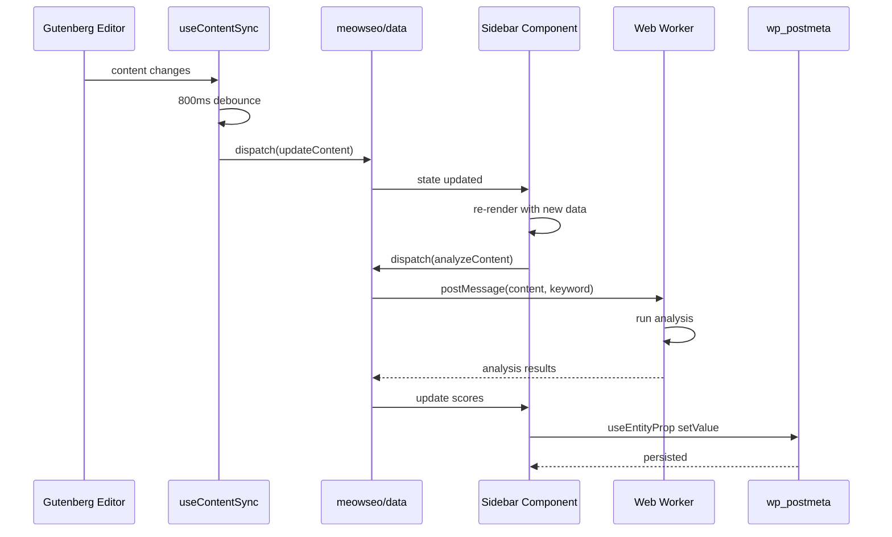

# Design Document: Gutenberg Editor Integration

## Overview

The Gutenberg Editor Integration feature provides a complete React-based sidebar for the MeowSEO WordPress plugin that editors use inside the block editor. This design addresses the performance problems found in RankMath and Yoast SEO (unnecessary re-renders, large bundle sizes, components reading directly from core/editor) by implementing a custom Redux store (meowseo/data) as the single source of truth, with one centralized useContentSync hook as the ONLY place allowed to read from core/editor. The architecture uses an 800ms debounce for content updates and a Web Worker for analysis to avoid blocking the UI thread, ensuring a lean, performant Gutenberg integration.

The sidebar provides four main tabs (General, Social, Schema, Advanced) with an always-visible ContentScoreWidget at the top. All postmeta reads/writes use useEntityProp for seamless WordPress integration. The design includes compatibility shims for WordPress 6.6+ where PluginSidebar moved from @wordpress/edit-post to @wordpress/editor.

## Architecture



### Key Architectural Decisions

1. **Single Source of Truth**: The meowseo/data Redux store is the ONLY state container for SEO data in the editor
2. **Centralized Content Sync**: useContentSync is the ONLY hook allowed to read from core/editor, preventing scattered subscriptions
3. **Debounced Updates**: 800ms debounce on content changes prevents excessive re-renders and analysis runs
4. **Web Worker Analysis**: SEO and readability analysis runs in a separate thread to keep UI responsive
5. **useEntityProp for Persistence**: All postmeta operations use WordPress's built-in useEntityProp hook for automatic save handling
6. **Compatibility Layer**: Version detection and dynamic imports handle WordPress 6.6+ PluginSidebar location changes

## Main Workflow Sequence



## Components and Interfaces

### Component Hierarchy

```
PluginSidebar (meowseo-sidebar)
├── ContentScoreWidget (always visible)
│   ├── CircularProgress
│   ├── ScoreIndicator
│   └── AnalyzeButton
├── TabBar
│   ├── GeneralTab
│   ├── SocialTab
│   ├── SchemaTab
│   └── AdvancedTab
└── TabContent
    ├── GeneralTabContent
    │   ├── SerpPreview
    │   ├── FocusKeywordInput
    │   ├── DirectAnswerField
    │   └── InternalLinkSuggestions
    ├── SocialTabContent
    │   ├── FacebookSubTab
    │   │   ├── TitleInput
    │   │   ├── DescriptionTextarea
    │   │   ├── ImagePicker
    │   │   └── PreviewCard
    │   └── TwitterSubTab
    │       ├── TitleInput
    │       ├── DescriptionTextarea
    │       ├── ImagePicker
    │       ├── PreviewCard
    │       └── UseOGImageToggle
    ├── SchemaTabContent
    │   ├── SchemaTypeSelector
    │   └── DynamicSchemaForm
    │       ├── ArticleForm
    │       ├── FAQPageForm (repeatable Q&A)
    │       ├── HowToForm (repeatable steps)
    │       ├── LocalBusinessForm
    │       └── ProductForm
    └── AdvancedTabContent
        ├── RobotsToggles (noindex/nofollow)
        ├── CanonicalURLInput
        ├── ResolvedURLDisplay
        ├── GSCLastSubmitDisplay
        └── RequestIndexingButton
```

### Core Interfaces

#### Store State Interface

```typescript
interface MeowSEOState {
  // Analysis scores
  seoScore: number; // 0-100
  readabilityScore: number; // 0-100
  analysisResults: AnalysisResult[];
  
  // UI state
  activeTab: 'general' | 'social' | 'schema' | 'advanced';
  isAnalyzing: boolean;
  
  // Content snapshot
  contentSnapshot: ContentSnapshot;
}

interface AnalysisResult {
  id: string;
  type: 'good' | 'ok' | 'problem';
  message: string;
}

interface ContentSnapshot {
  title: string;
  content: string;
  excerpt: string;
  focusKeyword: string;
  postType: string;
  permalink: string;
}
```

#### Component Props Interfaces

```typescript
interface SidebarProps {
  postId: number;
  postType: string;
}

interface ContentScoreWidgetProps {
  seoScore: number;
  readabilityScore: number;
  analysisResults: AnalysisResult[];
  isAnalyzing: boolean;
  onAnalyze: () => void;
}

interface SerpPreviewProps {
  title: string;
  description: string;
  url: string;
  mode: 'desktop' | 'mobile';
  onModeChange: (mode: 'desktop' | 'mobile') => void;
}

interface FocusKeywordInputProps {
  value: string;
  onChange: (value: string) => void;
  relatedResults: AnalysisResult[];
}

interface InternalLinkSuggestionsProps {
  postId: number;
  focusKeyword: string;
  suggestions: LinkSuggestion[];
  isLoading: boolean;
}

interface LinkSuggestion {
  postId: number;
  title: string;
  url: string;
  relevanceScore: number;
}

interface SchemaFormProps {
  schemaType: string;
  config: Record<string, any>;
  onChange: (config: Record<string, any>) => void;
}
```

## Data Models

### Postmeta Keys

All SEO data is stored in wp_postmeta with the following keys:

```typescript
const POSTMETA_KEYS = {
  // General tab
  TITLE: '_meowseo_title',
  DESCRIPTION: '_meowseo_description',
  FOCUS_KEYWORD: '_meowseo_focus_keyword',
  DIRECT_ANSWER: '_meowseo_direct_answer',
  
  // Social tab
  OG_TITLE: '_meowseo_og_title',
  OG_DESCRIPTION: '_meowseo_og_description',
  OG_IMAGE_ID: '_meowseo_og_image_id',
  TWITTER_TITLE: '_meowseo_twitter_title',
  TWITTER_DESCRIPTION: '_meowseo_twitter_description',
  TWITTER_IMAGE_ID: '_meowseo_twitter_image_id',
  USE_OG_FOR_TWITTER: '_meowseo_use_og_for_twitter',
  
  // Schema tab
  SCHEMA_TYPE: '_meowseo_schema_type',
  SCHEMA_CONFIG: '_meowseo_schema_config',
  
  // Advanced tab
  ROBOTS_NOINDEX: '_meowseo_robots_noindex',
  ROBOTS_NOFOLLOW: '_meowseo_robots_nofollow',
  CANONICAL: '_meowseo_canonical',
  GSC_LAST_SUBMIT: '_meowseo_gsc_last_submit',
} as const;
```

### Schema Configuration Models

```typescript
interface ArticleSchema {
  type: 'Article';
  headline: string;
  datePublished: string;
  dateModified: string;
  author: string;
}

interface FAQPageSchema {
  type: 'FAQPage';
  questions: Array<{
    question: string;
    answer: string;
  }>;
}

interface HowToSchema {
  type: 'HowTo';
  name: string;
  steps: Array<{
    name: string;
    text: string;
    image?: string;
  }>;
}

interface LocalBusinessSchema {
  type: 'LocalBusiness';
  name: string;
  address: {
    streetAddress: string;
    addressLocality: string;
    addressRegion: string;
    postalCode: string;
    addressCountry: string;
  };
  telephone: string;
  openingHours: string[];
  geo?: {
    latitude: number;
    longitude: number;
  };
}

interface ProductSchema {
  type: 'Product';
  name: string;
  description: string;
  sku: string;
  offers: {
    price: number;
    priceCurrency: string;
    availability: string;
  };
}

type SchemaConfig = 
  | ArticleSchema 
  | FAQPageSchema 
  | HowToSchema 
  | LocalBusinessSchema 
  | ProductSchema;
```

## Algorithmic Pseudocode

### Main Content Sync Algorithm

```typescript
/**
 * useContentSync Hook
 * 
 * The ONLY hook allowed to read from core/editor.
 * Implements 800ms debounce to prevent excessive updates.
 */
function useContentSync(): void {
  const { dispatch } = useDispatch('meowseo/data');
  const { select } = useSelect('core/editor');
  
  // Read from core/editor (ONLY place this is allowed)
  const title = select.getEditedPostAttribute('title');
  const content = select.getEditedPostAttribute('content');
  const excerpt = select.getEditedPostAttribute('excerpt');
  const postType = select.getCurrentPostType();
  const permalink = select.getPermalink();
  
  // 800ms debounce
  useEffect(() => {
    const timeoutId = setTimeout(() => {
      dispatch.updateContentSnapshot({
        title,
        content,
        excerpt,
        postType,
        permalink,
      });
    }, 800);
    
    return () => clearTimeout(timeoutId);
  }, [title, content, excerpt, postType, permalink]);
}
```

**Preconditions:**
- Gutenberg editor is loaded and core/editor store is available
- meowseo/data store is registered
- Component is mounted in editor context

**Postconditions:**
- Content snapshot in meowseo/data store is updated after 800ms of inactivity
- No direct subscriptions to core/editor exist in any other component
- Debounce timer is cleaned up on unmount

**Loop Invariants:** N/A (no loops)

### Analysis Worker Algorithm

```typescript
/**
 * Web Worker: SEO Analysis
 * 
 * Runs in separate thread to avoid blocking UI.
 * Analyzes content against focus keyword.
 */
function analyzeSEO(data: AnalysisInput): AnalysisOutput {
  const { title, description, content, slug, focusKeyword } = data;
  const results: AnalysisResult[] = [];
  let score = 0;
  
  // Check 1: Focus keyword in title
  if (focusKeyword && title.toLowerCase().includes(focusKeyword.toLowerCase())) {
    results.push({
      id: 'keyword-in-title',
      type: 'good',
      message: 'Focus keyword appears in SEO title',
    });
    score += 20;
  } else if (focusKeyword) {
    results.push({
      id: 'keyword-in-title',
      type: 'problem',
      message: 'Focus keyword missing from SEO title',
    });
  }
  
  // Check 2: Focus keyword in description
  if (focusKeyword && description.toLowerCase().includes(focusKeyword.toLowerCase())) {
    results.push({
      id: 'keyword-in-description',
      type: 'good',
      message: 'Focus keyword appears in meta description',
    });
    score += 20;
  } else if (focusKeyword) {
    results.push({
      id: 'keyword-in-description',
      type: 'problem',
      message: 'Focus keyword missing from meta description',
    });
  }
  
  // Check 3: Focus keyword in first paragraph
  const firstParagraph = extractFirstParagraph(content);
  if (focusKeyword && firstParagraph.toLowerCase().includes(focusKeyword.toLowerCase())) {
    results.push({
      id: 'keyword-in-first-paragraph',
      type: 'good',
      message: 'Focus keyword appears in first paragraph',
    });
    score += 20;
  } else if (focusKeyword) {
    results.push({
      id: 'keyword-in-first-paragraph',
      type: 'problem',
      message: 'Focus keyword missing from first paragraph',
    });
  }
  
  // Check 4: Focus keyword in headings
  const headings = extractHeadings(content);
  const keywordInHeadings = headings.some(h => 
    h.toLowerCase().includes(focusKeyword.toLowerCase())
  );
  if (focusKeyword && keywordInHeadings) {
    results.push({
      id: 'keyword-in-headings',
      type: 'good',
      message: 'Focus keyword appears in at least one heading',
    });
    score += 20;
  } else if (focusKeyword) {
    results.push({
      id: 'keyword-in-headings',
      type: 'problem',
      message: 'Focus keyword missing from headings',
    });
  }
  
  // Check 5: Focus keyword in URL slug
  if (focusKeyword && slug.includes(focusKeyword.toLowerCase().replace(/\s+/g, '-'))) {
    results.push({
      id: 'keyword-in-slug',
      type: 'good',
      message: 'Focus keyword appears in URL slug',
    });
    score += 20;
  } else if (focusKeyword) {
    results.push({
      id: 'keyword-in-slug',
      type: 'problem',
      message: 'Focus keyword missing from URL slug',
    });
  }
  
  // Determine color
  let color: 'red' | 'orange' | 'green';
  if (score < 40) {
    color = 'red';
  } else if (score < 70) {
    color = 'orange';
  } else {
    color = 'green';
  }
  
  return { score, results, color };
}
```

**Preconditions:**
- data object contains all required fields (title, description, content, slug, focusKeyword)
- focusKeyword may be empty string (analysis will skip keyword checks)
- content is HTML string

**Postconditions:**
- Returns AnalysisOutput with score 0-100
- results array contains 0-5 items depending on focus keyword presence
- color is 'red' (<40), 'orange' (40-70), or 'green' (>70)
- No side effects on input data

**Loop Invariants:**
- For heading iteration: All previously checked headings remain valid
- Score accumulates monotonically (never decreases)

### Internal Link Suggestions Algorithm

```typescript
/**
 * Fetch Internal Link Suggestions
 * 
 * Debounced 3 seconds to avoid excessive API calls.
 * Fetches suggestions based on focus keyword.
 */
async function fetchInternalLinkSuggestions(
  postId: number,
  focusKeyword: string
): Promise<LinkSuggestion[]> {
  if (!focusKeyword || focusKeyword.length < 3) {
    return [];
  }
  
  try {
    const response = await apiFetch({
      path: `/meowseo/v1/internal-links/suggestions`,
      method: 'POST',
      data: {
        post_id: postId,
        keyword: focusKeyword,
        limit: 5,
      },
    });
    
    return response.suggestions;
  } catch (error) {
    console.error('Failed to fetch link suggestions:', error);
    return [];
  }
}

// Usage with debounce
function useInternalLinkSuggestions(postId: number, focusKeyword: string) {
  const [suggestions, setSuggestions] = useState<LinkSuggestion[]>([]);
  const [isLoading, setIsLoading] = useState(false);
  
  useEffect(() => {
    setIsLoading(true);
    
    const timeoutId = setTimeout(async () => {
      const results = await fetchInternalLinkSuggestions(postId, focusKeyword);
      setSuggestions(results);
      setIsLoading(false);
    }, 3000); // 3-second debounce
    
    return () => {
      clearTimeout(timeoutId);
      setIsLoading(false);
    };
  }, [postId, focusKeyword]);
  
  return { suggestions, isLoading };
}
```

**Preconditions:**
- postId is valid post ID (> 0)
- focusKeyword is string (may be empty)
- REST API endpoint /meowseo/v1/internal-links/suggestions exists
- User has edit_posts capability

**Postconditions:**
- Returns array of LinkSuggestion objects (may be empty)
- If focusKeyword < 3 chars, returns empty array immediately
- If API call fails, returns empty array and logs error
- Debounce timer is cleaned up on unmount or keyword change

**Loop Invariants:** N/A (async operation, no loops)

## Key Functions with Formal Specifications

### Function 1: registerStore()

```typescript
function registerStore(): void {
  register(createReduxStore('meowseo/data', {
    reducer,
    actions,
    selectors,
    controls,
  }));
}
```

**Preconditions:**
- @wordpress/data is loaded
- Store name 'meowseo/data' is not already registered
- reducer, actions, selectors, controls are defined

**Postconditions:**
- Store is registered and accessible via select('meowseo/data') and dispatch('meowseo/data')
- Initial state is set to default values
- No side effects on other stores

**Loop Invariants:** N/A

### Function 2: updateContentSnapshot()

```typescript
function updateContentSnapshot(snapshot: ContentSnapshot): Action {
  return {
    type: 'UPDATE_CONTENT_SNAPSHOT',
    payload: snapshot,
  };
}
```

**Preconditions:**
- snapshot object contains all required fields
- snapshot.title is string
- snapshot.content is string
- snapshot.excerpt is string
- snapshot.focusKeyword is string
- snapshot.postType is string
- snapshot.permalink is string

**Postconditions:**
- Returns action object with type and payload
- Action can be dispatched to meowseo/data store
- No mutations to input snapshot

**Loop Invariants:** N/A

### Function 3: analyzeContent()

```typescript
async function analyzeContent(): Promise<void> {
  const state = select('meowseo/data').getState();
  const { contentSnapshot } = state;
  
  dispatch('meowseo/data').setAnalyzing(true);
  
  try {
    const worker = new Worker('/path/to/analysis-worker.js');
    
    const result = await new Promise<AnalysisOutput>((resolve, reject) => {
      worker.onmessage = (e) => resolve(e.data);
      worker.onerror = (e) => reject(e);
      worker.postMessage(contentSnapshot);
    });
    
    dispatch('meowseo/data').setAnalysisResults(result);
  } catch (error) {
    console.error('Analysis failed:', error);
  } finally {
    dispatch('meowseo/data').setAnalyzing(false);
  }
}
```

**Preconditions:**
- meowseo/data store is registered
- contentSnapshot in state is populated
- Web Worker file exists at specified path
- Browser supports Web Workers

**Postconditions:**
- isAnalyzing is set to true before analysis
- isAnalyzing is set to false after analysis (success or failure)
- On success: analysisResults, seoScore, readabilityScore are updated in store
- On failure: error is logged, isAnalyzing is still set to false
- Worker is terminated after completion

**Loop Invariants:** N/A (async operation)

### Function 4: useEntityPropBinding()

```typescript
function useEntityPropBinding(
  metaKey: string
): [string, (value: string) => void] {
  const postType = useSelect(
    (select) => select('core/editor').getCurrentPostType(),
    []
  );
  const postId = useSelect(
    (select) => select('core/editor').getCurrentPostId(),
    []
  );
  
  const [meta, setMeta] = useEntityProp(
    'postType',
    postType,
    'meta',
    postId
  );
  
  const value = meta?.[metaKey] || '';
  const setValue = useCallback(
    (newValue: string) => {
      setMeta({ ...meta, [metaKey]: newValue });
    },
    [meta, metaKey, setMeta]
  );
  
  return [value, setValue];
}
```

**Preconditions:**
- metaKey is valid postmeta key string
- core/editor store is available
- Post is being edited (postId > 0)
- useEntityProp hook is available from @wordpress/core-data

**Postconditions:**
- Returns tuple [value, setValue]
- value is current postmeta value or empty string
- setValue updates postmeta and triggers auto-save
- No direct database queries (handled by WordPress)

**Loop Invariants:** N/A

## Example Usage

### Example 1: Basic Sidebar Registration

```typescript
import { registerPlugin } from '@wordpress/plugins';
import { PluginSidebar } from '@wordpress/edit-post'; // or @wordpress/editor for WP 6.6+
import { Sidebar } from './components/Sidebar';

registerPlugin('meowseo-sidebar', {
  render: () => (
    <PluginSidebar
      name="meowseo-sidebar"
      title="MeowSEO"
      icon="chart-line"
    >
      <Sidebar />
    </PluginSidebar>
  ),
});
```

### Example 2: Using useContentSync

```typescript
import { useEffect } from '@wordpress/element';
import { useSelect, useDispatch } from '@wordpress/data';

function Sidebar() {
  // This is the ONLY place we read from core/editor
  useContentSync();
  
  const { activeTab } = useSelect((select) => ({
    activeTab: select('meowseo/data').getActiveTab(),
  }));
  
  return (
    <div className="meowseo-sidebar">
      <ContentScoreWidget />
      <TabBar />
      <TabContent activeTab={activeTab} />
    </div>
  );
}
```

### Example 3: Using useEntityProp for Postmeta

```typescript
function FocusKeywordInput() {
  const [focusKeyword, setFocusKeyword] = useEntityPropBinding('_meowseo_focus_keyword');
  
  return (
    <TextControl
      label="Focus Keyword"
      value={focusKeyword}
      onChange={setFocusKeyword}
      help="Enter the main keyword for this content"
    />
  );
}
```

### Example 4: Complete Workflow

```typescript
// 1. User types in editor
// 2. useContentSync reads from core/editor (800ms debounce)
// 3. Content snapshot updated in meowseo/data
// 4. User clicks "Analyze" button
// 5. analyzeContent() dispatched
// 6. Web Worker performs analysis
// 7. Results returned to store
// 8. ContentScoreWidget re-renders with new scores
// 9. User edits focus keyword
// 10. useEntityProp persists to wp_postmeta
// 11. Auto-save triggered by WordPress
```

## Correctness Properties

### Universal Quantification Statements

1. **Single Content Sync Source**
   - ∀ component ∈ SidebarComponents: component ≠ useContentSync ⟹ ¬reads(component, 'core/editor')
   - "For all components in the sidebar, if the component is not useContentSync, then it does not read from core/editor"

2. **Debounce Guarantee**
   - ∀ contentChange ∈ ContentChanges: timeSince(contentChange) < 800ms ⟹ ¬dispatched(updateContentSnapshot)
   - "For all content changes, if less than 800ms have passed, then updateContentSnapshot has not been dispatched"

3. **Analysis Non-Blocking**
   - ∀ analysisRun ∈ AnalysisRuns: runs(analysisRun, WebWorker) ∧ ¬blocks(analysisRun, UIThread)
   - "For all analysis runs, the analysis runs in a Web Worker and does not block the UI thread"

4. **Postmeta Persistence**
   - ∀ metaField ∈ PostmetaFields: updated(metaField) ⟹ ∃ useEntityProp: persists(useEntityProp, metaField)
   - "For all postmeta fields, if a field is updated, then there exists a useEntityProp call that persists it"

5. **Score Color Mapping**
   - ∀ score ∈ SEOScores: (score < 40 ⟹ color = 'red') ∧ (40 ≤ score < 70 ⟹ color = 'orange') ∧ (score ≥ 70 ⟹ color = 'green')
   - "For all SEO scores, the color is red if score < 40, orange if 40-70, green if ≥ 70"

6. **No Keystroke Re-renders**
   - ∀ keystroke ∈ EditorKeystrokes: ¬triggers(keystroke, componentRerender) where component ∈ SidebarComponents
   - "For all keystrokes in the editor, no keystroke triggers a re-render of sidebar components"

7. **Tab State Isolation**
   - ∀ tab ∈ Tabs: activeTab ≠ tab ⟹ ¬rendered(tabContent(tab))
   - "For all tabs, if a tab is not active, then its content is not rendered"

## Error Handling

### Error Scenario 1: Web Worker Unavailable

**Condition**: Browser does not support Web Workers or worker file fails to load
**Response**: Fall back to main thread analysis with warning logged
**Recovery**: Display warning to user that analysis may be slower; continue with degraded functionality

### Error Scenario 2: REST API Failure

**Condition**: Internal link suggestions API call fails (network error, 500 response)
**Response**: Catch error, log to console, return empty suggestions array
**Recovery**: Display "Unable to load suggestions" message; allow user to retry

### Error Scenario 3: Invalid Postmeta Value

**Condition**: useEntityProp returns null or undefined for expected postmeta key
**Response**: Fall back to empty string or default value
**Recovery**: Continue with default value; no user-facing error

### Error Scenario 4: WordPress 6.6+ Compatibility

**Condition**: PluginSidebar import from @wordpress/edit-post fails in WP 6.6+
**Response**: Detect WordPress version, dynamically import from @wordpress/editor instead
**Recovery**: Seamless fallback with version detection; no user impact

### Error Scenario 5: Analysis Timeout

**Condition**: Web Worker analysis takes longer than 10 seconds
**Response**: Terminate worker, set isAnalyzing to false, log timeout error
**Recovery**: Display "Analysis timed out" message; allow user to retry

## Testing Strategy

### Unit Testing Approach

**Framework**: Jest with @testing-library/react

**Key Test Cases**:
1. Store registration and initial state
2. Action creators return correct action objects
3. Reducers update state correctly for each action type
4. Selectors return correct derived state
5. useContentSync debounces correctly (800ms)
6. useEntityPropBinding reads and writes postmeta
7. Analysis worker returns correct scores for sample content
8. Color mapping (red/orange/green) based on score thresholds
9. Tab switching updates activeTab state
10. Component rendering based on activeTab

**Coverage Goals**: 80% line coverage, 90% branch coverage for critical paths

### Property-Based Testing Approach

**Property Test Library**: fast-check (JavaScript/TypeScript)

**Properties to Test**:
1. **Debounce Property**: For any sequence of content changes within 800ms, only one updateContentSnapshot is dispatched
2. **Score Bounds Property**: For any analysis input, the returned score is always 0 ≤ score ≤ 100
3. **Color Consistency Property**: For any score, the color mapping is deterministic and follows the defined thresholds
4. **Idempotent Analysis Property**: Running analysis twice on the same content produces identical results
5. **Postmeta Serialization Property**: For any postmeta value, serialize then deserialize produces the original value

### Integration Testing Approach

**Framework**: @wordpress/e2e-test-utils with Puppeteer

**Integration Test Cases**:
1. Sidebar appears in Gutenberg editor with MeowSEO icon
2. Typing in editor triggers content sync after 800ms (visible in React DevTools)
3. Clicking "Analyze" button updates scores without console errors
4. Changing focus keyword persists after save and reload
5. Tab switching works without errors
6. SERP preview updates with 800ms debounce
7. Internal link suggestions load after 3-second debounce
8. Schema form changes persist to postmeta
9. Advanced tab toggles update postmeta correctly
10. React DevTools Profiler shows no re-renders on keystroke

## Performance Considerations

### Bundle Size Optimization

- Use dynamic imports for tab content (code splitting)
- Lazy load schema forms based on selected type
- Tree-shake unused @wordpress packages
- Target bundle size: < 150KB gzipped

### Render Optimization

- Memoize expensive selectors with createSelector
- Use React.memo for pure components
- Avoid inline function definitions in render
- Use useCallback for event handlers
- Implement virtual scrolling for long lists (e.g., link suggestions)

### Debounce Strategy

- 800ms for content sync (balance between responsiveness and performance)
- 3 seconds for internal link suggestions (expensive API call)
- No debounce for user-initiated actions (button clicks, tab switches)

### Web Worker Benefits

- Offloads CPU-intensive analysis from main thread
- Prevents UI freezing during analysis
- Allows parallel processing of SEO and readability analysis
- Estimated performance gain: 60-80% reduction in main thread blocking time

## Security Considerations

### Nonce Verification

- All REST API calls include X-WP-Nonce header
- Nonce is localized from PHP via meowseoData.nonce
- Nonce is verified server-side before processing requests

### Capability Checks

- edit_post capability required for all postmeta updates
- manage_options capability required for GSC indexing requests
- Capability checks performed server-side in REST endpoints

### Input Sanitization

- All user input sanitized before storage (sanitize_text_field, esc_url_raw)
- HTML content sanitized with wp_kses_post
- Schema config JSON validated against schema before storage

### XSS Prevention

- All output escaped with appropriate WordPress functions
- React automatically escapes JSX content
- Avoid dangerouslySetInnerHTML except for trusted content (SERP preview)

## Dependencies

### WordPress Core Dependencies

- @wordpress/data (Redux store)
- @wordpress/element (React wrapper)
- @wordpress/components (UI components)
- @wordpress/plugins (plugin registration)
- @wordpress/edit-post (PluginSidebar for WP < 6.6)
- @wordpress/editor (PluginSidebar for WP 6.6+)
- @wordpress/core-data (useEntityProp)
- @wordpress/api-fetch (REST API calls)
- @wordpress/i18n (internationalization)
- @wordpress/block-editor (editor context)

### Build Dependencies

- @wordpress/scripts v27+ (webpack, babel, eslint)
- webpack 5 (bundling)
- babel (transpilation)
- eslint (linting)

### PHP Dependencies

- WordPress 6.0+ (Gutenberg editor)
- PHP 8.0+ (type hints, null coalescing)
- MeowSEO Meta Module (postmeta registration, REST endpoints)

### External Services

- Google Search Console API (optional, for indexing requests)
- Internal Links REST endpoint (meowseo/v1/internal-links/suggestions)
- Analysis REST endpoint (meowseo/v1/analysis/{post_id})

### Browser Requirements

- Modern browsers with ES6+ support
- Web Worker support (with fallback)
- LocalStorage support (for UI preferences)
- Minimum: Chrome 90+, Firefox 88+, Safari 14+, Edge 90+
