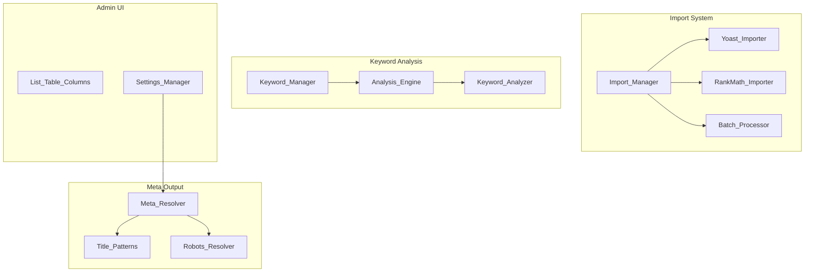

# Design Document: Sprint 1 - Adoption Blockers

## Overview

Sprint 1 - Adoption Blockers implements five critical features that prevent users from migrating from Yoast SEO Premium or RankMath Pro to MeowSEO. These features represent the minimum viable feature set for competitive parity in the WordPress SEO plugin market.

The sprint addresses:
1. **Import System** - Migrate SEO data from competitor plugins
2. **Multiple Focus Keywords** - Support up to 5 keywords with per-keyword analysis
3. **SEO Score Column** - Display scores in WordPress admin list tables
4. **Global Archive Robots** - Site-wide robots meta tag defaults
5. **Archive Title Patterns** - Variable substitution for archive page metadata

### Design Philosophy

This design follows MeowSEO's existing architectural patterns:
- **Module-based architecture** - Each feature is a self-contained module
- **Options-based configuration** - Settings stored in `meowseo_options`
- **WordPress integration** - Hooks into WordPress core APIs (WP_List_Table, admin_post, etc.)
- **Batch processing** - Large operations use chunked processing to prevent timeouts
- **Validation-first** - All user input validated before storage

## Architecture

### High-Level Component Diagram



### Module Structure

```
includes/
├── modules/
│   ├── import/
│   │   ├── class-import-manager.php
│   │   ├── class-batch-processor.php
│   │   ├── importers/
│   │   │   ├── class-base-importer.php
│   │   │   ├── class-yoast-importer.php
│   │   │   └── class-rankmath-importer.php
│   │   └── class-import-admin.php
│   ├── keywords/
│   │   ├── class-keyword-manager.php
│   │   └── class-keyword-analyzer.php
│   ├── admin/
│   │   └── class-list-table-columns.php
│   └── meta/
│       ├── class-robots-resolver.php (extends existing)
│       └── class-title-patterns.php (extends existing)
```

## Components and Interfaces

### 1. Import System

#### Import_Manager

**Responsibility**: Orchestrates the import process, detects installed plugins, and manages import state.

**Public Interface**:
```php
class Import_Manager {
    public function __construct( Options $options, Batch_Processor $processor );
    public function detect_installed_plugins(): array;
    public function start_import( string $plugin_slug ): array;
    public function get_import_status( string $import_id ): array;
    public function cancel_import( string $import_id ): bool;
}
```

**Key Methods**:
- `detect_installed_plugins()` - Scans for Yoast/RankMath by checking for option keys and plugin files
- `start_import()` - Validates plugin detection, creates import job, returns import_id
- `get_import_status()` - Returns progress (processed/total counts, current phase)

#### Base_Importer (Abstract)

**Responsibility**: Defines the import contract and shared logic for all importers.

**Public Interface**:
```php
abstract class Base_Importer {
    abstract public function get_plugin_name(): string;
    abstract public function is_plugin_installed(): bool;
    abstract public function get_postmeta_mappings(): array;
    abstract public function get_termmeta_mappings(): array;
    abstract public function get_options_mappings(): array;
    abstract public function import_redirects(): array;
    
    public function import_postmeta( array $post_ids ): array;
    public function import_termmeta( array $term_ids ): array;
    public function import_options(): array;
    protected function validate_and_transform( string $key, $value ): mixed;
}
```

**Shared Logic**:
- Batch processing coordination
- Error logging and recovery
- Progress tracking
- Data validation

#### Yoast_Importer

**Postmeta Mappings**:
```php
[
    '_yoast_wpseo_title' => '_meowseo_title',
    '_yoast_wpseo_metadesc' => '_meowseo_description',
    '_yoast_wpseo_focuskw' => '_meowseo_focus_keyword',
    '_yoast_wpseo_canonical' => '_meowseo_canonical_url',
    '_yoast_wpseo_meta-robots-noindex' => '_meowseo_robots_noindex',
    '_yoast_wpseo_meta-robots-nofollow' => '_meowseo_robots_nofollow',
    '_yoast_wpseo_opengraph-title' => '_meowseo_og_title',
    '_yoast_wpseo_opengraph-description' => '_meowseo_og_description',
    '_yoast_wpseo_twitter-title' => '_meowseo_twitter_title',
    '_yoast_wpseo_twitter-description' => '_meowseo_twitter_description',
]
```

**Termmeta Mappings**:
```php
[
    '_wpseo_title' => '_meowseo_title',
    '_wpseo_desc' => '_meowseo_description',
]
```

**Options Mappings**:
```php
[
    'wpseo' => [
        'separator' => 'separator',
        'title-home-wpseo' => 'homepage_title',
        'metadesc-home-wpseo' => 'homepage_description',
    ],
    'wpseo_titles' => [
        'title-post' => 'title_pattern_post',
        'title-page' => 'title_pattern_page',
        'title-category' => 'title_pattern_category',
        'title-post_tag' => 'title_pattern_tag',
        'title-author' => 'title_pattern_author',
        'title-archive' => 'title_pattern_archive',
        'title-search' => 'title_pattern_search',
        'title-404' => 'title_pattern_404',
    ],
]
```

**Redirect Import**:
- Query `wpseo_redirect` custom post type
- Transform to MeowSEO redirect format
- Preserve redirect type (301/302/307/410)

#### RankMath_Importer

**Postmeta Mappings**:
```php
[
    'rank_math_title' => '_meowseo_title',
    'rank_math_description' => '_meowseo_description',
    'rank_math_focus_keyword' => '_meowseo_focus_keyword',
    'rank_math_canonical_url' => '_meowseo_canonical_url',
    'rank_math_facebook_title' => '_meowseo_og_title',
    'rank_math_facebook_description' => '_meowseo_og_description',
    'rank_math_twitter_title' => '_meowseo_twitter_title',
    'rank_math_twitter_description' => '_meowseo_twitter_description',
]
```

**Special Handling**:
- `rank_math_robots` - Array containing multiple directives, must be split into `_meowseo_robots_noindex` and `_meowseo_robots_nofollow`
- `rank_math_focus_keyword` - Comma-separated string, split into primary + secondary keywords

**Redirect Import**:
- Query `rank_math_redirections` table
- Map columns: `url_to` → `source_url`, `url_from` → `target_url`, `header_code` → `redirect_type`

#### Batch_Processor

**Responsibility**: Processes large datasets in chunks to prevent PHP timeouts and memory exhaustion.

**Public Interface**:
```php
class Batch_Processor {
    public function __construct( int $batch_size = 100 );
    public function process_posts( callable $callback, array $args = [] ): array;
    public function process_terms( callable $callback, array $args = [] ): array;
    public function get_progress(): array;
}
```

**Implementation Details**:
- Uses `WP_Query` with pagination (`posts_per_page`, `paged`)
- Tracks progress in transient: `meowseo_import_{import_id}_progress`
- Yields control after each batch (allows cancellation)
- Logs errors per-item without stopping batch

**Batch Size**: 100 items (configurable via filter `meowseo_import_batch_size`)

### 2. Multiple Focus Keywords

#### Keyword_Manager

**Responsibility**: Manages the storage and retrieval of primary + secondary keywords.

**Public Interface**:
```php
class Keyword_Manager {
    public function __construct( Options $options );
    public function get_keywords( int $post_id ): array;
    public function set_primary_keyword( int $post_id, string $keyword ): bool;
    public function add_secondary_keyword( int $post_id, string $keyword ): bool;
    public function remove_secondary_keyword( int $post_id, string $keyword ): bool;
    public function reorder_secondary_keywords( int $post_id, array $keywords ): bool;
    public function validate_keyword_count( int $post_id ): bool;
}
```

**Storage Format**:
- Primary keyword: `_meowseo_focus_keyword` (string)
- Secondary keywords: `_meowseo_secondary_keywords` (JSON array)

**Validation**:
- Maximum 5 total keywords (1 primary + 4 secondary)
- Keywords must be non-empty strings
- Duplicate keywords rejected

**Example Storage**:
```php
// Primary
get_post_meta( $post_id, '_meowseo_focus_keyword', true ); // "wordpress seo"

// Secondary
get_post_meta( $post_id, '_meowseo_secondary_keywords', true ); 
// ["seo plugin", "search optimization", "meta tags"]
```

#### Keyword_Analyzer

**Responsibility**: Runs all keyword-based analysis checks for each keyword.

**Public Interface**:
```php
class Keyword_Analyzer {
    public function __construct( Analysis_Engine $engine );
    public function analyze_all_keywords( int $post_id, string $content ): array;
    public function analyze_single_keyword( string $keyword, string $content, array $context ): array;
}
```

**Analysis Checks** (run per keyword):
1. **Keyword Density** - Count occurrences / total words
2. **Keyword in Title** - Check if keyword appears in post title
3. **Keyword in Headings** - Check H1-H6 tags
4. **Keyword in Slug** - Check permalink slug
5. **Keyword in First Paragraph** - Check first 150 words
6. **Keyword in Meta Description** - Check meta description field

**Output Format**:
```php
[
    'wordpress seo' => [
        'density' => ['score' => 85, 'status' => 'good'],
        'in_title' => ['score' => 100, 'status' => 'good'],
        'in_headings' => ['score' => 70, 'status' => 'ok'],
        'in_slug' => ['score' => 100, 'status' => 'good'],
        'in_first_paragraph' => ['score' => 100, 'status' => 'good'],
        'in_meta_description' => ['score' => 100, 'status' => 'good'],
        'overall_score' => 92,
    ],
    'seo plugin' => [
        // ... same structure
    ],
]
```

**Integration with Existing Analysis Engine**:
- Extends `Analysis_Engine` class
- Reuses existing analyzer implementations
- Adds keyword iteration logic
- Aggregates results per keyword

### 3. SEO Score Column in Post Lists

#### List_Table_Columns

**Responsibility**: Adds SEO Score column to WordPress admin list tables with sorting support.

**Public Interface**:
```php
class List_Table_Columns {
    public function __construct( Options $options );
    public function register_hooks(): void;
    public function add_seo_score_column( array $columns ): array;
    public function render_seo_score_column( string $column_name, int $post_id ): void;
    public function register_sortable_column( array $columns ): array;
    public function handle_seo_score_sorting( WP_Query $query ): void;
}
```

**Column Rendering**:
```php
// Score ranges and colors
0-40:   Red circle    (#dc3232)
41-70:  Orange circle (#f56e28)
71-100: Green circle  (#46b450)
null:   Gray dash     (#a7aaad)
```

**HTML Output**:
```html
<span class="meowseo-score-indicator meowseo-score-good" 
      title="SEO Score: 85/100" 
      aria-label="SEO Score: 85 out of 100">
    <span class="meowseo-score-circle"></span>
    <span class="meowseo-score-text">85</span>
</span>
```

**Sorting Implementation**:
- Registers `seo_score` as sortable column
- Hooks into `pre_get_posts`
- Adds `meta_query` for `_meowseo_seo_score`
- Handles ASC/DESC ordering

**Post Type Support**:
- Automatically adds to all public post types
- Includes custom post types
- Excludes: `attachment`, `revision`, `nav_menu_item`

### 4. Global Archive Robots Settings

#### Robots_Resolver (Extension)

**Responsibility**: Resolves robots meta tags with global defaults and per-page overrides.

**New Methods**:
```php
class Robots_Resolver {
    // Existing methods...
    
    public function get_archive_robots( string $archive_type ): string;
    public function resolve_robots_for_archive(): string;
    private function get_global_robots_setting( string $key ): array;
}
```

**Archive Types**:
```php
[
    'author_archive' => 'Author Archives',
    'date_archive' => 'Date Archives',
    'category_archive' => 'Category Archives',
    'tag_archive' => 'Tag Archives',
    'search_results' => 'Search Results',
    'attachment' => 'Media Attachments',
    'post_type_archive_{type}' => 'Custom Post Type Archives',
]
```

**Settings Storage**:
```php
// In meowseo_options
[
    'robots_author_archive' => ['noindex' => true, 'nofollow' => false],
    'robots_date_archive' => ['noindex' => true, 'nofollow' => false],
    'robots_category_archive' => ['noindex' => false, 'nofollow' => false],
    'robots_tag_archive' => ['noindex' => false, 'nofollow' => false],
    'robots_search_results' => ['noindex' => true, 'nofollow' => false],
    'robots_attachment' => ['noindex' => true, 'nofollow' => false],
]
```

**Resolution Logic**:
1. Check if current page is an archive
2. Determine archive type via WordPress conditionals
3. Check for term-specific override (termmeta)
4. Fall back to global setting
5. Format as comma-separated string

**Settings UI Integration**:
- Add "Archive Robots" section to Advanced tab
- Checkbox grid: Archive Type × [noindex, nofollow]
- Help text explaining precedence

### 5. Archive Title/Description Patterns

#### Title_Patterns (Extension)

**Responsibility**: Extends existing Title_Patterns class to support archive page types.

**New Pattern Types**:
```php
[
    'category_archive' => '{term_name} Archives {sep} {site_name}',
    'tag_archive' => '{term_name} Tag {sep} {site_name}',
    'custom_taxonomy_archive' => '{term_name} {sep} {site_name}',
    'author_page' => '{author_name} {sep} {site_name}',
    'search_results' => 'Search Results for {search_phrase} {sep} {site_name}',
    'date_archive' => '{date} Archives {sep} {site_name}',
    '404_page' => 'Page Not Found {sep} {site_name}',
    'homepage' => '{site_name} {sep} {tagline}',
]
```

**New Variables**:
```php
[
    '{category}' => 'Category name',
    '{tag}' => 'Tag name',
    '{term}' => 'Generic term name',
    '{date}' => 'Archive date (formatted)',
    '{name}' => 'Author display name',
    '{searchphrase}' => 'Search query',
    '{posttype}' => 'Post type label',
    '{sep}' => 'Configured separator',
    '{page}' => 'Page number (for paginated archives)',
]
```

**Variable Resolution**:
```php
private function resolve_archive_variables( string $pattern ): string {
    $replacements = [];
    
    if ( is_category() ) {
        $term = get_queried_object();
        $replacements['{category}'] = $term->name;
        $replacements['{term}'] = $term->name;
    }
    
    if ( is_tag() ) {
        $term = get_queried_object();
        $replacements['{tag}'] = $term->name;
        $replacements['{term}'] = $term->name;
    }
    
    if ( is_author() ) {
        $author = get_queried_object();
        $replacements['{name}'] = $author->display_name;
    }
    
    if ( is_search() ) {
        $replacements['{searchphrase}'] = get_search_query();
    }
    
    if ( is_date() ) {
        $replacements['{date}'] = $this->format_archive_date();
    }
    
    if ( is_paged() ) {
        $replacements['{page}'] = get_query_var( 'paged' );
    }
    
    return str_replace( array_keys( $replacements ), array_values( $replacements ), $pattern );
}
```

**Settings UI Integration**:
- Add "Archive Patterns" section to General tab
- Text inputs for each archive type
- Live preview showing example output
- Variable reference tooltip

## Data Models

### Import Job

**Storage**: Transient `meowseo_import_{import_id}`

**Structure**:
```php
[
    'import_id' => 'yoast_20240115_123456',
    'plugin' => 'yoast',
    'status' => 'in_progress', // pending, in_progress, completed, failed, cancelled
    'started_at' => 1705324456,
    'completed_at' => null,
    'progress' => [
        'posts' => ['processed' => 150, 'total' => 500],
        'terms' => ['processed' => 20, 'total' => 50],
        'options' => ['processed' => 1, 'total' => 1],
        'redirects' => ['processed' => 0, 'total' => 0],
    ],
    'summary' => [
        'posts_imported' => 150,
        'terms_imported' => 20,
        'options_imported' => 1,
        'redirects_imported' => 0,
        'errors' => 3,
    ],
    'errors' => [
        ['post_id' => 123, 'field' => '_meowseo_title', 'error' => 'Invalid UTF-8'],
    ],
]
```

### Keyword Storage

**Primary Keyword**: `_meowseo_focus_keyword` (string)
```php
"wordpress seo plugin"
```

**Secondary Keywords**: `_meowseo_secondary_keywords` (JSON array)
```php
["seo optimization", "meta tags", "search engine", "wordpress plugin"]
```

**Keyword Analysis Results**: `_meowseo_keyword_analysis` (JSON object)
```php
{
    "wordpress seo plugin": {
        "density": {"score": 85, "status": "good"},
        "in_title": {"score": 100, "status": "good"},
        "in_headings": {"score": 70, "status": "ok"},
        "in_slug": {"score": 100, "status": "good"},
        "in_first_paragraph": {"score": 100, "status": "good"},
        "in_meta_description": {"score": 100, "status": "good"},
        "overall_score": 92
    },
    "seo optimization": {
        // ... same structure
    }
}
```

### SEO Score

**Storage**: `_meowseo_seo_score` (integer 0-100)

**Calculation**: Average of all analysis check scores

### Archive Robots Settings

**Storage**: `meowseo_options` array

```php
[
    'robots_author_archive' => ['noindex' => true, 'nofollow' => false],
    'robots_date_archive' => ['noindex' => true, 'nofollow' => false],
    'robots_category_archive' => ['noindex' => false, 'nofollow' => false],
    'robots_tag_archive' => ['noindex' => false, 'nofollow' => false],
    'robots_search_results' => ['noindex' => true, 'nofollow' => false],
    'robots_attachment' => ['noindex' => true, 'nofollow' => false],
]
```

### Archive Title Patterns

**Storage**: `meowseo_options['title_patterns']` array

```php
[
    'category_archive' => '{term_name} Archives {sep} {site_name}',
    'tag_archive' => '{term_name} Tag {sep} {site_name}',
    'author_page' => '{author_name} {sep} {site_name}',
    'search_results' => 'Search Results for {search_phrase} {sep} {site_name}',
    'date_archive' => '{date} Archives {sep} {site_name}',
    '404_page' => 'Page Not Found {sep} {site_name}',
    'homepage' => '{site_name} {sep} {tagline}',
]
```

## Error Handling

### Import System Errors

**Error Types**:
1. **Plugin Not Detected** - Return WP_Error before starting import
2. **Invalid Data** - Log error, skip item, continue batch
3. **Database Error** - Log error, retry once, skip on second failure
4. **Timeout** - Save progress, resume on next batch
5. **User Cancellation** - Clean up transients, mark as cancelled

**Error Logging**:
```php
Logger::error( 'Import error', [
    'import_id' => $import_id,
    'post_id' => $post_id,
    'field' => $field,
    'error' => $error_message,
] );
```

**Error Recovery**:
- Errors stored in import job transient
- Displayed in import summary
- Option to retry failed items
- Option to export error log

### Keyword Validation Errors

**Error Types**:
1. **Keyword Count Exceeded** - Return WP_Error, prevent save
2. **Empty Keyword** - Return WP_Error, prevent save
3. **Duplicate Keyword** - Return WP_Error, prevent save

**User Feedback**:
- Display error notice in Gutenberg sidebar
- Highlight invalid keyword input
- Show validation message

### Settings Validation Errors

**Error Types**:
1. **Invalid Pattern Syntax** - Show error message, prevent save
2. **Invalid Robots Configuration** - Show error message, prevent save
3. **Nonce Verification Failed** - HTTP 403 response

**Validation**:
- All settings validated before save
- Invalid settings rejected with specific error messages
- Valid settings saved, invalid settings ignored

## Testing Strategy

This feature involves infrastructure (import system), UI components (list table columns), and configuration (settings). Property-based testing is not applicable. Testing will focus on:

### Unit Tests

**Import System**:
- Test postmeta mapping transformations
- Test termmeta mapping transformations
- Test options mapping transformations
- Test redirect data transformation
- Test batch processing logic
- Test error handling and recovery
- Test progress tracking
- Mock WordPress functions (`get_post_meta`, `update_post_meta`, `WP_Query`)

**Keyword Manager**:
- Test keyword storage and retrieval
- Test keyword count validation
- Test duplicate detection
- Test keyword reordering
- Mock postmeta functions

**Keyword Analyzer**:
- Test per-keyword analysis execution
- Test result aggregation
- Test score calculation
- Use sample content fixtures

**List Table Columns**:
- Test column registration
- Test score indicator rendering
- Test sorting query modification
- Mock `WP_Query` and `WP_List_Table`

**Robots Resolver**:
- Test archive type detection
- Test global setting resolution
- Test term-specific override precedence
- Mock WordPress conditionals

**Title Patterns**:
- Test variable substitution
- Test archive type detection
- Test pattern resolution
- Use sample patterns and context

### Integration Tests

**Import System**:
- Create test posts with Yoast/RankMath postmeta
- Run import process
- Verify MeowSEO postmeta created correctly
- Verify redirect migration
- Test with real WordPress database

**Keyword Analysis**:
- Create test post with multiple keywords
- Run analysis
- Verify per-keyword results stored
- Verify overall score calculated

**List Table Columns**:
- Load admin list table page
- Verify column appears
- Verify score indicators render
- Test sorting functionality

**Archive Robots**:
- Configure global settings
- Visit archive pages
- Verify robots meta tags output
- Test term-specific overrides

**Archive Title Patterns**:
- Configure patterns
- Visit archive pages
- Verify title tags output
- Verify variable substitution

### Manual Testing

**Import UI**:
- Test import wizard flow
- Verify progress display
- Test cancellation
- Verify summary display
- Test error handling

**Keyword UI**:
- Add/remove secondary keywords
- Verify validation messages
- Test reordering
- Verify analysis results display

**Settings UI**:
- Configure archive robots
- Configure title patterns
- Verify live preview
- Test validation

### Performance Testing

**Import System**:
- Test with 10,000+ posts
- Verify batch processing prevents timeout
- Measure memory usage
- Test cancellation and resume

**Keyword Analysis**:
- Test with 5 keywords on long content
- Measure analysis time
- Verify no performance degradation

**List Table Columns**:
- Test with 1,000+ posts in list
- Verify sorting performance
- Measure query time

## Implementation Notes

### WordPress Hooks

**Import System**:
- `admin_menu` - Register import page
- `admin_post_meowseo_start_import` - Handle import submission
- `wp_ajax_meowseo_import_status` - AJAX status endpoint

**Keyword Analysis**:
- `save_post` - Trigger analysis on post save
- `rest_api_init` - Register REST endpoint for Gutenberg

**List Table Columns**:
- `manage_{post_type}_posts_columns` - Add column
- `manage_{post_type}_posts_custom_column` - Render column
- `manage_edit-{post_type}_sortable_columns` - Register sortable
- `pre_get_posts` - Handle sorting

**Archive Robots**:
- `wp_head` - Output robots meta tag (priority 1)

**Archive Title Patterns**:
- `wp_title` - Filter title output (priority 10)
- `document_title_parts` - Filter title parts (priority 10)

### Security Considerations

**Import System**:
- Verify nonce on import submission
- Check `manage_options` capability
- Sanitize all imported data
- Validate data types and formats
- Escape output in import UI

**Settings**:
- Verify nonce on settings save
- Check `manage_options` capability
- Validate all settings before save
- Sanitize user input
- Escape output in settings UI

**AJAX Endpoints**:
- Verify nonce on all AJAX requests
- Check capabilities
- Validate input parameters
- Return JSON responses only

### Performance Optimizations

**Import System**:
- Batch size: 100 items (configurable)
- Use direct database queries for bulk operations
- Cache plugin detection results
- Clean up transients after completion

**Keyword Analysis**:
- Cache analysis results in postmeta
- Only re-analyze on content change
- Use Web Worker for client-side analysis

**List Table Columns**:
- Use efficient meta_query for sorting
- Cache score calculations
- Limit query to visible posts only

**Archive Robots**:
- Cache resolved robots settings
- Use early return for non-archive pages

**Archive Title Patterns**:
- Cache pattern resolution
- Use early return for non-archive pages

### Backward Compatibility

**Import System**:
- No breaking changes
- New module, no existing functionality affected

**Keyword Storage**:
- Existing `_meowseo_focus_keyword` preserved
- New `_meowseo_secondary_keywords` added
- Existing analysis engine extended, not replaced

**Settings**:
- New settings added to existing structure
- Existing settings preserved
- Default values provided for new settings

**Meta Output**:
- Existing meta output logic extended
- No changes to existing output format
- New archive support added

## Migration Path

### From Yoast SEO

1. User clicks "Import from Yoast SEO" in MeowSEO settings
2. System detects Yoast installation
3. User confirms import
4. System processes in batches:
   - Postmeta (titles, descriptions, keywords, robots, social)
   - Termmeta (category/tag titles and descriptions)
   - Options (separator, homepage settings, title patterns)
   - Redirects (from custom post type)
5. System displays summary
6. User can deactivate Yoast

### From RankMath

1. User clicks "Import from RankMath" in MeowSEO settings
2. System detects RankMath installation
3. User confirms import
4. System processes in batches:
   - Postmeta (titles, descriptions, keywords, robots, social)
   - Termmeta (category/tag titles and descriptions)
   - Options (separator, homepage settings, title patterns)
   - Redirects (from database table)
5. System displays summary
6. User can deactivate RankMath

### Data Preservation

- Original competitor plugin data is NOT deleted
- MeowSEO data is created alongside
- Users can verify import before deactivating competitor plugin
- Option to delete competitor data after verification

## Future Enhancements

### Import System
- Support for All in One SEO
- Support for SEOPress
- CSV export of import summary
- Scheduled imports for multisite

### Keyword Analysis
- Keyword synonym support
- Keyword difficulty scoring
- Keyword suggestions based on content
- Competitor keyword analysis

### List Table Columns
- Bulk edit SEO scores
- Filter by score range
- Export scores to CSV
- Score history tracking

### Archive Robots
- Per-taxonomy robots settings
- Per-author robots settings
- Conditional robots based on post count
- Robots preview in settings

### Archive Title Patterns
- Pattern templates library
- A/B testing for patterns
- Pattern performance analytics
- Custom variable support

---

**Design Version**: 1.0  
**Last Updated**: 2024-01-15  
**Status**: Ready for Implementation
