# Design Document: Sprint 2 - Feature Parity

## Overview

Sprint 2 - Feature Parity implements six core SEO features that professional users expect from premium SEO plugins. These features are standard in both Yoast SEO Premium and RankMath Pro, and their absence represents a significant barrier to MeowSEO adoption.

The sprint addresses:
1. **Global Schema Identity** - WebSite and Organization schema on every page for sitelinks and knowledge panels
2. **Real-Time SERP Preview** - Live Google search result preview with character counting and mobile/desktop toggle
3. **Webmaster Tools Verification** - Meta tag verification for Google Search Console, Bing Webmaster Tools, and Yandex Webmaster
4. **Robots.txt Editor UI** - Admin interface for managing virtual robots.txt without FTP access
5. **Redirect CSV Import/Export** - Bulk redirect management with round-trip validation
6. **Cornerstone Content** - Mark pillar content with weighted link suggestions and admin list filtering

### Design Philosophy

This design follows MeowSEO's existing architectural patterns:
- **Module-based architecture** - Each feature is a self-contained module or extends existing modules
- **Options-based configuration** - Settings stored in `meowseo_options`
- **WordPress integration** - Hooks into WordPress core APIs (wp_head, admin_menu, manage_posts_columns)
- **Performance-first** - Caching, lazy loading, and efficient database queries
- **Validation-first** - All user input validated before storage

## Architecture

### High-Level Component Diagram

```mermaid
graph TB
    subgraph "Schema Module"
        SchemaOutput[Schema_Output]
        GlobalSchema[Global_Schema_Generator]
        WebSiteSchema[WebSite_Schema]
        OrganizationSchema[Organization_Schema]
    end
    
    subgraph "Gutenberg Sidebar"
        GeneralTab[General_Tab_Content]
        SERPPreview[SERP_Preview_Component]
        CharCounter[Character_Counter]
    end
    
    subgraph "Settings Module"
        SettingsManager[Settings_Manager]
        WebmasterTab[Webmaster_Tools_Tab]
        RobotsTxtTab[Robots_Txt_Tab]
        OrganizationTab[Organization_Tab]
    end
    
    subgraph "Redirects Module"
        RedirectManager[Redirect_Manager]
        CSVImporter[CSV_Importer]
        CSVExporter[CSV_Exporter]
    end
    
    subgraph "Cornerstone Module"
        CornerstoneManager[Cornerstone_Manager]
        ListTableColumns[List_Table_Columns]
        LinkSuggestions[Link_Suggestions_Engine]
    end
    
    subgraph "Meta Output"
        MetaOutput[Meta_Output]
        WebmasterVerification[Webmaster_Verification]
        RobotsTxtHandler[Robots_Txt_Handler]
    end
    
    SchemaOutput --> GlobalSchema
    GlobalSchema --> WebSiteSchema
    GlobalSchema --> OrganizationSchema
    
    GeneralTab --> SERPPreview
    SERPPreview --> CharCounter
    
    SettingsManager --> WebmasterTab
    SettingsManager --> RobotsTxtTab
    SettingsManager --> OrganizationTab
    
    RedirectManager --> CSVImporter
    RedirectManager --> CSVExporter
    
    CornerstoneManager --> ListTableColumns
    CornerstoneManager --> LinkSuggestions
    
    MetaOutput --> WebmasterVerification
    MetaOutput --> RobotsTxtHandler
```



### Module Structure

```
includes/
├── modules/
│   ├── schema/
│   │   ├── class-schema-output.php (extend)
│   │   ├── class-global-schema-generator.php (new)
│   │   ├── generators/
│   │   │   ├── class-website-schema.php (new)
│   │   │   └── class-organization-schema.php (new)
│   ├── meta/
│   │   ├── class-meta-output.php (extend)
│   │   └── class-webmaster-verification.php (new)
│   ├── seo/
│   │   ├── class-robots-txt.php (extend)
│   │   └── class-robots-txt-editor.php (new)
│   ├── redirects/
│   │   ├── class-redirect-manager.php (extend)
│   │   ├── class-csv-importer.php (new)
│   │   └── class-csv-exporter.php (new)
│   └── cornerstone/
│       ├── class-cornerstone-manager.php (new)
│       └── class-list-table-integration.php (new)
├── admin/
│   └── class-settings-manager.php (extend)
assets/
└── src/
    └── gutenberg/
        └── components/
            ├── SERPPreview.tsx (new)
            ├── CharacterCounter.tsx (new)
            └── tabs/
                └── GeneralTabContent.tsx (extend)
```

## Components and Interfaces

### 1. Global Schema Identity Markup

#### Global_Schema_Generator

**Responsibility**: Orchestrates generation of WebSite and Organization schema on every page.

**Public Interface**:
```php
class Global_Schema_Generator {
    public function __construct( Options $options );
    public function generate_global_schema(): array;
    public function should_output_schema(): bool;
    private function get_website_schema(): array;
    private function get_organization_schema(): array;
}
```

**Key Methods**:
- `generate_global_schema()` - Returns array of schema objects for output
- `should_output_schema()` - Checks if organization settings are configured
- Integration with existing `Schema_Output` class via filter hook

#### WebSite_Schema

**Responsibility**: Generates WebSite schema with search action for sitelinks search box.

**Schema Structure**:
```json
{
  "@context": "https://schema.org",
  "@type": "WebSite",
  "@id": "https://example.com/#website",
  "url": "https://example.com/",
  "name": "Site Name",
  "potentialAction": {
    "@type": "SearchAction",
    "target": {
      "@type": "EntryPoint",
      "urlTemplate": "https://example.com/?s={search_term_string}"
    },
    "query-input": "required name=search_term_string"
  }
}
```

**Configuration**:
- Site name from `get_bloginfo('name')`
- Site URL from `home_url()`
- Search URL pattern from WordPress search

#### Organization_Schema

**Responsibility**: Generates Organization schema with brand identity information.

**Schema Structure**:
```json
{
  "@context": "https://schema.org",
  "@type": "Organization",
  "@id": "https://example.com/#organization",
  "name": "Organization Name",
  "url": "https://example.com/",
  "logo": {
    "@type": "ImageObject",
    "url": "https://example.com/logo.png",
    "width": 600,
    "height": 60
  },
  "contactPoint": {
    "@type": "ContactPoint",
    "contactType": "customer service",
    "email": "support@example.com"
  },
  "sameAs": [
    "https://facebook.com/page",
    "https://twitter.com/handle",
    "https://instagram.com/profile",
    "https://linkedin.com/company/name",
    "https://youtube.com/channel"
  ]
}
```

**Configuration** (stored in `meowseo_options`):
```php
[
    'organization_name' => string,
    'organization_logo_url' => string,
    'organization_logo_width' => int,
    'organization_logo_height' => int,
    'organization_contact_email' => string,
    'social_profiles' => [
        'facebook' => string,
        'twitter' => string,
        'instagram' => string,
        'linkedin' => string,
        'youtube' => string,
    ],
]
```

**Validation**:
- Organization name: Required, non-empty string
- Logo URL: Valid URL format, optional
- Logo dimensions: Positive integers, optional
- Contact email: Valid email format, optional
- Social URLs: Valid URL format, optional

**Settings UI Integration**:
- Add "Organization" tab to Settings page
- Input fields for name, logo URL, logo dimensions, contact email
- Input fields for each social profile URL
- Help text explaining schema.org requirements
- Preview of generated schema

**Output Integration**:
- Hook into `meowseo_schema_output` filter
- Add WebSite and Organization to @graph array
- Output as separate JSON-LD script blocks in `<head>`
- Priority: Before page-specific schema

### 2. Real-Time SERP Preview

#### SERP_Preview Component (React/TypeScript)

**Responsibility**: Displays live preview of Google search result appearance with character counting.

**Component Interface**:
```typescript
interface SERPPreviewProps {
    title: string;
    description: string;
    url: string;
    mode: 'desktop' | 'mobile';
    onModeChange: (mode: 'desktop' | 'mobile') => void;
}

const SERPPreview: React.FC<SERPPreviewProps> = ({
    title,
    description,
    url,
    mode,
    onModeChange
}) => {
    // Component implementation
};
```

**Visual Design**:
- Google-style search result card
- Blue clickable title (truncated at 60 chars)
- Green URL breadcrumb
- Gray description text (truncated at 155 chars)
- Ellipsis (...) indicator for truncated text
- Mobile mode: Narrower width (360px)
- Desktop mode: Standard width (600px)

**Real-Time Updates**:
- Debounced updates (300ms delay) to prevent excessive re-renders
- Updates trigger on title/description field changes
- Character count updates immediately (no debounce)

#### Character_Counter Component (React/TypeScript)

**Responsibility**: Displays character count with color-coded status indicators.

**Component Interface**:
```typescript
interface CharacterCounterProps {
    value: string;
    maxLength: number;
    optimalMin: number;
    optimalMax: number;
    label: string;
}

const CharacterCounter: React.FC<CharacterCounterProps> = ({
    value,
    maxLength,
    optimalMin,
    optimalMax,
    label
}) => {
    const count = value.length;
    const status = getStatus(count, optimalMin, optimalMax, maxLength);
    
    return (
        <div className={`character-counter character-counter--${status}`}>
            <span className="character-counter__label">{label}</span>
            <span className="character-counter__count">{count}/{maxLength}</span>
        </div>
    );
};
```

**Status Calculation**:
```typescript
function getStatus(
    count: number,
    optimalMin: number,
    optimalMax: number,
    maxLength: number
): 'good' | 'warning' | 'error' {
    if (count > maxLength) return 'error'; // Red
    if (count >= optimalMin && count <= optimalMax) return 'good'; // Green
    return 'warning'; // Orange
}
```

**Character Limits**:
- **SEO Title**: 
  - Max: 60 characters (red if exceeded)
  - Optimal: 50-60 characters (green)
  - Below optimal: <50 characters (orange)
- **Meta Description**:
  - Max: 155 characters (red if exceeded)
  - Optimal: 120-155 characters (green)
  - Below optimal: <120 characters (orange)

**Color Scheme**:
- Green (#46b450): Optimal length
- Orange (#f56e28): Suboptimal but acceptable
- Red (#dc3232): Exceeds maximum

**Integration with General Tab**:
- Add SERP Preview above title/description fields
- Add Character Counter below each field
- Mobile/Desktop toggle button in preview header
- Store mode preference in localStorage

### 3. Webmaster Tools Verification

#### Webmaster_Verification

**Responsibility**: Outputs verification meta tags for webmaster tools in document head.

**Public Interface**:
```php
class Webmaster_Verification {
    public function __construct( Options $options );
    public function output_verification_tags(): void;
    private function get_google_verification_code(): string;
    private function get_bing_verification_code(): string;
    private function get_yandex_verification_code(): string;
    private function sanitize_verification_code( string $code ): string;
}
```

**Meta Tag Output**:
```html
<!-- Google Search Console -->
<meta name="google-site-verification" content="abc123xyz" />

<!-- Bing Webmaster Tools -->
<meta name="msvalidate.01" content="def456uvw" />

<!-- Yandex Webmaster -->
<meta name="yandex-verification" content="ghi789rst" />
```

**Settings Storage** (in `meowseo_options`):
```php
[
    'webmaster_verification' => [
        'google' => string, // Verification code only
        'bing' => string,
        'yandex' => string,
    ],
]
```

**Sanitization**:
- Strip HTML tags with `wp_strip_all_tags()`
- Remove whitespace with `trim()`
- Validate alphanumeric + hyphens only
- Max length: 100 characters

**Settings UI**:
- Add "Webmaster Tools" section to Advanced tab
- Text input for each service
- Help text with instructions:
  - Google: "Enter the verification code from Google Search Console (Settings > Ownership verification)"
  - Bing: "Enter the verification code from Bing Webmaster Tools (Settings > Verify ownership)"
  - Yandex: "Enter the verification code from Yandex Webmaster (Settings > Site verification)"
- Link to each service's verification page

**Output Integration**:
- Hook into `wp_head` action (priority 1)
- Output before other meta tags
- Only output if code is configured and non-empty

### 4. Robots.txt Editor UI

#### Robots_Txt_Editor

**Responsibility**: Provides admin interface for editing virtual robots.txt content.

**Public Interface**:
```php
class Robots_Txt_Editor {
    public function __construct( Options $options, Robots_Txt $robots_txt );
    public function render_editor_ui(): void;
    public function save_robots_txt( string $content ): bool|WP_Error;
    public function reset_to_default(): bool;
    public function validate_syntax( string $content ): bool|WP_Error;
    public function get_current_content(): string;
}
```

**Settings UI**:
- Add "Robots.txt" section to Advanced tab
- Large textarea (20 rows) for editing content
- "Save Changes" button
- "Reset to Default" button with confirmation dialog
- "Preview" link to view current robots.txt at /robots.txt
- Syntax validation on save

**Validation Rules**:
1. Must contain at least one "User-agent:" directive
2. Directives must be valid: User-agent, Disallow, Allow, Sitemap, Crawl-delay
3. Paths must start with / or be *
4. No HTML tags allowed
5. Max size: 500KB

**Validation Implementation**:
```php
private function validate_syntax( string $content ): bool|WP_Error {
    // Check size
    if ( strlen( $content ) > 512000 ) {
        return new WP_Error( 'robots_txt_too_large', __( 'Robots.txt content exceeds 500KB limit.', 'meowseo' ) );
    }
    
    // Check for HTML
    if ( $content !== wp_strip_all_tags( $content ) ) {
        return new WP_Error( 'robots_txt_contains_html', __( 'Robots.txt cannot contain HTML tags.', 'meowseo' ) );
    }
    
    // Check for at least one User-agent
    if ( ! preg_match( '/^User-agent:/mi', $content ) ) {
        return new WP_Error( 'robots_txt_no_user_agent', __( 'Robots.txt must contain at least one User-agent directive.', 'meowseo' ) );
    }
    
    // Validate directives
    $lines = explode( "\n", $content );
    foreach ( $lines as $line_num => $line ) {
        $line = trim( $line );
        if ( empty( $line ) || strpos( $line, '#' ) === 0 ) {
            continue; // Skip empty lines and comments
        }
        
        if ( ! preg_match( '/^(User-agent|Disallow|Allow|Sitemap|Crawl-delay):/i', $line ) ) {
            return new WP_Error(
                'robots_txt_invalid_directive',
                sprintf( __( 'Invalid directive on line %d: %s', 'meowseo' ), $line_num + 1, $line )
            );
        }
    }
    
    return true;
}
```

**Default Content**:
```
User-agent: *
Disallow: /wp-admin/
Allow: /wp-admin/admin-ajax.php

Sitemap: {sitemap_url}
```

**Storage**:
- Store in `meowseo_options['robots_txt_content']`
- If empty, use default content
- Hook into `do_robots` action to output custom content

**Integration with Existing Robots_Txt Class**:
- Extend existing `Robots_Txt` class
- Add `get_custom_content()` method
- Add `set_custom_content()` method
- Modify `output_robots_txt()` to use custom content if set

### 5. Redirect CSV Import and Export

#### CSV_Importer

**Responsibility**: Parses CSV files and creates redirect records.

**Public Interface**:
```php
class CSV_Importer {
    public function __construct( Redirect_Manager $redirect_manager );
    public function import_from_file( array $file ): array|WP_Error;
    public function import_from_string( string $csv_content ): array|WP_Error;
    private function parse_csv( string $content ): array|WP_Error;
    private function validate_row( array $row, int $line_num ): bool|WP_Error;
    private function create_redirect( array $row ): bool|WP_Error;
}
```

**CSV Format**:
```csv
source_url,target_url,status_code
/old-page,/new-page,301
/another-old-page,https://example.com/external,302
/regex:^/blog/(\d+)$,/posts/$1,301
```

**Required Columns**:
- `source_url` - Source URL path or regex pattern
- `target_url` - Target URL (absolute or relative)
- `status_code` - HTTP status code (301, 302, 307, 410)

**Optional Columns** (for export compatibility):
- `hits` - Number of times redirect was triggered
- `created_date` - When redirect was created
- `last_accessed` - Last time redirect was triggered

**Validation Rules**:
1. CSV must have header row with required columns
2. `source_url` must be non-empty
3. `target_url` must be non-empty (except for 410 status)
4. `status_code` must be one of: 301, 302, 307, 410
5. Regex patterns must be valid (test with `preg_match`)
6. Duplicate source URLs are skipped with warning

**Import Process**:
1. Upload CSV file via admin UI
2. Parse CSV content
3. Validate each row
4. Create redirect records
5. Display summary: imported count, skipped count, errors
6. Log import action with user ID and timestamp

**Error Handling**:
```php
// Example error for invalid CSV
return new WP_Error(
    'csv_parse_error',
    sprintf( __( 'CSV parsing failed on line %d: %s', 'meowseo' ), $line_num, $error_message ),
    array( 'line' => $line_num, 'content' => $line_content )
);

// Example error for duplicate
return new WP_Error(
    'duplicate_redirect',
    sprintf( __( 'Redirect already exists for source URL: %s', 'meowseo' ), $source_url ),
    array( 'source_url' => $source_url )
);
```

#### CSV_Exporter

**Responsibility**: Generates CSV files from existing redirect records.

**Public Interface**:
```php
class CSV_Exporter {
    public function __construct( Redirect_Manager $redirect_manager );
    public function export_to_file(): string; // Returns file path
    public function export_to_string(): string; // Returns CSV content
    private function get_all_redirects(): array;
    private function format_redirect_row( array $redirect ): array;
    private function generate_csv_content( array $redirects ): string;
}
```

**Export Format**:
```csv
source_url,target_url,status_code,hits,created_date,last_accessed
/old-page,/new-page,301,150,2024-01-15 10:30:00,2024-01-20 14:25:00
/another-old-page,https://example.com/external,302,25,2024-01-16 09:15:00,2024-01-19 16:45:00
```

**Export Process**:
1. Query all redirects from database
2. Format each redirect as CSV row
3. Generate CSV content with header
4. Set appropriate headers for download
5. Stream CSV content to browser
6. Log export action with user ID and timestamp

**Filename Format**:
```
meowseo-redirects-{site_name}-{date}.csv
Example: meowseo-redirects-example-com-2024-01-20.csv
```

**Settings UI Integration**:
- Add "Import/Export" section to Tools page
- File upload control for import
- "Export Redirects" button for export
- Display import summary after upload
- Display error messages for failed imports

### 6. Cornerstone Content Management

#### Cornerstone_Manager

**Responsibility**: Manages cornerstone content marking and integrates with link suggestions.

**Public Interface**:
```php
class Cornerstone_Manager {
    public function __construct( Options $options );
    public function is_cornerstone( int $post_id ): bool;
    public function set_cornerstone( int $post_id, bool $is_cornerstone ): bool;
    public function get_cornerstone_posts( array $args = [] ): array;
    public function get_cornerstone_count(): int;
    public function apply_cornerstone_weight( array $suggestions ): array;
}
```

**Storage**:
- Postmeta key: `_meowseo_is_cornerstone`
- Value: `1` (string) for cornerstone, deleted for non-cornerstone
- Indexed for efficient queries

**Gutenberg Sidebar Integration**:
- Add checkbox to Advanced tab: "Mark as Cornerstone Content"
- Help text: "Cornerstone content represents your most important pages. These will be prioritized in internal link suggestions."
- Checkbox state synced with postmeta
- Save on post save

**Post List Table Integration**:

**List_Table_Integration**

**Responsibility**: Adds cornerstone column and filter to post list tables.

**Public Interface**:
```php
class List_Table_Integration {
    public function __construct( Cornerstone_Manager $cornerstone_manager );
    public function register_hooks(): void;
    public function add_cornerstone_column( array $columns ): array;
    public function render_cornerstone_column( string $column_name, int $post_id ): void;
    public function add_cornerstone_filter(): void;
    public function filter_by_cornerstone( WP_Query $query ): void;
    public function register_sortable_column( array $columns ): array;
}
```

**Column Display**:
- Column title: "Cornerstone"
- Icon for cornerstone posts: ⭐ (star emoji) or dashicon-star-filled
- Empty for non-cornerstone posts
- Tooltip: "Cornerstone Content"

**Filter Dropdown**:
- Add filter dropdown above post list
- Options: "All Posts", "Cornerstone Only", "Non-Cornerstone"
- Filter by meta_query on `_meowseo_is_cornerstone`

**Sortable Column**:
- Make column sortable by cornerstone status
- Cornerstone posts appear first when sorted ascending

**Link Suggestions Weighting**:
- Modify existing `Link_Suggestions_Engine` to apply 2x weight to cornerstone posts
- Scoring formula: `base_score * (is_cornerstone ? 2 : 1)`
- Cornerstone posts appear higher in suggestion list

**Dashboard Widget**:
- Add "Cornerstone Content" widget to dashboard
- Display count of cornerstone posts
- Display list of cornerstone posts with edit links
- Link to filtered post list showing only cornerstone posts

## Data Models

### Global Schema Settings

**Storage**: `meowseo_options['organization']`

```php
[
    'name' => string, // Organization name
    'logo_url' => string, // Logo image URL
    'logo_width' => int, // Logo width in pixels
    'logo_height' => int, // Logo height in pixels
    'contact_email' => string, // Contact email
    'social_profiles' => [
        'facebook' => string, // Facebook page URL
        'twitter' => string, // Twitter profile URL
        'instagram' => string, // Instagram profile URL
        'linkedin' => string, // LinkedIn company URL
        'youtube' => string, // YouTube channel URL
    ],
]
```

### Webmaster Verification Settings

**Storage**: `meowseo_options['webmaster_verification']`

```php
[
    'google' => string, // Google Search Console verification code
    'bing' => string, // Bing Webmaster Tools verification code
    'yandex' => string, // Yandex Webmaster verification code
]
```

### Robots.txt Content

**Storage**: `meowseo_options['robots_txt_content']`

```php
string // Raw robots.txt content
```

### Redirect CSV Structure

**Import Format**:
```csv
source_url,target_url,status_code
/old-page,/new-page,301
```

**Export Format**:
```csv
source_url,target_url,status_code,hits,created_date,last_accessed
/old-page,/new-page,301,150,2024-01-15 10:30:00,2024-01-20 14:25:00
```

**Database Storage** (existing `meowseo_redirects` table):
```php
[
    'id' => int,
    'source_url' => string,
    'target_url' => string,
    'status_code' => int,
    'hits' => int,
    'created_at' => datetime,
    'last_accessed' => datetime,
]
```

### Cornerstone Content

**Storage**: Postmeta `_meowseo_is_cornerstone`

```php
'1' // String value for cornerstone posts
// Deleted for non-cornerstone posts
```

## Error Handling

### Schema Generation Errors

**Error Types**:
1. **Missing Organization Name** - Skip Organization schema, output WebSite only
2. **Invalid Logo URL** - Skip logo property, output Organization without logo
3. **Invalid Social URL** - Skip invalid URL, include valid URLs only

**Error Handling Strategy**:
- Graceful degradation: Output partial schema if some fields are invalid
- Log warnings for invalid configuration
- Never output invalid JSON-LD (validate before output)

### SERP Preview Errors

**Error Types**:
1. **Empty Title** - Display placeholder: "Enter a title..."
2. **Empty Description** - Display placeholder: "Enter a description..."
3. **Invalid URL** - Display site URL as fallback

**Error Handling Strategy**:
- Always display preview, even with missing data
- Use placeholders for empty fields
- Never crash or hide preview due to invalid input

### Webmaster Verification Errors

**Error Types**:
1. **Invalid Verification Code** - Display error message, prevent save
2. **HTML in Code** - Strip HTML, display warning

**Validation**:
```php
if ( ! preg_match( '/^[a-zA-Z0-9_-]{0,100}$/', $code ) ) {
    return new WP_Error(
        'invalid_verification_code',
        __( 'Verification code must contain only letters, numbers, hyphens, and underscores (max 100 characters).', 'meowseo' )
    );
}
```

### Robots.txt Editor Errors

**Error Types**:
1. **Invalid Syntax** - Display error with line number, prevent save
2. **File Too Large** - Display error, prevent save
3. **HTML Content** - Strip HTML, display warning

**Error Display**:
```php
// Example error message
"Invalid directive on line 5: InvalidDirective: /path
Valid directives are: User-agent, Disallow, Allow, Sitemap, Crawl-delay"
```

### CSV Import Errors

**Error Types**:
1. **Missing Required Columns** - Display error, abort import
2. **Invalid CSV Format** - Display error with line number, abort import
3. **Invalid Redirect Data** - Skip row, log error, continue import
4. **Duplicate Source URL** - Skip row, log warning, continue import

**Error Summary Display**:
```
Import Summary:
✓ Successfully imported: 45 redirects
⚠ Skipped duplicates: 3 redirects
✗ Failed validation: 2 redirects

Errors:
- Line 12: Invalid status code "305" (must be 301, 302, 307, or 410)
- Line 28: Invalid regex pattern "^/blog/(\d+$" (missing closing parenthesis)

Warnings:
- Line 15: Duplicate source URL "/old-page" (skipped)
- Line 22: Duplicate source URL "/another-page" (skipped)
- Line 35: Duplicate source URL "/third-page" (skipped)
```

### Cornerstone Management Errors

**Error Types**:
1. **Invalid Post ID** - Return WP_Error, log error
2. **Database Error** - Return WP_Error, log error

**Error Handling**:
```php
if ( ! get_post( $post_id ) ) {
    return new WP_Error(
        'invalid_post_id',
        sprintf( __( 'Post ID %d does not exist.', 'meowseo' ), $post_id )
    );
}
```

## Correctness Properties

*A property is a characteristic or behavior that should hold true across all valid executions of a system—essentially, a formal statement about what the system should do. Properties serve as the bridge between human-readable specifications and machine-verifiable correctness guarantees.*

Before writing correctness properties, I need to analyze which acceptance criteria are suitable for property-based testing.


### Property Reflection

After analyzing all acceptance criteria, I've identified the following properties that are suitable for property-based testing. Let me check for redundancy:

**Schema Generation (1.1, 1.2, 1.3, 1.7)**:
- 1.1 and 1.2 test that specific schema types are generated with required properties
- 1.3 tests that social profiles are included when configured
- 1.7 is a round-trip property that subsumes 1.1, 1.2, and 1.3
- **Decision**: Keep only 1.7 (round-trip) as it validates all schema generation correctness

**Character Counting (2.4, 2.5)**:
- Both test the same logic (character counting) for different fields
- **Decision**: Combine into single property for character counting

**Color Indicators for Title (2.6, 2.7, 2.8)**:
- All three test the same color logic with different thresholds
- **Decision**: Combine into single property for title color status

**Color Indicators for Description (2.9, 2.10, 2.11)**:
- All three test the same color logic with different thresholds
- **Decision**: Combine into single property for description color status

**Text Truncation (2.15, 2.16)**:
- Both test the same truncation logic with different limits
- **Decision**: Combine into single property for text truncation

**Verification Meta Tags (3.4, 3.5, 3.6)**:
- All three test the same logic (conditional meta tag output) for different services
- **Decision**: Combine into single property for verification tag output

**Robots.txt Round-Trip (4.3, 4.4)**:
- 4.3 tests save/load cycle
- 4.4 tests validation
- These are separate concerns
- **Decision**: Keep both as separate properties

**CSV Import/Export (5.3, 5.4, 5.6, 5.8, 5.10, 5.11, 5.12)**:
- 5.11 is a round-trip property that validates the entire import/export cycle
- 5.3, 5.6, 5.8 are subsumed by 5.11
- 5.4, 5.10, 5.12 test specific validation/formatting logic not covered by round-trip
- **Decision**: Keep 5.11 (round-trip), 5.4 (validation), 5.10 (filename format), 5.12 (duplicate handling)

**Cornerstone Management (6.2, 6.3, 6.4, 6.6, 6.9, 6.10)**:
- 6.2 and 6.3 test set/unset logic (complementary operations)
- 6.4 tests conditional display based on 6.2
- 6.6 tests filtering based on 6.2
- 6.9 tests scoring based on 6.2
- 6.10 tests counting based on 6.2
- All depend on the same underlying data, but test different aspects
- **Decision**: Keep all as they test different behaviors

### Correctness Properties

### Property 1: Schema JSON-LD Round-Trip Preservation

*For any* valid organization settings (name, logo URL, logo dimensions, contact email, social profile URLs), generating JSON-LD schema output then parsing it back SHALL produce equivalent schema objects with all configured properties preserved.

**Validates: Requirements 1.1, 1.2, 1.3, 1.7**

### Property 2: Character Count Accuracy

*For any* string input, the Character_Counter SHALL display a count that exactly equals the string length.

**Validates: Requirements 2.4, 2.5**

### Property 3: Title Color Status Correctness

*For any* string input, the Character_Counter SHALL display:
- Red color when length > 60
- Orange color when length >= 50 and length <= 60
- Green color when length < 50

**Validates: Requirements 2.6, 2.7, 2.8**

### Property 4: Description Color Status Correctness

*For any* string input, the Character_Counter SHALL display:
- Red color when length > 155
- Green color when length >= 120 and length <= 155
- Orange color when length < 120

**Validates: Requirements 2.9, 2.10, 2.11**

### Property 5: Text Truncation with Ellipsis

*For any* string input and truncation limit, the SERP_Preview SHALL:
- Display the full string when length <= limit
- Display the first `limit` characters followed by "..." when length > limit

**Validates: Requirements 2.15, 2.16**

### Property 6: Verification Meta Tag Conditional Output

*For any* non-empty verification code and service name (google, bing, yandex), the Webmaster_Verification SHALL output a meta tag with the correct name attribute for that service, and SHALL omit the meta tag when the verification code is empty.

**Validates: Requirements 3.4, 3.5, 3.6, 3.7**

### Property 7: Verification Code Sanitization

*For any* string input containing HTML tags or script content, the Webmaster_Verification SHALL strip all HTML tags and produce a sanitized output containing only alphanumeric characters, hyphens, and underscores.

**Validates: Requirements 3.8**

### Property 8: Robots.txt Content Round-Trip Preservation

*For any* valid robots.txt content, saving the content then loading it back SHALL produce equivalent content with all directives preserved.

**Validates: Requirements 4.3**

### Property 9: Robots.txt Syntax Validation

*For any* robots.txt content, the Robots_Txt_Editor SHALL correctly identify valid syntax (containing at least one User-agent directive and only valid directive types) and reject invalid syntax (missing User-agent, invalid directives, HTML content, or exceeding size limit).

**Validates: Requirements 4.4**

### Property 10: CSV Column Validation

*For any* CSV content, the Redirect_Manager SHALL correctly identify whether the required columns (source_url, target_url, status_code) are present, accepting CSV with all required columns and rejecting CSV missing any required column.

**Validates: Requirements 5.4**

### Property 11: CSV Filename Format

*For any* redirect export operation, the Redirect_Manager SHALL generate a filename matching the pattern "meowseo-redirects-YYYY-MM-DD.csv" where YYYY-MM-DD is the current date.

**Validates: Requirements 5.10**

### Property 12: Redirect CSV Round-Trip Preservation

*For any* set of valid redirect records, exporting to CSV then importing the CSV SHALL recreate equivalent redirect records with all fields (source_url, target_url, status_code) preserved.

**Validates: Requirements 5.11**

### Property 13: Duplicate Redirect Handling

*For any* CSV content containing duplicate source URLs, the Redirect_Manager SHALL skip all duplicate entries after the first occurrence and report the count of skipped duplicates.

**Validates: Requirements 5.12**

### Property 14: Cornerstone Postmeta Storage

*For any* post, when the cornerstone checkbox is checked, the Cornerstone_Manager SHALL store the value "1" in postmeta key "_meowseo_is_cornerstone", and when unchecked, SHALL delete the postmeta key.

**Validates: Requirements 6.2, 6.3**

### Property 15: Cornerstone Indicator Display

*For any* set of posts, the Post_List_Table SHALL display a cornerstone indicator icon only for posts with "_meowseo_is_cornerstone" postmeta set to "1", and SHALL display no indicator for posts without this postmeta.

**Validates: Requirements 6.4**

### Property 16: Cornerstone Filter Accuracy

*For any* set of posts containing both cornerstone and non-cornerstone posts, applying the cornerstone filter SHALL display only posts with "_meowseo_is_cornerstone" postmeta set to "1".

**Validates: Requirements 6.6**

### Property 17: Cornerstone Link Suggestion Weighting

*For any* set of posts containing both cornerstone and non-cornerstone posts, the Cornerstone_Manager SHALL assign scores to cornerstone posts that are exactly 2x the base score compared to non-cornerstone posts with equivalent relevance.

**Validates: Requirements 6.9**

### Property 18: Cornerstone Count Accuracy

*For any* set of posts, the Cornerstone_Manager SHALL display a count in the dashboard widget that exactly equals the number of posts with "_meowseo_is_cornerstone" postmeta set to "1".

**Validates: Requirements 6.10**

## Testing Strategy

This feature involves schema generation, UI components, settings management, CSV import/export, and database operations. Property-based testing IS applicable for several core behaviors.

### Property-Based Tests

**Schema Generation**:
- **Property 1 (Round-Trip)**: Generate random organization settings, serialize to JSON-LD, parse back, verify equivalence
- Test with: empty fields, missing fields, invalid URLs, special characters in names
- Minimum 100 iterations per test

**Character Counting and Color Status**:
- **Property 2 (Count Accuracy)**: Generate random strings (0-500 chars), verify count equals length
- **Property 3 (Title Colors)**: Generate strings of varying lengths, verify correct color for each range
- **Property 4 (Description Colors)**: Generate strings of varying lengths, verify correct color for each range
- Test with: ASCII, Unicode, emoji, whitespace, empty strings
- Minimum 100 iterations per test

**Text Truncation**:
- **Property 5 (Truncation)**: Generate random strings and limits, verify truncation logic
- Test with: strings shorter than limit, equal to limit, longer than limit
- Test with: ASCII, Unicode, emoji
- Minimum 100 iterations per test

**Verification Tags**:
- **Property 6 (Conditional Output)**: Generate random verification codes (including empty), verify correct meta tag output
- **Property 7 (Sanitization)**: Generate strings with HTML tags, scripts, special chars, verify sanitization
- Test with: valid codes, empty codes, HTML injection attempts, XSS attempts
- Minimum 100 iterations per test

**Robots.txt**:
- **Property 8 (Round-Trip)**: Generate random valid robots.txt content, save/load, verify equivalence
- **Property 9 (Validation)**: Generate valid and invalid robots.txt content, verify validation correctness
- Test with: valid directives, invalid directives, missing User-agent, HTML content, oversized content
- Minimum 100 iterations per test

**CSV Import/Export**:
- **Property 10 (Column Validation)**: Generate CSV with various column combinations, verify validation
- **Property 11 (Filename Format)**: Export redirects, verify filename matches pattern
- **Property 12 (Round-Trip)**: Generate random redirect records, export/import, verify equivalence
- **Property 13 (Duplicate Handling)**: Generate CSV with duplicates, verify skipping and counting
- Test with: valid redirects, invalid status codes, regex patterns, special characters in URLs
- Minimum 100 iterations per test

**Cornerstone Management**:
- **Property 14 (Postmeta Storage)**: Generate random posts, set/unset cornerstone, verify postmeta
- **Property 15 (Indicator Display)**: Generate posts with/without cornerstone, verify indicator display
- **Property 16 (Filter Accuracy)**: Generate mixed posts, apply filter, verify only cornerstone shown
- **Property 17 (Weighting)**: Generate posts with scores, verify cornerstone posts have 2x score
- **Property 18 (Count Accuracy)**: Generate random number of cornerstone posts, verify count
- Test with: various post types, published/draft status, different authors
- Minimum 100 iterations per test

### Unit Tests

**Schema Generators**:
- Test WebSite schema structure with valid configuration
- Test Organization schema structure with valid configuration
- Test Organization schema omits logo when not configured
- Test social profiles array includes only configured URLs
- Mock WordPress functions (`home_url`, `get_bloginfo`)

**SERP Preview Components**:
- Test component renders with valid props
- Test mobile/desktop mode toggle
- Test placeholder display for empty fields
- Mock React hooks and WordPress data

**Webmaster Verification**:
- Test meta tag output format for each service
- Test empty code produces no output
- Test HTML stripping
- Test alphanumeric validation
- Mock WordPress functions (`wp_strip_all_tags`)

**Robots.txt Editor**:
- Test syntax validation rules
- Test default content generation
- Test size limit enforcement
- Test directive validation
- Mock WordPress options functions

**CSV Importer/Exporter**:
- Test CSV parsing with valid format
- Test CSV parsing with invalid format
- Test redirect record creation
- Test CSV generation from records
- Test filename generation
- Mock database functions

**Cornerstone Manager**:
- Test postmeta set/delete operations
- Test cornerstone query logic
- Test score weighting calculation
- Test count calculation
- Mock WordPress postmeta functions

### Integration Tests

**Schema Output**:
- Create test site with organization settings
- Generate page output
- Verify JSON-LD script blocks in head
- Verify schema structure with real WordPress environment

**SERP Preview**:
- Render Gutenberg sidebar
- Verify SERP preview component appears
- Test real-time updates with user input
- Verify character counters update

**Webmaster Verification**:
- Configure verification codes
- Load frontend page
- Verify meta tags in head
- Test with real WordPress environment

**Robots.txt Editor**:
- Save robots.txt content via admin UI
- Load /robots.txt endpoint
- Verify content matches saved content
- Test reset functionality

**CSV Import/Export**:
- Create test redirects
- Export to CSV
- Import CSV
- Verify redirects match
- Test with real database

**Cornerstone Management**:
- Mark posts as cornerstone
- Load post list table
- Verify column and filter work
- Test link suggestions with cornerstone posts
- Test with real WordPress environment

### Manual Testing

**Schema Preview**:
- Configure organization settings
- Use Google Rich Results Test to validate schema
- Verify sitelinks search box eligibility
- Verify organization knowledge panel data

**SERP Preview**:
- Test with various title/description lengths
- Verify visual accuracy compared to real Google results
- Test mobile/desktop toggle
- Verify color indicators

**Settings UI**:
- Test all input fields
- Verify validation messages
- Test save/load cycle
- Verify help text

**Robots.txt Editor**:
- Test syntax validation with various inputs
- Test reset functionality
- Verify preview link works
- Test with real robots.txt crawlers

**CSV Import/Export**:
- Test with large CSV files (1000+ redirects)
- Test with malformed CSV
- Verify error messages
- Test download functionality

**Cornerstone Management**:
- Mark various posts as cornerstone
- Verify list table display
- Test filter functionality
- Verify link suggestions prioritize cornerstone

### Performance Testing

**Schema Generation**:
- Measure schema generation time
- Test with large social profile arrays
- Verify no performance impact on page load

**SERP Preview**:
- Measure update latency
- Verify < 500ms update time
- Test with long content

**CSV Import**:
- Test with 10,000+ redirect CSV
- Verify batch processing prevents timeout
- Measure import time

**Cornerstone Queries**:
- Test with 10,000+ posts
- Measure filter query time
- Verify efficient meta_query usage

## Implementation Notes

### WordPress Hooks

**Schema Output**:
- `wp_head` - Output JSON-LD script blocks (priority 1)
- `meowseo_schema_output` - Filter to add global schema to @graph

**SERP Preview**:
- `enqueue_block_editor_assets` - Enqueue React components
- `rest_api_init` - Register REST endpoints for preview data

**Webmaster Verification**:
- `wp_head` - Output verification meta tags (priority 1)

**Robots.txt**:
- `do_robots` - Output custom robots.txt content
- `admin_menu` - Register settings page

**CSV Import/Export**:
- `admin_post_meowseo_import_redirects` - Handle CSV upload
- `admin_post_meowseo_export_redirects` - Handle CSV download

**Cornerstone Management**:
- `add_meta_boxes` - Add cornerstone checkbox to post editor
- `save_post` - Save cornerstone postmeta
- `manage_{post_type}_posts_columns` - Add cornerstone column
- `manage_{post_type}_posts_custom_column` - Render cornerstone column
- `restrict_manage_posts` - Add cornerstone filter dropdown
- `pre_get_posts` - Apply cornerstone filter

### Security Considerations

**Schema Output**:
- Sanitize all organization settings with `esc_url()`, `esc_html()`
- Validate URLs before including in schema
- Escape JSON output

**SERP Preview**:
- Sanitize all user input in preview
- Escape HTML output
- No security concerns (client-side only)

**Webmaster Verification**:
- Sanitize verification codes with `wp_strip_all_tags()`
- Validate alphanumeric format
- Escape meta tag attributes
- Check `manage_options` capability

**Robots.txt Editor**:
- Check `manage_options` capability
- Verify nonce on save
- Sanitize content (strip HTML)
- Validate syntax before save
- Escape output

**CSV Import/Export**:
- Check `manage_options` capability
- Verify nonce on upload
- Validate CSV format
- Sanitize all redirect data
- Escape CSV output
- Limit file size (5MB max)

**Cornerstone Management**:
- Check `edit_post` capability
- Verify nonce on save
- Sanitize postmeta values
- Escape column output

### Performance Optimizations

**Schema Output**:
- Cache organization settings in object cache
- Generate schema once per page load
- Use early return if settings not configured

**SERP Preview**:
- Debounce updates (300ms)
- Use React.memo for components
- Optimize re-renders

**Webmaster Verification**:
- Cache verification codes in object cache
- Use early return if no codes configured

**Robots.txt**:
- Cache robots.txt content in object cache
- Serve with appropriate cache headers

**CSV Import**:
- Process in batches (100 redirects per batch)
- Use direct database queries for bulk insert
- Display progress bar for large imports

**Cornerstone Queries**:
- Index `_meowseo_is_cornerstone` postmeta
- Use efficient meta_query
- Cache cornerstone post IDs

### Backward Compatibility

**Schema Output**:
- New feature, no breaking changes
- Existing schema output preserved
- Global schema added to @graph array

**SERP Preview**:
- New component, no breaking changes
- Existing title/description fields unchanged

**Webmaster Verification**:
- New feature, no breaking changes
- No impact on existing meta tags

**Robots.txt Editor**:
- Extends existing Robots_Txt class
- Default behavior preserved if no custom content
- Existing robots.txt output unchanged

**CSV Import/Export**:
- New feature, no breaking changes
- Existing redirect management unchanged

**Cornerstone Management**:
- New feature, no breaking changes
- New postmeta key, no conflicts
- Existing link suggestions enhanced, not replaced

## Migration Path

No migration required. All features are new additions with no impact on existing data or functionality.

### Initial Setup

**Organization Schema**:
1. Navigate to Settings > Organization
2. Enter organization name (required)
3. Enter logo URL (optional)
4. Enter social profile URLs (optional)
5. Save settings
6. Verify schema output with Google Rich Results Test

**Webmaster Verification**:
1. Navigate to Settings > Advanced > Webmaster Tools
2. Enter verification codes from each service
3. Save settings
4. Verify meta tags in page source
5. Complete verification in each webmaster tool

**Robots.txt Editor**:
1. Navigate to Settings > Advanced > Robots.txt
2. Edit robots.txt content as needed
3. Save changes
4. Preview at /robots.txt
5. Test with robots.txt validators

**Cornerstone Content**:
1. Edit important posts/pages
2. Check "Mark as Cornerstone Content" in sidebar
3. Save post
4. View post list to see cornerstone indicator
5. Use filter to view only cornerstone content

## Future Enhancements

### Schema Output
- Support for Person schema (author pages)
- Support for additional Organization types (LocalBusiness, Corporation, etc.)
- Schema validation with Google's Structured Data Testing Tool API
- Schema templates for common industries

### SERP Preview
- Preview for different search engines (Bing, DuckDuckGo)
- Preview for rich results (FAQ, HowTo, Recipe)
- A/B testing for titles and descriptions
- Historical SERP appearance tracking

### Webmaster Verification
- Support for additional services (Pinterest, Ahrefs, Norton)
- Automatic verification status checking
- Verification expiry notifications

### Robots.txt Editor
- Syntax highlighting
- Auto-completion for directives
- Robots.txt templates for common scenarios
- Validation with robots.txt testing tools

### CSV Import/Export
- Support for additional formats (JSON, XML)
- Scheduled redirect imports
- Redirect conflict detection and resolution
- Redirect performance analytics

### Cornerstone Content
- Automatic cornerstone suggestions based on traffic
- Cornerstone content health monitoring
- Stale cornerstone detection (not updated in 6+ months)
- Cornerstone content workflow (review reminders)

---

**Design Version**: 1.0  
**Last Updated**: 2024-01-20  
**Status**: Ready for Implementation
