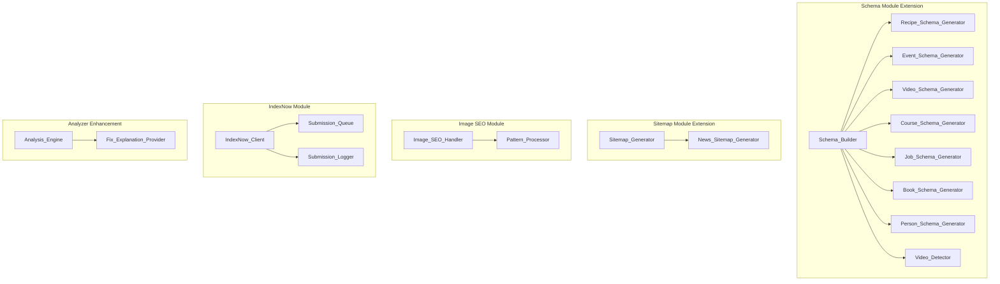

# Design Document: Sprint 3 - Schema + Content Coverage

## Overview

Sprint 3 - Schema + Content Coverage expands MeowSEO's schema type support and adds specialized content optimization features to achieve feature parity with Yoast SEO Premium and RankMath Pro. This sprint implements six key enhancements that address critical gaps in schema coverage, content discovery, and user guidance.

The sprint addresses:
1. **Expanded Schema Types** - Add 7 new schema types (Recipe, Event, VideoObject, Course, JobPosting, Book, Person) to match competitor coverage
2. **Video Schema Auto-Detection** - Automatically generate VideoObject schema from YouTube/Vimeo embeds
3. **Google News Sitemap** - Dedicated news sitemap for Google News discovery
4. **Image SEO Automation** - Pattern-based automatic alt text generation
5. **IndexNow Instant Indexing** - Submit URL updates to Bing, Yandex, and Seznam instantly
6. **Analyzer Fix Explanations** - Actionable guidance for every failing SEO check

### Design Philosophy

This design follows MeowSEO's existing architectural patterns:
- **Module-based architecture** - Each feature extends existing modules or adds new focused modules
- **Options-based configuration** - Settings stored in `meowseo_options`
- **WordPress integration** - Hooks into WordPress core APIs and filters
- **Performance-first** - Caching, throttling, and efficient queries
- **Validation-first** - All user input validated before storage

### Current State

**Existing Schema Support**: Article, FAQ, HowTo, LocalBusiness, Product, Speakable (6 types)
**Competitor Schema Support**: Yoast Premium (10 types), RankMath Pro (20+ types)
**Gap**: Missing Recipe, Event, VideoObject, Course, JobPosting, Book, Person

**Existing Sitemap**: XML sitemap for posts and terms
**Gap**: No Google News sitemap with news:news elements

**Existing Image Handling**: Manual alt text entry only
**Gap**: No automatic alt text generation

**Existing Indexing**: Google Search Console OAuth submission
**Gap**: No IndexNow protocol support

**Existing Analyzer Output**: Pass/fail scores only
**Gap**: No actionable fix guidance

## Architecture

### High-Level Component Diagram



### Module Structure

```
includes/
├── modules/
│   ├── schema/
│   │   ├── class-schema.php (extend)
│   │   ├── generators/
│   │   │   ├── class-recipe-schema-generator.php (new)
│   │   │   ├── class-event-schema-generator.php (new)
│   │   │   ├── class-video-schema-generator.php (new)
│   │   │   ├── class-course-schema-generator.php (new)
│   │   │   ├── class-job-schema-generator.php (new)
│   │   │   ├── class-book-schema-generator.php (new)
│   │   │   └── class-person-schema-generator.php (new)
│   │   └── class-video-detector.php (new)
│   ├── sitemap/
│   │   ├── class-sitemap-generator.php (extend)
│   │   └── class-news-sitemap-generator.php (new)
│   ├── image-seo/
│   │   ├── class-image-seo-handler.php (new)
│   │   └── class-pattern-processor.php (new)
│   ├── indexnow/
│   │   ├── class-indexnow-client.php (new)
│   │   ├── class-submission-queue.php (new)
│   │   └── class-submission-logger.php (new)
│   └── analysis/
│       ├── class-analysis-engine.php (extend)
│       └── class-fix-explanation-provider.php (new)
assets/
└── src/
    └── gutenberg/
        └── components/
            └── tabs/
                └── SchemaTabContent.tsx (extend)
```

## Components and Interfaces

### 1. Expanded Schema Type Support

#### Schema Type Generators

Each new schema type follows the same generator pattern established by existing schema types.

**Base Generator Interface** (established pattern):
```php
interface Schema_Generator_Interface {
    public function generate( int $post_id, array $config ): array;
    public function get_required_fields(): array;
    public function get_optional_fields(): array;
    public function validate_config( array $config ): bool|WP_Error;
}
```

#### Recipe_Schema_Generator

**Responsibility**: Generates Recipe schema markup with cooking instructions and nutrition information.

**Public Interface**:
```php
class Recipe_Schema_Generator implements Schema_Generator_Interface {
    public function generate( int $post_id, array $config ): array;
    public function get_required_fields(): array;
    public function get_optional_fields(): array;
    public function validate_config( array $config ): bool|WP_Error;
    private function format_ingredients( array $ingredients ): array;
    private function format_instructions( array $instructions ): array;
    private function format_nutrition( array $nutrition ): array;
}
```

**Schema Structure**:
```json
{
  "@type": "Recipe",
  "name": "Recipe Name",
  "description": "Recipe description",
  "image": "https://example.com/image.jpg",
  "author": {
    "@type": "Person",
    "name": "Author Name"
  },
  "datePublished": "2024-01-20",
  "prepTime": "PT15M",
  "cookTime": "PT30M",
  "totalTime": "PT45M",
  "recipeYield": "4 servings",
  "recipeCategory": "Main Course",
  "recipeCuisine": "Italian",
  "recipeIngredient": [
    "2 cups flour",
    "1 cup sugar"
  ],
  "recipeInstructions": [
    {
      "@type": "HowToStep",
      "text": "Mix ingredients"
    }
  ],
  "nutrition": {
    "@type": "NutritionInformation",
    "calories": "250 calories",
    "fatContent": "10g",
    "carbohydrateContent": "30g",
    "proteinContent": "8g"
  }
}
```

**Required Fields**: name, description, recipeIngredient, recipeInstructions
**Optional Fields**: prepTime, cookTime, totalTime, recipeYield, recipeCategory, recipeCuisine, nutrition, image

#### Event_Schema_Generator

**Responsibility**: Generates Event schema markup for concerts, webinars, meetups, and other events.

**Schema Structure**:
```json
{
  "@type": "Event",
  "name": "Event Name",
  "description": "Event description",
  "startDate": "2024-06-15T19:00:00-05:00",
  "endDate": "2024-06-15T22:00:00-05:00",
  "eventStatus": "https://schema.org/EventScheduled",
  "eventAttendanceMode": "https://schema.org/OfflineEventAttendanceMode",
  "location": {
    "@type": "Place",
    "name": "Venue Name",
    "address": {
      "@type": "PostalAddress",
      "streetAddress": "123 Main St",
      "addressLocality": "City",
      "addressRegion": "State",
      "postalCode": "12345",
      "addressCountry": "US"
    }
  },
  "organizer": {
    "@type": "Organization",
    "name": "Organizer Name",
    "url": "https://example.com"
  },
  "offers": {
    "@type": "Offer",
    "url": "https://example.com/tickets",
    "price": "30",
    "priceCurrency": "USD",
    "availability": "https://schema.org/InStock"
  }
}
```

**Required Fields**: name, startDate, location
**Optional Fields**: endDate, description, eventStatus, eventAttendanceMode, organizer, offers, image

#### Video_Schema_Generator

**Responsibility**: Generates VideoObject schema markup for video content.

**Schema Structure**:
```json
{
  "@type": "VideoObject",
  "name": "Video Title",
  "description": "Video description",
  "thumbnailUrl": "https://example.com/thumbnail.jpg",
  "uploadDate": "2024-01-20T10:00:00Z",
  "duration": "PT5M30S",
  "contentUrl": "https://www.youtube.com/watch?v=abc123",
  "embedUrl": "https://www.youtube.com/embed/abc123"
}
```

**Required Fields**: name, description, thumbnailUrl, uploadDate
**Optional Fields**: duration, contentUrl, embedUrl

#### Course_Schema_Generator

**Responsibility**: Generates Course schema markup for educational content.

**Schema Structure**:
```json
{
  "@type": "Course",
  "name": "Course Name",
  "description": "Course description",
  "provider": {
    "@type": "Organization",
    "name": "Provider Name",
    "sameAs": "https://example.com"
  },
  "courseCode": "CS101",
  "hasCourseInstance": {
    "@type": "CourseInstance",
    "courseMode": "online",
    "courseWorkload": "PT40H"
  }
}
```

**Required Fields**: name, description, provider
**Optional Fields**: courseCode, hasCourseInstance

#### Job_Schema_Generator

**Responsibility**: Generates JobPosting schema markup for job listings.

**Schema Structure**:
```json
{
  "@type": "JobPosting",
  "title": "Job Title",
  "description": "Job description",
  "datePosted": "2024-01-20",
  "validThrough": "2024-02-20",
  "employmentType": "FULL_TIME",
  "hiringOrganization": {
    "@type": "Organization",
    "name": "Company Name",
    "sameAs": "https://example.com"
  },
  "jobLocation": {
    "@type": "Place",
    "address": {
      "@type": "PostalAddress",
      "addressLocality": "City",
      "addressRegion": "State",
      "addressCountry": "US"
    }
  },
  "baseSalary": {
    "@type": "MonetaryAmount",
    "currency": "USD",
    "value": {
      "@type": "QuantitativeValue",
      "value": 50000,
      "unitText": "YEAR"
    }
  }
}
```

**Required Fields**: title, description, datePosted, hiringOrganization
**Optional Fields**: validThrough, employmentType, jobLocation, baseSalary

#### Book_Schema_Generator

**Responsibility**: Generates Book schema markup for book content.

**Schema Structure**:
```json
{
  "@type": "Book",
  "name": "Book Title",
  "author": {
    "@type": "Person",
    "name": "Author Name"
  },
  "isbn": "978-3-16-148410-0",
  "numberOfPages": 350,
  "publisher": {
    "@type": "Organization",
    "name": "Publisher Name"
  },
  "datePublished": "2024-01-20",
  "bookFormat": "https://schema.org/Hardcover"
}
```

**Required Fields**: name, author
**Optional Fields**: isbn, numberOfPages, publisher, datePublished, bookFormat

#### Person_Schema_Generator

**Responsibility**: Generates Person schema markup for author bios and about pages.

**Schema Structure**:
```json
{
  "@type": "Person",
  "name": "Person Name",
  "jobTitle": "Job Title",
  "description": "Bio description",
  "image": "https://example.com/photo.jpg",
  "url": "https://example.com",
  "sameAs": [
    "https://twitter.com/handle",
    "https://linkedin.com/in/profile"
  ]
}
```

**Required Fields**: name
**Optional Fields**: jobTitle, description, image, url, sameAs

#### Schema_Builder Extension

**Responsibility**: Extends existing Schema_Builder to support new schema types.

**New Methods**:
```php
class Schema_Builder {
    // Existing methods...
    
    private function build_recipe_schema( int $post_id, array $config ): array;
    private function build_event_schema( int $post_id, array $config ): array;
    private function build_video_schema( int $post_id, array $config ): array;
    private function build_course_schema( int $post_id, array $config ): array;
    private function build_job_schema( int $post_id, array $config ): array;
    private function build_book_schema( int $post_id, array $config ): array;
    private function build_person_schema( int $post_id, array $config ): array;
}
```

**Schema Type Registration**:
```php
// Add to existing schema type array
private $schema_types = array(
    'Article',
    'WebPage',
    'FAQPage',
    'HowTo',
    'LocalBusiness',
    'Product',
    'Recipe',        // New
    'Event',         // New
    'VideoObject',   // New
    'Course',        // New
    'JobPosting',    // New
    'Book',          // New
    'Person',        // New
);
```

### 2. Video Schema Auto-Detection

#### Video_Detector

**Responsibility**: Parses post content to identify embedded YouTube and Vimeo videos and extract video IDs.

**Public Interface**:
```php
class Video_Detector {
    public function __construct();
    public function detect_videos( string $content ): array;
    public function detect_youtube_videos( string $content ): array;
    public function detect_vimeo_videos( string $content ): array;
    private function extract_youtube_id( string $url ): string|false;
    private function extract_vimeo_id( string $url ): string|false;
    private function parse_gutenberg_blocks( string $content ): array;
    private function parse_classic_editor_content( string $content ): array;
}
```

**Detection Patterns**:

**YouTube URL Patterns**:
```php
private $youtube_patterns = array(
    // Standard watch URL
    '#https?://(?:www\.)?youtube\.com/watch\?v=([a-zA-Z0-9_-]{11})#',
    // Short URL
    '#https?://youtu\.be/([a-zA-Z0-9_-]{11})#',
    // Embed URL
    '#https?://(?:www\.)?youtube\.com/embed/([a-zA-Z0-9_-]{11})#',
    // YouTube block
    '#<!-- wp:embed {"url":"https://(?:www\.)?youtube\.com/watch\?v=([a-zA-Z0-9_-]{11})"#',
);
```

**Vimeo URL Patterns**:
```php
private $vimeo_patterns = array(
    // Standard URL
    '#https?://(?:www\.)?vimeo\.com/(\d+)#',
    // Player URL
    '#https?://player\.vimeo\.com/video/(\d+)#',
    // Vimeo block
    '#<!-- wp:embed {"url":"https://vimeo\.com/(\d+)"#',
);
```

**Detection Process**:
1. Check if content contains Gutenberg blocks (presence of `<!-- wp:`)
2. If blocks: Parse block comments and extract video URLs from embed blocks
3. If classic editor: Use regex patterns to find oEmbed URLs
4. Extract video IDs from all found URLs
5. Return array of video data: `[['platform' => 'youtube', 'id' => 'abc123'], ...]`

**Integration with Schema Generation**:
```php
// In Schema_Builder::build()
$video_detector = new Video_Detector();
$videos = $video_detector->detect_videos( $post->post_content );

if ( ! empty( $videos ) && $this->is_auto_video_schema_enabled() ) {
    foreach ( $videos as $video ) {
        $video_schema = $this->build_video_schema_from_detection( $video );
        $graph[] = $video_schema;
    }
}
```

**Video Metadata Fetching**:
```php
private function fetch_video_metadata( string $platform, string $video_id ): array|false {
    if ( 'youtube' === $platform ) {
        return $this->fetch_youtube_metadata( $video_id );
    } elseif ( 'vimeo' === $platform ) {
        return $this->fetch_vimeo_metadata( $video_id );
    }
    return false;
}

private function fetch_youtube_metadata( string $video_id ): array|false {
    // Use YouTube oEmbed API (no API key required)
    $url = 'https://www.youtube.com/oembed?url=https://www.youtube.com/watch?v=' . $video_id . '&format=json';
    $response = wp_remote_get( $url );
    
    if ( is_wp_error( $response ) ) {
        return false;
    }
    
    $data = json_decode( wp_remote_retrieve_body( $response ), true );
    
    return array(
        'title' => $data['title'] ?? '',
        'description' => '',
        'thumbnail_url' => $data['thumbnail_url'] ?? '',
        'duration' => '', // Not available from oEmbed
    );
}

private function fetch_vimeo_metadata( string $video_id ): array|false {
    // Use Vimeo oEmbed API
    $url = 'https://vimeo.com/api/oembed.json?url=https://vimeo.com/' . $video_id;
    $response = wp_remote_get( $url );
    
    if ( is_wp_error( $response ) ) {
        return false;
    }
    
    $data = json_decode( wp_remote_retrieve_body( $response ), true );
    
    return array(
        'title' => $data['title'] ?? '',
        'description' => $data['description'] ?? '',
        'thumbnail_url' => $data['thumbnail_url'] ?? '',
        'duration' => $data['duration'] ?? '', // In seconds
    );
}
```

**Settings Integration**:
```php
// Add to meowseo_options
[
    'auto_video_schema_enabled' => bool, // Default: true
]
```

### 3. Google News Sitemap

#### News_Sitemap_Generator

**Responsibility**: Generates Google News compliant XML sitemap with news:news elements.

**Public Interface**:
```php
class News_Sitemap_Generator {
    public function __construct( Options $options );
    public function generate(): string|false;
    public function get_news_posts(): array;
    private function build_news_xml( array $posts ): string;
    private function is_news_post( WP_Post $post ): bool;
    private function get_publication_name(): string;
    private function get_publication_language(): string;
}
```

**News Post Criteria**:
- Published within last 2 days (48 hours)
- Post status: 'publish'
- Not marked with Googlebot-News noindex
- Post type: 'post' (configurable via filter)

**XML Structure**:
```xml
<?xml version="1.0" encoding="UTF-8"?>
<urlset xmlns="http://www.sitemaps.org/schemas/sitemap/0.9"
        xmlns:news="http://www.google.com/schemas/sitemap-news/0.9">
    <url>
        <loc>https://example.com/article-url</loc>
        <news:news>
            <news:publication>
                <news:name>Publication Name</news:name>
                <news:language>en</news:language>
            </news:publication>
            <news:publication_date>2024-01-20T10:00:00Z</news:publication_date>
            <news:title>Article Title</news:title>
            <news:keywords>keyword1, keyword2, keyword3</news:keywords>
        </news:news>
    </url>
</urlset>
```

**Implementation**:
```php
public function generate(): string|false {
    $posts = $this->get_news_posts();
    
    if ( empty( $posts ) ) {
        return false;
    }
    
    $xml = $this->build_news_xml( $posts );
    
    // Cache for 5 minutes
    set_transient( 'meowseo_news_sitemap', $xml, 5 * MINUTE_IN_SECONDS );
    
    return $xml;
}

public function get_news_posts(): array {
    $two_days_ago = gmdate( 'Y-m-d H:i:s', strtotime( '-2 days' ) );
    
    $args = array(
        'post_type' => 'post',
        'post_status' => 'publish',
        'date_query' => array(
            array(
                'after' => $two_days_ago,
                'inclusive' => true,
            ),
        ),
        'posts_per_page' => 1000,
        'meta_query' => array(
            'relation' => 'OR',
            array(
                'key' => '_meowseo_googlebot_news_noindex',
                'compare' => 'NOT EXISTS',
            ),
            array(
                'key' => '_meowseo_googlebot_news_noindex',
                'value' => '1',
                'compare' => '!=',
            ),
        ),
    );
    
    return get_posts( $args );
}

private function build_news_xml( array $posts ): string {
    $xml = '<?xml version="1.0" encoding="UTF-8"?>' . "\n";
    $xml .= '<urlset xmlns="http://www.sitemaps.org/schemas/sitemap/0.9" ';
    $xml .= 'xmlns:news="http://www.google.com/schemas/sitemap-news/0.9">' . "\n";
    
    $publication_name = $this->get_publication_name();
    $publication_language = $this->get_publication_language();
    
    foreach ( $posts as $post ) {
        $xml .= "\t<url>\n";
        $xml .= "\t\t<loc>" . esc_url( get_permalink( $post ) ) . "</loc>\n";
        $xml .= "\t\t<news:news>\n";
        $xml .= "\t\t\t<news:publication>\n";
        $xml .= "\t\t\t\t<news:name>" . esc_html( $publication_name ) . "</news:name>\n";
        $xml .= "\t\t\t\t<news:language>" . esc_html( $publication_language ) . "</news:language>\n";
        $xml .= "\t\t\t</news:publication>\n";
        $xml .= "\t\t\t<news:publication_date>" . get_the_date( 'c', $post ) . "</news:publication_date>\n";
        $xml .= "\t\t\t<news:title>" . esc_html( get_the_title( $post ) ) . "</news:title>\n";
        
        // Add keywords if focus keyword is set
        $focus_keyword = get_post_meta( $post->ID, '_meowseo_focus_keyword', true );
        if ( ! empty( $focus_keyword ) ) {
            $xml .= "\t\t\t<news:keywords>" . esc_html( $focus_keyword ) . "</news:keywords>\n";
        }
        
        $xml .= "\t\t</news:news>\n";
        $xml .= "\t</url>\n";
    }
    
    $xml .= '</urlset>';
    
    return $xml;
}
```

**URL Routing**:
```php
// In Sitemap module boot()
add_action( 'init', function() {
    add_rewrite_rule(
        '^news-sitemap\.xml$',
        'index.php?meowseo_news_sitemap=1',
        'top'
    );
} );

add_filter( 'query_vars', function( $vars ) {
    $vars[] = 'meowseo_news_sitemap';
    return $vars;
} );

add_action( 'template_redirect', function() {
    if ( get_query_var( 'meowseo_news_sitemap' ) ) {
        $generator = new News_Sitemap_Generator( $this->options );
        
        // Check cache first
        $xml = get_transient( 'meowseo_news_sitemap' );
        
        if ( false === $xml ) {
            $xml = $generator->generate();
        }
        
        if ( false === $xml ) {
            status_header( 404 );
            return;
        }
        
        header( 'Content-Type: application/xml; charset=utf-8' );
        header( 'X-Robots-Tag: noindex, follow', true );
        echo $xml;
        exit;
    }
} );
```

**Sitemap Index Integration**:
```php
// Extend Sitemap_Generator::build_index_xml()
private function build_index_xml( array $post_types ): string {
    $xml = '<?xml version="1.0" encoding="UTF-8"?>' . "\n";
    $xml .= '<sitemapindex xmlns="http://www.sitemaps.org/schemas/sitemap/0.9">' . "\n";
    
    $site_url = trailingslashit( get_site_url() );
    
    // Add news sitemap
    $xml .= "\t<sitemap>\n";
    $xml .= "\t\t<loc>" . esc_url( $site_url . 'news-sitemap.xml' ) . "</loc>\n";
    $xml .= "\t\t<lastmod>" . gmdate( 'Y-m-d\TH:i:s\+00:00' ) . "</lastmod>\n";
    $xml .= "\t</sitemap>\n";
    
    // Existing post type sitemaps...
    foreach ( $post_types as $post_type ) {
        // ...
    }
    
    $xml .= '</sitemapindex>';
    
    return $xml;
}
```

**Settings**:
```php
// Add to meowseo_options
[
    'news_sitemap_publication_name' => string, // Default: get_bloginfo('name')
    'news_sitemap_language' => string, // Default: get_bloginfo('language')
]
```

**Cache Invalidation**:
```php
// Invalidate cache on post publish/update
add_action( 'transition_post_status', function( $new_status, $old_status, $post ) {
    if ( 'post' === $post->post_type && 'publish' === $new_status ) {
        delete_transient( 'meowseo_news_sitemap' );
    }
}, 10, 3 );
```


### 4. Image SEO Automation

#### Image_SEO_Handler

**Responsibility**: Automatically generates alt text for images using pattern-based templates.

**Public Interface**:
```php
class Image_SEO_Handler {
    public function __construct( Options $options, Pattern_Processor $pattern_processor );
    public function boot(): void;
    public function filter_image_attributes( array $attr, WP_Post $attachment ): array;
    public function is_enabled(): bool;
    public function should_override_existing(): bool;
    private function generate_alt_text( WP_Post $attachment ): string;
}
```

**Implementation**:
```php
public function boot(): void {
    if ( ! $this->is_enabled() ) {
        return;
    }
    
    // Hook into image attribute filter
    add_filter( 'wp_get_attachment_image_attributes', array( $this, 'filter_image_attributes' ), 10, 2 );
}

public function filter_image_attributes( array $attr, WP_Post $attachment ): array {
    // Skip if alt text exists and we're not overriding
    if ( ! empty( $attr['alt'] ) && ! $this->should_override_existing() ) {
        return $attr;
    }
    
    // Generate alt text from pattern
    $alt_text = $this->generate_alt_text( $attachment );
    
    if ( ! empty( $alt_text ) ) {
        $attr['alt'] = $alt_text;
    }
    
    return $attr;
}

private function generate_alt_text( WP_Post $attachment ): string {
    $pattern = $this->options->get( 'image_seo_alt_pattern', '%imagetitle%' );
    
    $variables = array(
        '%imagetitle%' => get_the_title( $attachment ),
        '%imagealt%' => get_post_meta( $attachment->ID, '_wp_attachment_image_alt', true ),
        '%sitename%' => get_bloginfo( 'name' ),
    );
    
    return $this->pattern_processor->process( $pattern, $variables );
}
```

#### Pattern_Processor

**Responsibility**: Processes pattern templates with variable substitution.

**Public Interface**:
```php
class Pattern_Processor {
    public function process( string $pattern, array $variables ): string;
    public function get_available_variables(): array;
    private function sanitize_output( string $text ): string;
}
```

**Implementation**:
```php
public function process( string $pattern, array $variables ): string {
    $output = $pattern;
    
    foreach ( $variables as $variable => $value ) {
        $output = str_replace( $variable, $value, $output );
    }
    
    return $this->sanitize_output( $output );
}

private function sanitize_output( string $text ): string {
    // Remove HTML tags
    $text = wp_strip_all_tags( $text );
    
    // Trim whitespace
    $text = trim( $text );
    
    // Limit length to 125 characters (recommended alt text length)
    if ( strlen( $text ) > 125 ) {
        $text = substr( $text, 0, 122 ) . '...';
    }
    
    return $text;
}

public function get_available_variables(): array {
    return array(
        '%imagetitle%' => __( 'Image title', 'meowseo' ),
        '%imagealt%' => __( 'Existing alt text', 'meowseo' ),
        '%sitename%' => __( 'Site name', 'meowseo' ),
    );
}
```

**Settings**:
```php
// Add to meowseo_options
[
    'image_seo_enabled' => bool, // Default: false
    'image_seo_alt_pattern' => string, // Default: '%imagetitle%'
    'image_seo_override_existing' => bool, // Default: false
]
```

**Settings UI**:
- Add "Image SEO" section to Advanced tab
- Checkbox: "Enable automatic alt text generation"
- Text input: "Alt text pattern" with variable reference
- Checkbox: "Override existing alt text"
- Help text explaining pattern variables

### 5. IndexNow Instant Indexing

#### IndexNow_Client

**Responsibility**: Submits URL updates to IndexNow API for instant indexing by Bing, Yandex, and Seznam.

**Public Interface**:
```php
class IndexNow_Client {
    public function __construct( Options $options, Submission_Queue $queue, Submission_Logger $logger );
    public function boot(): void;
    public function submit_url( string $url ): bool|WP_Error;
    public function submit_urls( array $urls ): array;
    public function get_api_key(): string;
    public function generate_api_key(): string;
    public function is_enabled(): bool;
    private function make_request( array $urls ): bool|WP_Error;
}
```

**Implementation**:
```php
public function boot(): void {
    if ( ! $this->is_enabled() ) {
        return;
    }
    
    // Hook into post publish/update
    add_action( 'transition_post_status', array( $this, 'handle_post_transition' ), 10, 3 );
    
    // Process queued submissions
    add_action( 'meowseo_process_indexnow_queue', array( $this->queue, 'process' ) );
    
    // Schedule queue processing if not already scheduled
    if ( ! wp_next_scheduled( 'meowseo_process_indexnow_queue' ) ) {
        wp_schedule_event( time(), 'meowseo_indexnow_interval', 'meowseo_process_indexnow_queue' );
    }
}

public function handle_post_transition( string $new_status, string $old_status, WP_Post $post ): void {
    // Only submit when post is published or updated
    if ( 'publish' !== $new_status ) {
        return;
    }
    
    // Skip if post type is not public
    if ( ! is_post_type_viewable( $post->post_type ) ) {
        return;
    }
    
    $url = get_permalink( $post );
    
    // Add to queue instead of immediate submission
    $this->queue->add( $url );
}

public function submit_url( string $url ): bool|WP_Error {
    return $this->submit_urls( array( $url ) );
}

public function submit_urls( array $urls ): array {
    $api_key = $this->get_api_key();
    
    if ( empty( $api_key ) ) {
        return array(
            'success' => false,
            'error' => __( 'IndexNow API key not configured', 'meowseo' ),
        );
    }
    
    $result = $this->make_request( $urls );
    
    // Log submission
    $this->logger->log( $urls, $result );
    
    if ( is_wp_error( $result ) ) {
        return array(
            'success' => false,
            'error' => $result->get_error_message(),
        );
    }
    
    return array(
        'success' => true,
        'urls_submitted' => count( $urls ),
    );
}

private function make_request( array $urls ): bool|WP_Error {
    $api_key = $this->get_api_key();
    $host = parse_url( home_url(), PHP_URL_HOST );
    
    $body = array(
        'host' => $host,
        'key' => $api_key,
        'urlList' => $urls,
    );
    
    $response = wp_remote_post(
        'https://api.indexnow.org/indexnow',
        array(
            'headers' => array(
                'Content-Type' => 'application/json',
            ),
            'body' => wp_json_encode( $body ),
            'timeout' => 10,
        )
    );
    
    if ( is_wp_error( $response ) ) {
        return $response;
    }
    
    $status_code = wp_remote_retrieve_response_code( $response );
    
    // 200 = success, 202 = accepted
    if ( ! in_array( $status_code, array( 200, 202 ), true ) ) {
        return new WP_Error(
            'indexnow_request_failed',
            sprintf( __( 'IndexNow request failed with status code %d', 'meowseo' ), $status_code )
        );
    }
    
    return true;
}

public function get_api_key(): string {
    $api_key = $this->options->get( 'indexnow_api_key', '' );
    
    if ( empty( $api_key ) ) {
        $api_key = $this->generate_api_key();
        $this->options->set( 'indexnow_api_key', $api_key );
    }
    
    return $api_key;
}

public function generate_api_key(): string {
    // Generate a random 32-character hexadecimal key
    return bin2hex( random_bytes( 16 ) );
}
```

#### Submission_Queue

**Responsibility**: Manages queued URL submissions with throttling.

**Public Interface**:
```php
class Submission_Queue {
    public function __construct( IndexNow_Client $client );
    public function add( string $url ): bool;
    public function process(): void;
    public function get_queue_size(): int;
    private function get_queue(): array;
    private function save_queue( array $queue ): void;
    private function should_throttle(): bool;
}
```

**Implementation**:
```php
public function add( string $url ): bool {
    $queue = $this->get_queue();
    
    // Avoid duplicates
    if ( in_array( $url, $queue, true ) ) {
        return false;
    }
    
    $queue[] = $url;
    $this->save_queue( $queue );
    
    return true;
}

public function process(): void {
    if ( $this->should_throttle() ) {
        return;
    }
    
    $queue = $this->get_queue();
    
    if ( empty( $queue ) ) {
        return;
    }
    
    // Process up to 10 URLs at a time
    $batch = array_slice( $queue, 0, 10 );
    $remaining = array_slice( $queue, 10 );
    
    // Submit batch
    $result = $this->client->submit_urls( $batch );
    
    if ( $result['success'] ) {
        // Remove submitted URLs from queue
        $this->save_queue( $remaining );
        
        // Update last submission time
        update_option( 'meowseo_indexnow_last_submission', time() );
    } else {
        // Retry logic: move failed URLs to end of queue
        $this->save_queue( array_merge( $remaining, $batch ) );
    }
}

private function should_throttle(): bool {
    $last_submission = get_option( 'meowseo_indexnow_last_submission', 0 );
    $time_since_last = time() - $last_submission;
    
    // Minimum 5 seconds between submissions
    return $time_since_last < 5;
}

private function get_queue(): array {
    return get_option( 'meowseo_indexnow_queue', array() );
}

private function save_queue( array $queue ): void {
    update_option( 'meowseo_indexnow_queue', $queue );
}
```

**Custom Cron Interval**:
```php
// Register custom cron interval for queue processing
add_filter( 'cron_schedules', function( $schedules ) {
    $schedules['meowseo_indexnow_interval'] = array(
        'interval' => 10, // 10 seconds
        'display' => __( 'Every 10 seconds (IndexNow)', 'meowseo' ),
    );
    return $schedules;
} );
```

#### Submission_Logger

**Responsibility**: Logs all IndexNow submission attempts with retry tracking.

**Public Interface**:
```php
class Submission_Logger {
    public function log( array $urls, $result ): void;
    public function get_history( int $limit = 100 ): array;
    public function clear_history(): void;
    private function get_log_entries(): array;
    private function save_log_entries( array $entries ): void;
}
```

**Log Entry Structure**:
```php
[
    'timestamp' => int,
    'urls' => array,
    'success' => bool,
    'error' => string|null,
    'retry_count' => int,
]
```

**Implementation**:
```php
public function log( array $urls, $result ): void {
    $entries = $this->get_log_entries();
    
    $entry = array(
        'timestamp' => time(),
        'urls' => $urls,
        'success' => is_array( $result ) && $result['success'],
        'error' => is_wp_error( $result ) ? $result->get_error_message() : ( $result['error'] ?? null ),
        'retry_count' => 0,
    );
    
    // Add to beginning of array
    array_unshift( $entries, $entry );
    
    // Keep only last 100 entries
    $entries = array_slice( $entries, 0, 100 );
    
    $this->save_log_entries( $entries );
}

public function get_history( int $limit = 100 ): array {
    $entries = $this->get_log_entries();
    return array_slice( $entries, 0, $limit );
}

private function get_log_entries(): array {
    return get_option( 'meowseo_indexnow_log', array() );
}

private function save_log_entries( array $entries ): void {
    update_option( 'meowseo_indexnow_log', $entries );
}
```

**Retry Logic with Exponential Backoff**:
```php
// In IndexNow_Client::make_request()
private function make_request_with_retry( array $urls, int $retry_count = 0 ): bool|WP_Error {
    $result = $this->make_request( $urls );
    
    if ( is_wp_error( $result ) && $retry_count < 3 ) {
        // Exponential backoff: 5s, 10s, 20s
        $delay = 5 * pow( 2, $retry_count );
        sleep( $delay );
        
        return $this->make_request_with_retry( $urls, $retry_count + 1 );
    }
    
    return $result;
}
```

**Settings**:
```php
// Add to meowseo_options
[
    'indexnow_enabled' => bool, // Default: false
    'indexnow_api_key' => string, // Auto-generated
]
```

**Admin UI - Submission History**:
```php
// Add to Tools page
public function render_submission_history(): void {
    $history = $this->logger->get_history( 100 );
    
    echo '<div class="meowseo-indexnow-history">';
    echo '<h3>' . esc_html__( 'IndexNow Submission History', 'meowseo' ) . '</h3>';
    echo '<table class="wp-list-table widefat fixed striped">';
    echo '<thead><tr>';
    echo '<th>' . esc_html__( 'Time', 'meowseo' ) . '</th>';
    echo '<th>' . esc_html__( 'URLs', 'meowseo' ) . '</th>';
    echo '<th>' . esc_html__( 'Status', 'meowseo' ) . '</th>';
    echo '<th>' . esc_html__( 'Error', 'meowseo' ) . '</th>';
    echo '</tr></thead>';
    echo '<tbody>';
    
    foreach ( $history as $entry ) {
        echo '<tr>';
        echo '<td>' . esc_html( gmdate( 'Y-m-d H:i:s', $entry['timestamp'] ) ) . '</td>';
        echo '<td>' . esc_html( implode( ', ', $entry['urls'] ) ) . '</td>';
        echo '<td>' . ( $entry['success'] ? '✓ Success' : '✗ Failed' ) . '</td>';
        echo '<td>' . esc_html( $entry['error'] ?? '-' ) . '</td>';
        echo '</tr>';
    }
    
    echo '</tbody></table>';
    echo '</div>';
}
```

### 6. Analyzer Fix Explanations

#### Fix_Explanation_Provider

**Responsibility**: Provides actionable fix guidance for each failing analyzer check.

**Public Interface**:
```php
class Fix_Explanation_Provider {
    public function get_explanation( string $analyzer_id, array $context ): string;
    private function get_title_too_short_explanation( array $context ): string;
    private function get_title_too_long_explanation( array $context ): string;
    private function get_keyword_missing_title_explanation( array $context ): string;
    private function get_keyword_missing_first_paragraph_explanation( array $context ): string;
    private function get_description_missing_explanation( array $context ): string;
    private function get_content_too_short_explanation( array $context ): string;
    private function get_keyword_density_low_explanation( array $context ): string;
    private function get_keyword_density_high_explanation( array $context ): string;
    private function get_keyword_missing_headings_explanation( array $context ): string;
    private function get_images_missing_alt_explanation( array $context ): string;
    private function get_slug_not_optimized_explanation( array $context ): string;
}
```

**Explanation Templates**:

```php
private $explanations = array(
    'title_too_short' => array(
        'issue' => 'Your SEO title is too short at {current_length} characters.',
        'fix' => 'Aim for {min_length}-{max_length} characters. Add more descriptive words that include your focus keyword "{keyword}".',
    ),
    'title_too_long' => array(
        'issue' => 'Your SEO title is too long at {current_length} characters.',
        'fix' => 'Shorten it to {max_length} characters or less. Google typically displays the first {max_length} characters in search results.',
    ),
    'keyword_missing_title' => array(
        'issue' => 'Your focus keyword "{keyword}" is not in the SEO title.',
        'fix' => 'Add "{keyword}" near the beginning of your title for better SEO. Example: "{keyword} - {site_name}"',
    ),
    'keyword_missing_first_paragraph' => array(
        'issue' => 'Your focus keyword "{keyword}" is not in the first paragraph.',
        'fix' => 'Include "{keyword}" in the opening sentences to signal relevance to search engines and readers.',
    ),
    'description_missing' => array(
        'issue' => 'Your meta description is missing.',
        'fix' => 'Write a compelling 150-160 character summary that includes your focus keyword "{keyword}" and encourages clicks.',
    ),
    'content_too_short' => array(
        'issue' => 'Your content is only {current_words} words.',
        'fix' => 'Aim for at least {min_words} words. Add more detailed information, examples, or sections to provide comprehensive coverage of "{keyword}".',
    ),
    'keyword_density_low' => array(
        'issue' => 'Your keyword density for "{keyword}" is {current_density}%.',
        'fix' => 'Aim for {target_min}%-{target_max}% density. Add "{keyword}" naturally in headings, body text, and image alt text.',
    ),
    'keyword_density_high' => array(
        'issue' => 'Your keyword density for "{keyword}" is {current_density}%, which may be considered keyword stuffing.',
        'fix' => 'Reduce to {target_max}% or less. Use synonyms and related terms instead of repeating "{keyword}" excessively.',
    ),
    'keyword_missing_headings' => array(
        'issue' => 'Your focus keyword "{keyword}" is not in any headings.',
        'fix' => 'Add "{keyword}" to at least one H2 or H3 heading to improve content structure and SEO.',
    ),
    'images_missing_alt' => array(
        'issue' => 'You have {count} images without alt text.',
        'fix' => 'Add descriptive alt text to all images. Include "{keyword}" where relevant, but prioritize accurate descriptions for accessibility.',
    ),
    'slug_not_optimized' => array(
        'issue' => 'Your URL slug doesn\'t include the focus keyword.',
        'fix' => 'Edit the permalink to include "{keyword}". Keep it short and readable. Example: /your-site/{keyword_slug}/',
    ),
);
```

**Implementation**:
```php
public function get_explanation( string $analyzer_id, array $context ): string {
    if ( ! isset( $this->explanations[ $analyzer_id ] ) ) {
        return '';
    }
    
    $template = $this->explanations[ $analyzer_id ];
    
    $issue = $this->replace_variables( $template['issue'], $context );
    $fix = $this->replace_variables( $template['fix'], $context );
    
    return sprintf(
        '<div class="meowseo-fix-explanation"><p class="issue">%s</p><p class="fix"><strong>How to fix:</strong> %s</p></div>',
        esc_html( $issue ),
        esc_html( $fix )
    );
}

private function replace_variables( string $text, array $context ): string {
    $replacements = array(
        '{current_length}' => $context['current_length'] ?? '',
        '{min_length}' => $context['min_length'] ?? '',
        '{max_length}' => $context['max_length'] ?? '',
        '{keyword}' => $context['keyword'] ?? '',
        '{site_name}' => get_bloginfo( 'name' ),
        '{current_words}' => $context['current_words'] ?? '',
        '{min_words}' => $context['min_words'] ?? '',
        '{current_density}' => $context['current_density'] ?? '',
        '{target_min}' => $context['target_min'] ?? '',
        '{target_max}' => $context['target_max'] ?? '',
        '{count}' => $context['count'] ?? '',
        '{keyword_slug}' => sanitize_title( $context['keyword'] ?? '' ),
    );
    
    return str_replace( array_keys( $replacements ), array_values( $replacements ), $text );
}
```

**Integration with Analysis Engine**:
```php
// Extend Analysis_Engine to include fix explanations
class Analysis_Engine {
    private Fix_Explanation_Provider $fix_provider;
    
    public function __construct( Options $options, Fix_Explanation_Provider $fix_provider ) {
        $this->options = $options;
        $this->fix_provider = $fix_provider;
    }
    
    public function analyze( int $post_id, string $content ): array {
        $results = array();
        
        // Run all analyzers...
        foreach ( $this->analyzers as $analyzer_id => $analyzer ) {
            $result = $analyzer->analyze( $post_id, $content );
            
            // Add fix explanation if check failed
            if ( 'fail' === $result['status'] || 'warning' === $result['status'] ) {
                $result['fix_explanation'] = $this->fix_provider->get_explanation(
                    $analyzer_id,
                    $result['context'] ?? array()
                );
            }
            
            $results[ $analyzer_id ] = $result;
        }
        
        return $results;
    }
}
```

**Gutenberg Sidebar Display**:
```typescript
// In AnalyzerResult component
interface AnalyzerResultProps {
    analyzer: string;
    result: {
        score: number;
        status: 'pass' | 'warning' | 'fail';
        message: string;
        fix_explanation?: string;
    };
}

const AnalyzerResult: React.FC<AnalyzerResultProps> = ({ analyzer, result }) => {
    return (
        <div className={`analyzer-result analyzer-result--${result.status}`}>
            <div className="analyzer-result__header">
                <StatusIcon status={result.status} />
                <span className="analyzer-result__name">{analyzer}</span>
                <span className="analyzer-result__score">{result.score}/100</span>
            </div>
            <p className="analyzer-result__message">{result.message}</p>
            {result.fix_explanation && (
                <div 
                    className="analyzer-result__fix-explanation"
                    dangerouslySetInnerHTML={{ __html: result.fix_explanation }}
                />
            )}
        </div>
    );
};
```

## Data Models

### Schema Configuration Storage

**Postmeta Keys**:
```php
'_meowseo_schema_type' => string, // 'Recipe', 'Event', 'VideoObject', etc.
'_meowseo_schema_config' => string, // JSON-encoded configuration
```

**Recipe Schema Config**:
```json
{
  "name": "Recipe Name",
  "description": "Recipe description",
  "prepTime": "PT15M",
  "cookTime": "PT30M",
  "totalTime": "PT45M",
  "recipeYield": "4 servings",
  "recipeCategory": "Main Course",
  "recipeCuisine": "Italian",
  "recipeIngredient": ["2 cups flour", "1 cup sugar"],
  "recipeInstructions": [
    {"text": "Mix ingredients"},
    {"text": "Bake at 350°F"}
  ],
  "nutrition": {
    "calories": "250 calories",
    "fatContent": "10g"
  }
}
```

**Event Schema Config**:
```json
{
  "name": "Event Name",
  "description": "Event description",
  "startDate": "2024-06-15T19:00:00-05:00",
  "endDate": "2024-06-15T22:00:00-05:00",
  "location": {
    "name": "Venue Name",
    "address": {
      "streetAddress": "123 Main St",
      "addressLocality": "City",
      "addressRegion": "State",
      "postalCode": "12345",
      "addressCountry": "US"
    }
  },
  "organizer": {
    "name": "Organizer Name",
    "url": "https://example.com"
  }
}
```

### Video Detection Data

**Detected Video Structure**:
```php
[
    'platform' => 'youtube' | 'vimeo',
    'id' => string, // Video ID
    'url' => string, // Full URL
    'metadata' => array( // Fetched from API
        'title' => string,
        'description' => string,
        'thumbnail_url' => string,
        'duration' => string, // ISO 8601 duration
    ),
]
```

### News Sitemap Settings

**Options Storage**:
```php
[
    'news_sitemap_publication_name' => string,
    'news_sitemap_language' => string, // ISO 639-1 code
]
```

**Postmeta for Googlebot-News**:
```php
'_meowseo_googlebot_news_noindex' => '1' | '0'
```

### Image SEO Settings

**Options Storage**:
```php
[
    'image_seo_enabled' => bool,
    'image_seo_alt_pattern' => string,
    'image_seo_override_existing' => bool,
]
```

### IndexNow Data

**Options Storage**:
```php
[
    'indexnow_enabled' => bool,
    'indexnow_api_key' => string,
    'meowseo_indexnow_queue' => array, // Array of URLs
    'meowseo_indexnow_last_submission' => int, // Unix timestamp
    'meowseo_indexnow_log' => array, // Array of log entries
]
```

**Log Entry Structure**:
```php
[
    'timestamp' => int,
    'urls' => array,
    'success' => bool,
    'error' => string|null,
    'retry_count' => int,
]
```

### Analyzer Fix Explanation Context

**Context Data Structure**:
```php
[
    'keyword' => string,
    'current_length' => int,
    'min_length' => int,
    'max_length' => int,
    'current_words' => int,
    'min_words' => int,
    'current_density' => float,
    'target_min' => float,
    'target_max' => float,
    'count' => int,
]
```


## Error Handling

### Schema Generation Errors

**Error Types**:
1. **Missing Required Fields** - Skip schema generation, log warning
2. **Invalid Field Values** - Use default values, log warning
3. **Invalid Date Format** - Skip date field, log warning
4. **Invalid Duration Format** - Skip duration field, log warning

**Error Handling Strategy**:
```php
// Graceful degradation - output partial schema if some fields are invalid
try {
    $schema = $generator->generate( $post_id, $config );
} catch ( Exception $e ) {
    Logger::warning( 'Schema generation failed', array(
        'post_id' => $post_id,
        'schema_type' => $config['type'],
        'error' => $e->getMessage(),
    ) );
    return array(); // Skip this schema
}
```

### Video Detection Errors

**Error Types**:
1. **Invalid Video URL** - Skip video, log warning
2. **API Fetch Failure** - Generate schema without metadata, allow manual entry
3. **Invalid Video ID** - Skip video, log warning

**Error Handling**:
```php
// Fallback to manual entry if metadata fetch fails
$metadata = $this->fetch_video_metadata( $platform, $video_id );

if ( false === $metadata ) {
    Logger::info( 'Video metadata fetch failed', array(
        'platform' => $platform,
        'video_id' => $video_id,
    ) );
    
    // Generate schema with URL only
    return array(
        '@type' => 'VideoObject',
        'contentUrl' => $url,
        'embedUrl' => $url,
    );
}
```

### News Sitemap Errors

**Error Types**:
1. **No News Posts** - Return empty sitemap (404)
2. **Invalid Publication Settings** - Use defaults
3. **Cache Write Failure** - Continue without caching

**Error Handling**:
```php
$posts = $this->get_news_posts();

if ( empty( $posts ) ) {
    // Return 404 if no news posts
    return false;
}

$publication_name = $this->get_publication_name();
if ( empty( $publication_name ) ) {
    // Fallback to site name
    $publication_name = get_bloginfo( 'name' );
}
```

### Image SEO Errors

**Error Types**:
1. **Empty Image Title** - Skip alt text generation
2. **Pattern Processing Error** - Use image title as fallback
3. **Invalid Pattern Variables** - Remove invalid variables

**Error Handling**:
```php
$alt_text = $this->generate_alt_text( $attachment );

if ( empty( $alt_text ) ) {
    // Fallback to image title
    $alt_text = get_the_title( $attachment );
}

if ( empty( $alt_text ) ) {
    // Skip if still empty
    return $attr;
}
```

### IndexNow Errors

**Error Types**:
1. **API Request Failure** - Retry with exponential backoff (up to 3 times)
2. **Invalid API Key** - Generate new key, log error
3. **Rate Limit Exceeded** - Queue for later submission
4. **Network Timeout** - Retry with longer timeout

**Error Handling**:
```php
$result = $this->make_request_with_retry( $urls, 0 );

if ( is_wp_error( $result ) ) {
    Logger::error( 'IndexNow submission failed', array(
        'urls' => $urls,
        'error' => $result->get_error_message(),
        'retry_count' => 3,
    ) );
    
    // Keep URLs in queue for next attempt
    return false;
}
```

### Analyzer Fix Explanation Errors

**Error Types**:
1. **Missing Context Data** - Use generic explanation
2. **Unknown Analyzer ID** - Return empty string
3. **Template Processing Error** - Return basic message

**Error Handling**:
```php
public function get_explanation( string $analyzer_id, array $context ): string {
    if ( ! isset( $this->explanations[ $analyzer_id ] ) ) {
        // Unknown analyzer - return empty
        return '';
    }
    
    try {
        return $this->build_explanation( $analyzer_id, $context );
    } catch ( Exception $e ) {
        Logger::warning( 'Fix explanation generation failed', array(
            'analyzer_id' => $analyzer_id,
            'error' => $e->getMessage(),
        ) );
        
        // Return generic message
        return __( 'Please review this check and make improvements.', 'meowseo' );
    }
}
```

## Correctness Properties

*A property is a characteristic or behavior that should hold true across all valid executions of a system—essentially, a formal statement about what the system should do. Properties serve as the bridge between human-readable specifications and machine-verifiable correctness guarantees.*

### Property 1: Schema Generation Preserves Configuration

*For any* valid schema configuration (Recipe, Event, VideoObject, Course, JobPosting, Book, or Person), generating JSON-LD schema SHALL produce output containing all configured required properties with their values preserved.

**Validates: Requirements 1.1, 1.2, 1.3, 1.4, 1.5, 1.6, 1.7**

### Property 2: Schema Validation Correctness

*For any* generated schema object, the Schema_Manager SHALL correctly identify valid schemas (containing all required properties with correct types) and reject invalid schemas (missing required properties or incorrect types).

**Validates: Requirements 1.8**

### Property 3: Video URL Parsing Accuracy

*For any* YouTube or Vimeo URL in standard, short, or embed format, the Video_Detector SHALL correctly extract the video ID and identify the platform.

**Validates: Requirements 2.1, 2.2, 2.3**

### Property 4: Automatic Video Schema Generation

*For any* post content containing detected video URLs, the Schema_Manager SHALL generate a VideoObject schema for each video with the correct video URL.

**Validates: Requirements 2.4**

### Property 5: Video Schema Fallback Behavior

*For any* video where metadata fetching fails, the Schema_Manager SHALL generate VideoObject schema containing the video URL and allow manual property entry.

**Validates: Requirements 2.6**

### Property 6: Multiple Video Schema Generation

*For any* post content containing N detected videos (where N > 0), the Schema_Manager SHALL generate exactly N VideoObject schemas.

**Validates: Requirements 2.9**

### Property 7: News Post Date Filtering

*For any* set of posts with various publication dates, the News_Sitemap_Generator SHALL include only posts published within the last 2 days (48 hours).

**Validates: Requirements 3.2**

### Property 8: News Post Noindex Exclusion

*For any* post with Googlebot-News noindex meta tag set, the News_Sitemap_Generator SHALL exclude it from the news sitemap.

**Validates: Requirements 3.6, 3.7**

### Property 9: News Sitemap XML Structure

*For any* set of news posts, the News_Sitemap_Generator SHALL generate XML containing news:news elements with publication name, language, publication date, title, and keywords (if set) for each post.

**Validates: Requirements 3.3, 3.4, 3.5**

### Property 10: Pattern-Based Alt Text Generation

*For any* image attachment and alt text pattern containing variables (%imagetitle%, %imagealt%, %sitename%), the Image_SEO_Handler SHALL generate alt text with all variables correctly replaced by their corresponding values.

**Validates: Requirements 4.1, 4.2, 4.3, 4.4**

### Property 11: Alt Text Preservation

*For any* image with existing alt text, when automatic alt text generation is enabled and override is disabled, the Image_SEO_Handler SHALL preserve the existing alt text unchanged.

**Validates: Requirements 4.10**

### Property 12: IndexNow API Key Inclusion

*For any* IndexNow submission request, the IndexNow_Client SHALL include a valid API key in the request body.

**Validates: Requirements 5.3**

### Property 13: IndexNow API Key Generation

*For any* IndexNow_Client instance where no API key is configured, calling get_api_key() SHALL generate a new 32-character hexadecimal key and store it in options.

**Validates: Requirements 5.5**

### Property 14: IndexNow Request Throttling

*For any* sequence of URL submissions, the IndexNow_Client SHALL enforce a minimum 5-second delay between consecutive API requests.

**Validates: Requirements 5.7, 5.8**

### Property 15: IndexNow Submission Logging

*For any* IndexNow submission attempt, the Submission_Logger SHALL create a log entry containing timestamp, URLs, success status, and error message (if failed).

**Validates: Requirements 5.9**

### Property 16: IndexNow Retry with Exponential Backoff

*For any* failed IndexNow submission, the IndexNow_Client SHALL retry up to 3 times with exponential backoff delays (5s, 10s, 20s).

**Validates: Requirements 5.11**

### Property 17: Fix Explanation Presence

*For any* analyzer result with failing or warning status, the Analysis_Engine SHALL include a non-empty fix_explanation in the result.

**Validates: Requirements 6.1**

### Property 18: Fix Explanation Character Count Inclusion

*For any* title length analyzer failure (too short or too long), the Fix_Explanation SHALL include the recommended minimum or maximum character count in the explanation text.

**Validates: Requirements 6.4, 6.5**

### Property 19: Fix Explanation Keyword Suggestions

*For any* keyword-related analyzer failure (missing from title, first paragraph, headings, or slug), the Fix_Explanation SHALL include the focus keyword in the suggestion text.

**Validates: Requirements 6.6, 6.7, 6.12, 6.14**

### Property 20: Fix Explanation Density Range

*For any* keyword density analyzer failure (too low or too high), the Fix_Explanation SHALL include the target density range in the explanation text.

**Validates: Requirements 6.10, 6.11**

## Testing Strategy

This feature involves schema generation, content parsing, sitemap generation, image attribute filtering, external API integration, and analyzer enhancements. Property-based testing IS applicable for core logic, while integration tests are needed for WordPress hooks and external APIs.

### Property-Based Tests

**Schema Generation**:
- **Property 1 (Configuration Preservation)**: Generate random schema configurations for all 7 new types, verify all required properties are present in output
- Test with: valid configurations, missing optional fields, various data types
- Minimum 100 iterations per schema type

**Schema Validation**:
- **Property 2 (Validation Correctness)**: Generate valid and invalid schema objects, verify validation correctly identifies each
- Test with: missing required fields, incorrect types, extra fields
- Minimum 100 iterations

**Video URL Parsing**:
- **Property 3 (Parsing Accuracy)**: Generate random YouTube/Vimeo URLs in various formats, verify correct ID extraction
- Test with: standard URLs, short URLs, embed URLs, URLs with parameters
- Minimum 100 iterations

**Video Schema Generation**:
- **Property 4 (Automatic Generation)**: Generate content with embedded videos, verify VideoObject schemas are created
- **Property 5 (Fallback Behavior)**: Simulate API failures, verify schema is generated with URL only
- **Property 6 (Multiple Videos)**: Generate content with 0-10 videos, verify schema count matches video count
- Minimum 100 iterations per property

**News Sitemap Filtering**:
- **Property 7 (Date Filtering)**: Generate posts with dates from -5 days to +1 day, verify only posts within 2 days are included
- **Property 8 (Noindex Exclusion)**: Generate posts with/without noindex tag, verify exclusion logic
- Minimum 100 iterations per property

**News Sitemap XML**:
- **Property 9 (XML Structure)**: Generate random posts, verify XML contains all required news:news elements
- Test with: posts with/without keywords, various titles, different dates
- Minimum 100 iterations

**Image Alt Text**:
- **Property 10 (Pattern Processing)**: Generate random patterns and image data, verify variable substitution
- **Property 11 (Preservation)**: Generate images with existing alt text, verify preservation when override is disabled
- Test with: various patterns, empty titles, special characters
- Minimum 100 iterations per property

**IndexNow**:
- **Property 12 (API Key Inclusion)**: Generate random submission requests, verify API key is present
- **Property 13 (Key Generation)**: Test with no configured key, verify generation and storage
- **Property 14 (Throttling)**: Submit multiple URLs rapidly, verify 5-second delays
- **Property 15 (Logging)**: Submit URLs, verify log entries contain all required fields
- **Property 16 (Retry Logic)**: Simulate API failures, verify 3 retries with exponential backoff
- Minimum 100 iterations per property

**Fix Explanations**:
- **Property 17 (Presence)**: Generate failing analyzer results, verify explanations are present
- **Property 18 (Character Counts)**: Generate title length failures, verify character counts in explanations
- **Property 19 (Keyword Suggestions)**: Generate keyword-related failures, verify keyword appears in suggestions
- **Property 20 (Density Range)**: Generate density failures, verify range appears in explanations
- Minimum 100 iterations per property

### Unit Tests

**Schema Generators**:
- Test each generator with valid configuration
- Test with missing optional fields
- Test with invalid field values
- Mock WordPress functions

**Video Detector**:
- Test YouTube URL pattern matching
- Test Vimeo URL pattern matching
- Test Gutenberg block parsing
- Test classic editor parsing
- Mock WordPress functions

**News Sitemap Generator**:
- Test XML structure generation
- Test publication name/language retrieval
- Test post filtering logic
- Mock WordPress query functions

**Image SEO Handler**:
- Test pattern variable replacement
- Test alt text generation
- Test existing alt text preservation
- Mock WordPress image functions

**IndexNow Client**:
- Test API request formatting
- Test API key generation
- Test queue management
- Test throttling logic
- Mock wp_remote_post

**Fix Explanation Provider**:
- Test explanation template processing
- Test variable replacement
- Test context data handling
- Test unknown analyzer handling

### Integration Tests

**Schema Output**:
- Create test posts with new schema types
- Generate page output
- Verify JSON-LD script blocks in head
- Verify schema structure with real WordPress

**Video Detection**:
- Create posts with YouTube/Vimeo embeds
- Run video detection
- Verify video IDs extracted
- Test with real Gutenberg blocks

**News Sitemap**:
- Create test posts with various dates
- Request /news-sitemap.xml
- Verify XML structure
- Verify caching behavior
- Test with real WordPress

**Image SEO**:
- Upload test images
- Configure alt text pattern
- Render images
- Verify alt text applied
- Test with real WordPress

**IndexNow**:
- Configure API key
- Publish test post
- Verify URL added to queue
- Verify queue processing
- Mock external API

**Fix Explanations**:
- Run analyzers on test content
- Verify explanations in results
- Verify display in Gutenberg sidebar
- Test with real WordPress

### Manual Testing

**Schema Types**:
- Configure each new schema type in Gutenberg
- Verify form fields appear
- Save and verify schema output
- Validate with Google Rich Results Test

**Video Auto-Detection**:
- Embed YouTube video in post
- Verify VideoObject schema generated
- Embed Vimeo video
- Verify schema generated
- Test with multiple videos

**News Sitemap**:
- Publish news posts
- Visit /news-sitemap.xml
- Verify posts appear
- Wait 2 days, verify posts removed
- Submit to Google News

**Image SEO**:
- Configure alt text pattern
- Upload images without alt text
- Insert in post
- Verify alt text generated
- Test override setting

**IndexNow**:
- Configure IndexNow
- Publish post
- Check submission history
- Verify in Bing Webmaster Tools
- Test with multiple posts

**Fix Explanations**:
- Create post with SEO issues
- View Gutenberg sidebar
- Verify explanations appear
- Verify explanations are actionable
- Test all analyzer types

### Performance Testing

**Schema Generation**:
- Test with 10+ schema objects per post
- Measure generation time
- Verify caching effectiveness

**Video Detection**:
- Test with posts containing 20+ videos
- Measure detection time
- Verify no performance degradation

**News Sitemap**:
- Test with 1000+ news posts
- Measure generation time
- Verify caching reduces load

**Image SEO**:
- Test with posts containing 50+ images
- Measure alt text generation time
- Verify no page load impact

**IndexNow**:
- Test with 100+ simultaneous post publishes
- Verify queue processing
- Measure API request timing
- Verify throttling works

## Implementation Notes

### WordPress Hooks

**Schema Module**:
- `meowseo_schema_types` - Filter to add new schema types
- `meowseo_schema_config_fields` - Filter to add schema configuration fields
- `meowseo_video_detection_enabled` - Filter to enable/disable video detection

**Sitemap Module**:
- `init` - Register news sitemap rewrite rule
- `query_vars` - Add news sitemap query var
- `template_redirect` - Serve news sitemap
- `transition_post_status` - Invalidate news sitemap cache

**Image SEO Module**:
- `wp_get_attachment_image_attributes` - Filter image attributes
- `meowseo_image_seo_pattern` - Filter alt text pattern
- `meowseo_image_seo_variables` - Filter available variables

**IndexNow Module**:
- `transition_post_status` - Queue URL on publish/update
- `meowseo_process_indexnow_queue` - Process queued submissions
- `cron_schedules` - Register custom cron interval

**Analysis Module**:
- `meowseo_analyzer_result` - Filter to add fix explanations
- `meowseo_fix_explanation` - Filter to customize explanations

### Security Considerations

**Schema Generation**:
- Sanitize all user input with `sanitize_text_field()`, `esc_url()`
- Validate schema configuration structure
- Escape JSON output
- Check `edit_post` capability

**Video Detection**:
- Validate video URLs before processing
- Sanitize video IDs
- Escape oEmbed API responses
- Rate limit API requests

**News Sitemap**:
- Escape all XML output
- Validate publication settings
- Check post visibility
- Respect noindex settings

**Image SEO**:
- Sanitize pattern templates
- Validate pattern variables
- Escape alt text output
- Check `manage_options` capability for settings

**IndexNow**:
- Validate API key format
- Sanitize URLs before submission
- Escape log output
- Check `manage_options` capability for settings
- Rate limit API requests

**Fix Explanations**:
- Escape all explanation text
- Sanitize context data
- Validate analyzer IDs
- No user input in explanations

### Performance Optimizations

**Schema Generation**:
- Cache generated schema per post
- Lazy load schema generators
- Only generate enabled schema types

**Video Detection**:
- Cache detected videos per post
- Only run detection if auto-video-schema enabled
- Batch oEmbed API requests

**News Sitemap**:
- Cache sitemap for 5 minutes
- Use direct database queries
- Limit to 1000 posts
- Index postmeta for noindex checks

**Image SEO**:
- Cache pattern processing results
- Only process if enabled
- Skip if alt text exists and override disabled

**IndexNow**:
- Queue submissions instead of immediate
- Batch up to 10 URLs per request
- Throttle to 5-second minimum delay
- Use WP-Cron for background processing

**Fix Explanations**:
- Cache explanation templates
- Only generate for failing checks
- Lazy load explanation provider

### Backward Compatibility

**Schema Module**:
- New schema types added to existing system
- Existing schema types unchanged
- No breaking changes to schema output

**Sitemap Module**:
- News sitemap is new addition
- Existing sitemaps unchanged
- Sitemap index extended to include news sitemap

**Image SEO**:
- New feature, disabled by default
- No impact on existing images
- Existing alt text preserved

**IndexNow**:
- New feature, disabled by default
- No impact on existing indexing
- GSC integration unchanged

**Analysis Module**:
- Fix explanations added to existing results
- Existing analyzer output unchanged
- Backward compatible with existing UI

## Migration Path

No migration required. All features are new additions with no impact on existing data or functionality.

### Initial Setup

**New Schema Types**:
1. Edit post in Gutenberg
2. Open Schema tab
3. Select new schema type (Recipe, Event, etc.)
4. Fill in required fields
5. Save post
6. Verify schema output with Google Rich Results Test

**Video Auto-Detection**:
1. Navigate to Settings > Schema
2. Enable "Automatic video schema generation"
3. Embed YouTube or Vimeo video in post
4. Save post
5. Verify VideoObject schema in page source

**News Sitemap**:
1. Navigate to Settings > Sitemap
2. Configure publication name and language
3. Publish news posts
4. Visit /news-sitemap.xml
5. Submit to Google News

**Image SEO**:
1. Navigate to Settings > Advanced > Image SEO
2. Enable "Automatic alt text generation"
3. Configure alt text pattern
4. Upload images
5. Verify alt text applied

**IndexNow**:
1. Navigate to Settings > Advanced > IndexNow
2. Enable "IndexNow submissions"
3. API key auto-generated
4. Publish post
5. Check submission history

**Fix Explanations**:
- No setup required
- Automatically appear in Gutenberg sidebar
- Available for all failing analyzer checks

## Future Enhancements

### Schema Types
- Additional schema types (SoftwareApplication, Movie, Music, Restaurant)
- Schema templates for common use cases
- Schema validation with Google's API
- Schema preview in Gutenberg

### Video Detection
- Support for additional platforms (Dailymotion, Wistia, VideoPress)
- Video sitemap generation
- Video duration detection
- Video transcript support

### News Sitemap
- Multi-language news sitemap support
- News category filtering
- Custom post type support
- News sitemap analytics

### Image SEO
- Additional pattern variables (post title, category, tags)
- Automatic image caption generation
- Image title optimization
- Image filename optimization

### IndexNow
- Bulk URL submission tool
- Submission scheduling
- IndexNow analytics dashboard
- Integration with other search engines

### Fix Explanations
- AI-powered explanation generation
- Personalized suggestions based on content type
- Video tutorials for each check
- One-click fix actions

---

**Design Version**: 1.0  
**Last Updated**: 2024-01-20  
**Status**: Ready for Implementation
