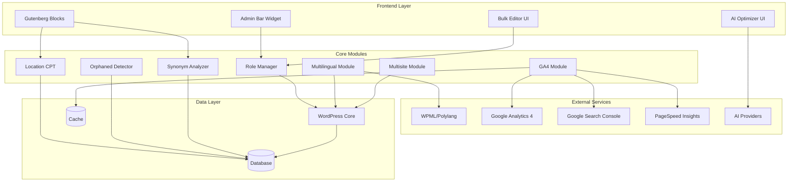

# Design Document: Sprint 4 - Advanced & Ecosystem

## Overview

Sprint 4 delivers 11 enterprise-grade features that complete MeowSEO's feature parity with premium SEO plugins. This sprint encompasses role-based access control, multilingual support, multisite compatibility, multi-location local SEO, bulk editing operations, Google Analytics 4 integration, frontend admin bar indicators, orphaned content detection, Gutenberg content blocks, AI-powered content optimization, and keyword synonym analysis.

### Key Design Principles

1. **Enterprise Scalability**: Support multisite networks with thousands of sites and multi-location businesses with hundreds of locations
2. **Integration-First**: Seamlessly integrate with WPML, Polylang, Google Analytics 4, and Google Search Console
3. **Performance Optimization**: Cache API responses, minimize database queries, and use efficient bulk operations
4. **Security by Design**: Implement capability-based access control and secure OAuth token storage
5. **Developer Experience**: Provide React-based Gutenberg blocks with TypeScript support and comprehensive APIs

### Technology Stack

- **Backend**: PHP 8.0+, WordPress 6.0+, PSR-4 autoloading
- **Frontend**: React 18, TypeScript, WordPress Block Editor API
- **Testing**: PHPUnit 9.5 with Eris (property-based testing), Jest with fast-check
- **APIs**: Google Analytics 4 Data API, Google Search Console API, PageSpeed Insights API
- **Storage**: WordPress options API, postmeta, custom tables for analytics cache

## Architecture

### System Architecture




### Module Interactions

1. **Role Manager** controls access to all features through WordPress capabilities
2. **Multilingual Module** integrates with WPML/Polylang to provide hreflang tags and per-language metadata
3. **Multisite Module** ensures per-site isolation of settings, redirects, and analytics
4. **Location CPT** provides shortcodes and schema for multi-location businesses
5. **GA4 Module** fetches and caches analytics data from multiple Google APIs
6. **Orphaned Detector** analyzes internal link structure to identify isolated content
7. **Synonym Analyzer** extends keyword analysis to include semantic variations

## Components and Interfaces

### 1. Role Manager (`includes/modules/roles/class-role-manager.php`)

**Purpose**: Manage WordPress capabilities for MeowSEO features

**Public Interface**:
```php
class Role_Manager {
    public function register_capabilities(): void;
    public function user_can(string $capability): bool;
    public function get_role_capabilities(string $role): array;
    public function add_capability_to_role(string $role, string $capability): bool;
    public function remove_capability_from_role(string $role, string $capability): bool;
    public function get_all_meowseo_capabilities(): array;
}
```

**Capabilities**:
- `meowseo_manage_settings`: Access plugin settings
- `meowseo_manage_redirects`: Manage redirect rules
- `meowseo_view_404_monitor`: View 404 error logs
- `meowseo_manage_analytics`: Configure analytics integrations
- `meowseo_edit_general_meta`: Edit basic SEO metadata
- `meowseo_edit_advanced_meta`: Edit advanced SEO settings
- `meowseo_edit_social_meta`: Edit social media metadata
- `meowseo_edit_schema`: Edit structured data
- `meowseo_use_ai_generation`: Use AI content generation
- `meowseo_use_ai_optimizer`: Use AI optimization suggestions
- `meowseo_view_link_suggestions`: View internal link suggestions
- `meowseo_manage_locations`: Manage business locations
- `meowseo_bulk_edit`: Perform bulk SEO operations
- `meowseo_view_admin_bar`: View admin bar SEO indicators
- `meowseo_import_export`: Import/export SEO data

**Default Role Assignments**:
- Administrator: All capabilities
- Editor: `meowseo_edit_general_meta`, `meowseo_edit_social_meta`, `meowseo_view_link_suggestions`
- Author/Contributor/Subscriber: No capabilities by default

### 2. Multilingual Module (`includes/modules/multilingual/class-multilingual-module.php`)

**Purpose**: Integrate with WPML and Polylang for multilingual SEO

**Public Interface**:
```php
class Multilingual_Module {
    public function detect_translation_plugin(): ?string;
    public function get_translations(int $post_id): array;
    public function get_default_language(): string;
    public function get_current_language(): string;
    public function output_hreflang_tags(): void;
    public function get_translated_metadata(int $post_id, string $language): array;
    public function sync_schema_translations(int $post_id): void;
}
```

**Integration Points**:
- WPML: Uses `wpml_get_language_information`, `wpml_get_element_translations`
- Polylang: Uses `pll_get_post_translations`, `pll_default_language`, `pll_current_language`

**Hreflang Output Format**:
```html
<link rel="alternate" hreflang="en" href="https://example.com/page/" />
<link rel="alternate" hreflang="es" href="https://example.com/es/pagina/" />
<link rel="alternate" hreflang="fr" href="https://example.com/fr/page/" />
<link rel="alternate" hreflang="x-default" href="https://example.com/page/" />
```

### 3. Multisite Module (`includes/modules/multisite/class-multisite-module.php`)

**Purpose**: Support WordPress multisite networks with per-site configuration

**Public Interface**:
```php
class Multisite_Module {
    public function is_network_activated(): bool;
    public function get_network_settings(): array;
    public function update_network_settings(array $settings): bool;
    public function get_site_settings(int $site_id): array;
    public function initialize_new_site(int $site_id): void;
    public function get_network_disabled_features(): array;
}
```

**Network Admin Interface**:
- Default settings for new sites
- Feature toggles (disable specific features network-wide)
- Bulk operations across sites
- Network-wide analytics dashboard

**Per-Site Isolation**:
- Settings stored in site-specific options table
- Redirects stored with site ID prefix
- 404 logs filtered by site
- Sitemaps generated with correct site URLs

### 4. Location CPT (`includes/modules/locations/class-location-cpt.php`)

**Purpose**: Manage multiple business locations with schema and maps

**Custom Post Type**: `meowseo_location`

**Custom Fields**:
```php
[
    'business_name' => 'string',
    'street_address' => 'string',
    'city' => 'string',
    'state' => 'string',
    'postal_code' => 'string',
    'country' => 'string',
    'phone' => 'string',
    'email' => 'string',
    'latitude' => 'float', // -90 to 90
    'longitude' => 'float', // -180 to 180
    'opening_hours' => 'array', // [day => [open, close]]
]
```

**Shortcodes**:
```php
[meowseo_address id="123"]
[meowseo_map id="123" width="600" height="400"]
[meowseo_opening_hours id="123"]
[meowseo_store_locator zoom="10" center="lat,lng"]
```

**LocalBusiness Schema**:
```json
{
  "@context": "https://schema.org",
  "@type": "LocalBusiness",
  "name": "Business Name",
  "address": {
    "@type": "PostalAddress",
    "streetAddress": "123 Main St",
    "addressLocality": "City",
    "addressRegion": "State",
    "postalCode": "12345",
    "addressCountry": "US"
  },
  "geo": {
    "@type": "GeoCoordinates",
    "latitude": 40.7128,
    "longitude": -74.0060
  },
  "telephone": "+1-555-555-5555",
  "email": "contact@example.com",
  "openingHoursSpecification": [
    {
      "@type": "OpeningHoursSpecification",
      "dayOfWeek": "Monday",
      "opens": "09:00",
      "closes": "17:00"
    }
  ]
}
```

**KML Export Format**:
```xml
<?xml version="1.0" encoding="UTF-8"?>
<kml xmlns="http://www.opengis.net/kml/2.2">
  <Document>
    <name>Business Locations</name>
    <Placemark>
      <name>Location Name</name>
      <description>Address details</description>
      <Point>
        <coordinates>-74.0060,40.7128,0</coordinates>
      </Point>
    </Placemark>
  </Document>
</kml>
```

### 5. Bulk Editor (`includes/modules/bulk/class-bulk-editor.php`)

**Purpose**: Perform bulk SEO operations on multiple posts

**Public Interface**:
```php
class Bulk_Editor {
    public function register_bulk_actions(): void;
    public function handle_bulk_action(string $action, array $post_ids): int;
    public function export_to_csv(array $post_ids): string;
    public function get_supported_post_types(): array;
}
```

**Bulk Actions**:
- Set noindex/index
- Set nofollow/follow
- Remove canonical URL
- Set schema type (Article, None, etc.)
- Export to CSV

**CSV Export Columns**:
```
ID, Title, URL, Focus Keyword, Meta Description, SEO Score, Noindex, Nofollow, Canonical URL, Schema Type
```

**CSV Format**: RFC 4180 compliant with proper escaping

### 6. GA4 Module (`includes/modules/analytics/class-ga4-module.php`)

**Purpose**: Integrate Google Analytics 4 and Search Console data

**Public Interface**:
```php
class GA4_Module {
    public function authenticate_oauth(): string; // Returns auth URL
    public function handle_oauth_callback(string $code): bool;
    public function get_ga4_metrics(string $start_date, string $end_date): array;
    public function get_gsc_metrics(string $start_date, string $end_date): array;
    public function get_pagespeed_insights(string $url): array;
    public function identify_winning_content(): array;
    public function identify_losing_content(): array;
    public function send_weekly_report(string $email): bool;
}
```

**GA4 Metrics**:
- Sessions
- Users
- Pageviews
- Bounce rate
- Average session duration

**GSC Metrics**:
- Impressions
- Clicks
- CTR (Click-through rate)
- Average position

**PageSpeed Insights**:
- Largest Contentful Paint (LCP)
- First Input Delay (FID)
- Cumulative Layout Shift (CLS)
- Overall performance score

**Caching Strategy**:
- Cache API responses for 6 hours
- Store in WordPress transients with site-specific keys
- Invalidate cache on manual refresh

**OAuth Flow**:
1. User clicks "Connect Google Analytics"
2. Redirect to Google OAuth consent screen
3. User grants permissions
4. Google redirects back with authorization code
5. Exchange code for access token and refresh token
6. Store refresh token securely in WordPress options (encrypted)

### 7. Admin Bar Module (`includes/modules/admin-bar/class-admin-bar-module.php`)

**Purpose**: Display SEO score in WordPress admin bar on frontend

**Public Interface**:
```php
class Admin_Bar_Module {
    public function add_admin_bar_menu(WP_Admin_Bar $wp_admin_bar): void;
    public function get_current_page_score(): array;
    public function render_admin_bar_dropdown(): void;
}
```

**Display Logic**:
- Only on singular posts/pages (not archives or homepage)
- Only for users with `meowseo_view_admin_bar` capability
- Color-coded indicator: Red (0-49), Orange (50-79), Green (80-100)

**Dropdown Content**:
- SEO score
- Readability score
- Focus keyword
- Number of failing checks
- "Edit SEO" link (opens editor with MeowSEO sidebar)

**Caching**: Scores cached for 5 minutes per post

### 8. Orphaned Detector (`includes/modules/orphaned/class-orphaned-detector.php`)

**Purpose**: Identify content with no internal links

**Public Interface**:
```php
class Orphaned_Detector {
    public function scan_all_content(): array;
    public function get_orphaned_posts(array $filters = []): array;
    public function get_inbound_link_count(int $post_id): int;
    public function suggest_linking_opportunities(int $orphaned_post_id): array;
    public function schedule_weekly_scan(): void;
}
```

**Detection Algorithm**:
1. Query all published posts/pages
2. For each post, count inbound links from `meowseo_internal_links` table
3. Mark posts with zero inbound links as orphaned
4. Store results in `meowseo_orphaned_content` table

**Linking Suggestions**:
- Analyze content similarity using TF-IDF or keyword overlap
- Suggest 5 posts that should link to the orphaned content
- Consider category, tag, and keyword relationships

**WP-Cron Job**: Weekly scan scheduled via `wp_schedule_event`

### 9. Block Library (`src/blocks/`)

**Purpose**: Provide SEO-friendly Gutenberg blocks

**Blocks**:

#### 9.1 Estimated Reading Time (`meowseo/estimated-reading-time`)
```typescript
interface ReadingTimeAttributes {
    wordsPerMinute: number; // 150-300, default 200
    showIcon: boolean;
    customText: string;
}
```

**Calculation**: `Math.ceil(wordCount / wordsPerMinute)`

#### 9.2 Related Posts (`meowseo/related-posts`)
```typescript
interface RelatedPostsAttributes {
    numberOfPosts: number; // 1-10, default 3
    displayStyle: 'list' | 'grid';
    showExcerpt: boolean;
    showThumbnail: boolean;
    relationshipType: 'keyword' | 'category' | 'tag';
}
```

**Query Logic**: Match by focus keyword, categories, or tags

#### 9.3 Siblings (`meowseo/siblings`)
```typescript
interface SiblingsAttributes {
    showThumbnails: boolean;
    orderBy: 'menu_order' | 'title' | 'date';
}
```

**Query**: Posts with same `post_parent`

#### 9.4 Subpages (`meowseo/subpages`)
```typescript
interface SubpagesAttributes {
    depth: number; // 1-3
    showThumbnails: boolean;
}
```

**Query**: Posts where `post_parent` equals current post ID

**Accessibility Requirements**:
- Proper heading hierarchy (h2, h3, etc.)
- ARIA labels for interactive elements
- Keyboard navigation support
- Screen reader announcements for dynamic content

### 10. AI Optimizer (`includes/modules/ai/class-ai-optimizer.php`)

**Purpose**: Generate AI-powered suggestions for failing SEO checks

**Public Interface**:
```php
class AI_Optimizer {
    public function get_suggestion(string $check_name, string $content, string $keyword): string;
    public function get_cached_suggestion(int $post_id, string $check_name): ?string;
    public function clear_suggestion_cache(int $post_id): void;
}
```

**Supported Checks**:
- Keyword density
- Keyword in title
- Keyword in headings
- Keyword in first paragraph
- Keyword in meta description
- Title length
- Description length
- Content length
- Internal links
- External links
- Image alt text

**Prompt Template**:
```
This content is failing the [check name] SEO check.
Focus keyword: [keyword]
Current content: [excerpt]

Provide a specific, actionable suggestion to fix this issue. Be concise and practical.
```

**AI Provider Integration**:
- Uses same provider configuration as AI generation module
- Supports OpenAI, Anthropic, Gemini
- Respects API key and quota limits

**Caching**: Suggestions cached for 1 hour per check per post

### 11. Synonym Analyzer (`includes/modules/synonyms/class-synonym-analyzer.php`)

**Purpose**: Analyze content for keyword synonyms

**Public Interface**:
```php
class Synonym_Analyzer {
    public function get_synonyms(int $post_id): array;
    public function set_synonyms(int $post_id, array $synonyms): bool;
    public function analyze_synonym(string $synonym, string $content): array;
    public function calculate_combined_score(array $primary_results, array $synonym_results): float;
}
```

**Storage**: `_meowseo_keyword_synonyms` postmeta as JSON array

**Synonym Checks**:
- Synonym density (0.5-2.5%)
- Synonym in title
- Synonym in headings
- Synonym in first paragraph
- Synonym in meta description

**Combined Score Formula**:
```
combined_score = (primary_keyword_score * 0.6) + (average_synonym_score * 0.4)
```

**UI Display**:
- Primary keyword matches highlighted in blue
- Synonym matches highlighted in green
- Separate analysis results for each synonym
- Summary showing optimization status per synonym

## Data Models

### Role Capabilities (WordPress Options)

Stored in WordPress roles via `get_role()` and `add_cap()`:
```php
[
    'administrator' => [
        'meowseo_manage_settings' => true,
        'meowseo_manage_redirects' => true,
        // ... all capabilities
    ],
    'editor' => [
        'meowseo_edit_general_meta' => true,
        'meowseo_edit_social_meta' => true,
        'meowseo_view_link_suggestions' => true,
    ],
]
```

### Multilingual Metadata (Postmeta)

Per-language metadata stored with language suffix:
```php
_meowseo_title_en
_meowseo_title_es
_meowseo_title_fr
_meowseo_description_en
_meowseo_description_es
_meowseo_description_fr
```

### Multisite Network Settings (Site Options)

```php
[
    'default_settings' => [...],
    'disabled_features' => ['ai_generation', 'analytics'],
    'network_admin_email' => 'admin@example.com',
]
```

### Location Custom Fields (Postmeta)

```php
_meowseo_location_business_name
_meowseo_location_street_address
_meowseo_location_city
_meowseo_location_state
_meowseo_location_postal_code
_meowseo_location_country
_meowseo_location_phone
_meowseo_location_email
_meowseo_location_latitude
_meowseo_location_longitude
_meowseo_location_opening_hours // JSON array
```

### GA4 Cache (Transients)

```php
set_transient('meowseo_ga4_metrics_' . $site_id . '_' . $date_range, $data, 6 * HOUR_IN_SECONDS);
set_transient('meowseo_gsc_metrics_' . $site_id . '_' . $date_range, $data, 6 * HOUR_IN_SECONDS);
set_transient('meowseo_psi_' . md5($url), $data, 6 * HOUR_IN_SECONDS);
```

### Orphaned Content Table

```sql
CREATE TABLE meowseo_orphaned_content (
    id BIGINT UNSIGNED AUTO_INCREMENT PRIMARY KEY,
    post_id BIGINT UNSIGNED NOT NULL,
    inbound_link_count INT DEFAULT 0,
    last_scanned DATETIME NOT NULL,
    INDEX post_id_idx (post_id),
    INDEX inbound_link_count_idx (inbound_link_count)
);
```

### AI Suggestion Cache (Transients)

```php
set_transient('meowseo_ai_suggestion_' . $post_id . '_' . $check_name, $suggestion, HOUR_IN_SECONDS);
```

### Keyword Synonyms (Postmeta)

```php
_meowseo_keyword_synonyms // JSON: ["synonym1", "synonym2", "synonym3"]
```

## Error Handling

### Role Manager Errors

- **Unauthorized Access**: Return `WP_Error` with code `meowseo_unauthorized`
- **Invalid Capability**: Log warning and return false
- **Role Not Found**: Return `WP_Error` with code `meowseo_invalid_role`

### Multilingual Module Errors

- **Translation Plugin Not Found**: Gracefully degrade, skip hreflang output
- **Invalid Language Code**: Log warning, use default language
- **Missing Translation**: Return original content

### Multisite Module Errors

- **Network Activation Required**: Display admin notice
- **Site Not Found**: Return `WP_Error` with code `meowseo_invalid_site`
- **Permission Denied**: Check for `manage_network` capability

### Location CPT Errors

- **Invalid Coordinates**: Validate latitude (-90 to 90) and longitude (-180 to 180)
- **Missing Required Fields**: Display validation errors in admin
- **KML Export Failure**: Return `WP_Error` with code `meowseo_kml_export_failed`

### Bulk Editor Errors

- **No Posts Selected**: Display admin notice
- **Bulk Action Failed**: Log error, display count of successful vs failed operations
- **CSV Export Failure**: Return `WP_Error` with code `meowseo_csv_export_failed`

### GA4 Module Errors

- **OAuth Failure**: Display user-friendly error message, provide retry link
- **API Quota Exceeded**: Display notice, suggest waiting or upgrading quota
- **Invalid Credentials**: Prompt re-authentication
- **Network Error**: Retry with exponential backoff (3 attempts)

### Admin Bar Module Errors

- **Score Calculation Failure**: Hide admin bar menu item
- **Cache Failure**: Recalculate score without caching

### Orphaned Detector Errors

- **Scan Timeout**: Process in batches of 100 posts
- **Database Error**: Log error, display admin notice

### Block Library Errors

- **Invalid Attributes**: Use default values
- **Query Failure**: Display "No posts found" message
- **Render Error**: Catch exceptions, display error boundary

### AI Optimizer Errors

- **API Key Missing**: Display setup instructions
- **API Error**: Display user-friendly error message
- **Rate Limit Exceeded**: Display notice with retry time
- **Invalid Response**: Log error, display generic error message

### Synonym Analyzer Errors

- **Too Many Synonyms**: Limit to 5, display validation error
- **Invalid Synonym Format**: Sanitize input, remove invalid characters
- **Analysis Failure**: Log error, return empty results

## Testing Strategy

This feature involves extensive integration with external services (WPML, Polylang, Google APIs), WordPress multisite, and complex UI components. Property-based testing is NOT appropriate for most of these features because:

1. **Infrastructure Integration**: Testing WPML/Polylang integration, multisite behavior, and OAuth flows requires integration tests with real or mocked WordPress environments
2. **External API Behavior**: Google Analytics 4, Search Console, and PageSpeed Insights APIs have deterministic behavior that doesn't vary meaningfully with input
3. **UI Components**: Gutenberg blocks and admin interfaces require snapshot tests and user interaction tests
4. **Configuration Validation**: Role capabilities and settings are one-time setup checks

### Testing Approach

**Unit Tests** (PHPUnit):
- Role Manager: Test capability registration, user permission checks, role assignment
- Multilingual Module: Test translation plugin detection, hreflang tag generation
- Multisite Module: Test per-site settings isolation, network activation
- Location CPT: Test coordinate validation, schema generation, shortcode rendering
- Bulk Editor: Test CSV export formatting, bulk action application
- Orphaned Detector: Test link counting algorithm, suggestion generation
- Synonym Analyzer: Test synonym storage, combined score calculation

**Integration Tests**:
- GA4 Module: Mock Google API responses, test OAuth flow, cache behavior
- Admin Bar Module: Test score calculation, admin bar rendering
- AI Optimizer: Mock AI provider responses, test prompt generation

**Frontend Tests** (Jest + React Testing Library):
- Gutenberg Blocks: Test block registration, attribute handling, rendering
- Block interactions: Test user input, dynamic queries, accessibility

**Property-Based Tests** (Eris for PHP, fast-check for TypeScript):

While most features are not suitable for PBT, a few specific algorithms can benefit:

1. **Coordinate Validation** (Location CPT):
   - Property: For any latitude/longitude pair, validation should correctly identify valid ranges
   - Generator: Random floats including edge cases (-90, 90, -180, 180, out-of-range values)

2. **CSV Export Escaping** (Bulk Editor):
   - Property: For any post data, CSV export should produce RFC 4180 compliant output
   - Generator: Random strings with special characters (quotes, commas, newlines)

3. **Synonym Score Calculation** (Synonym Analyzer):
   - Property: Combined score should always be between 0 and 100
   - Property: Changing primary score should affect combined score proportionally
   - Generator: Random primary and synonym scores (0-100)

**Example Property Test (Synonym Score)**:
```php
use Eris\Generator;

class SynonymAnalyzerTest extends \PHPUnit\Framework\TestCase {
    use Eris\TestTrait;
    
    public function testCombinedScoreIsAlwaysBetweenZeroAndHundred() {
        $this->forAll(
            Generator\choose(0, 100), // primary score
            Generator\vector(3, Generator\choose(0, 100)) // synonym scores
        )->then(function ($primary_score, $synonym_scores) {
            $analyzer = new Synonym_Analyzer();
            $combined = $analyzer->calculate_combined_score(
                ['score' => $primary_score],
                array_map(fn($s) => ['score' => $s], $synonym_scores)
            );
            
            $this->assertGreaterThanOrEqual(0, $combined);
            $this->assertLessThanOrEqual(100, $combined);
        });
    }
}
```

**Accessibility Testing**:
- Automated: axe-core for Gutenberg blocks
- Manual: Keyboard navigation, screen reader testing

**Performance Testing**:
- Bulk operations: Test with 1000+ posts
- Multisite: Test with 100+ sites
- Location queries: Test with 500+ locations
- API caching: Verify cache hit rates

### Test Coverage Goals

- Unit tests: 80%+ code coverage
- Integration tests: All critical paths
- Property tests: Core algorithms (coordinate validation, CSV escaping, score calculation)
- Accessibility: WCAG 2.1 AA compliance for all UI components


## Correctness Properties

*A property is a characteristic or behavior that should hold true across all valid executions of a system—essentially, a formal statement about what the system should do. Properties serve as the bridge between human-readable specifications and machine-verifiable correctness guarantees.*

**Note on Property-Based Testing Applicability:**

This sprint primarily involves infrastructure integration (WPML, Polylang, multisite), external API integration (Google Analytics 4, Search Console), UI components (Gutenberg blocks), and configuration management (role capabilities). Most of these features are NOT suitable for property-based testing because:

- Infrastructure integration requires integration tests with real or mocked environments
- External API behavior is deterministic and doesn't vary meaningfully with input
- UI components require snapshot tests and user interaction tests
- Configuration validation is one-time setup checking

However, three specific algorithms DO benefit from property-based testing because they involve pure logic that should work correctly across all valid inputs:

### Property 1: Coordinate Validation Correctness

*For any* latitude and longitude values, the Location CPT validation SHALL correctly identify valid coordinates (latitude between -90 and 90, longitude between -180 and 180) and reject invalid coordinates outside these ranges.

**Validates: Requirements 4.3**

**Rationale**: Coordinate validation is a pure function with clear mathematical boundaries. Testing with random values including edge cases (-90, 90, -180, 180) and out-of-range values ensures the validation logic is correct for all possible inputs.

### Property 2: CSV Export RFC 4180 Compliance

*For any* post data containing special characters (quotes, commas, newlines, tabs), the Bulk Editor CSV export SHALL produce RFC 4180 compliant output with proper field escaping and quoting.

**Validates: Requirements 5.5, 5.7**

**Rationale**: CSV escaping must work correctly regardless of input data. Testing with random strings containing special characters ensures the export handles all edge cases (embedded quotes, commas in fields, newlines in content) according to RFC 4180 specification.

### Property 3: Combined Synonym Score Bounds and Formula

*For any* primary keyword score (0-100) and any set of synonym scores (0-100 each), the Synonym Analyzer combined score calculation SHALL:
1. Produce a result between 0 and 100 (inclusive)
2. Follow the formula: (primary_score × 0.6) + (average_synonym_score × 0.4)
3. Increase proportionally when primary score increases (holding synonyms constant)
4. Increase proportionally when synonym scores increase (holding primary constant)

**Validates: Requirements 11.5**

**Rationale**: The combined score formula is a pure mathematical function that should work correctly for all valid input scores. Testing with random score combinations ensures the calculation never produces invalid results (< 0 or > 100) and correctly implements the weighted average formula.

